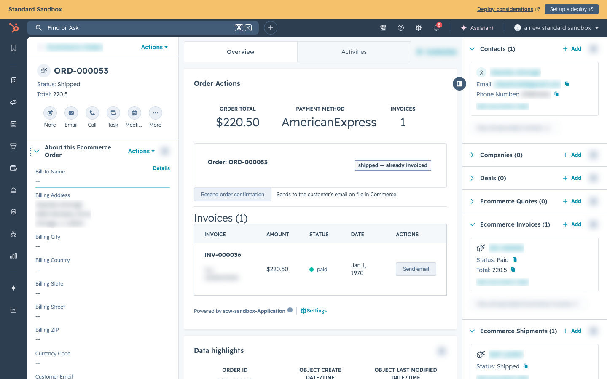
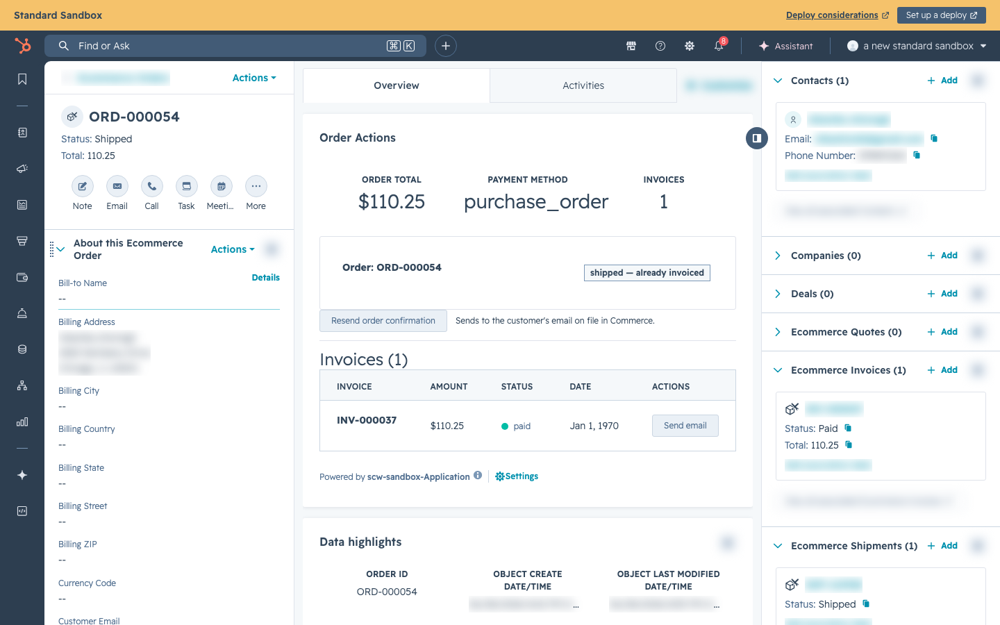
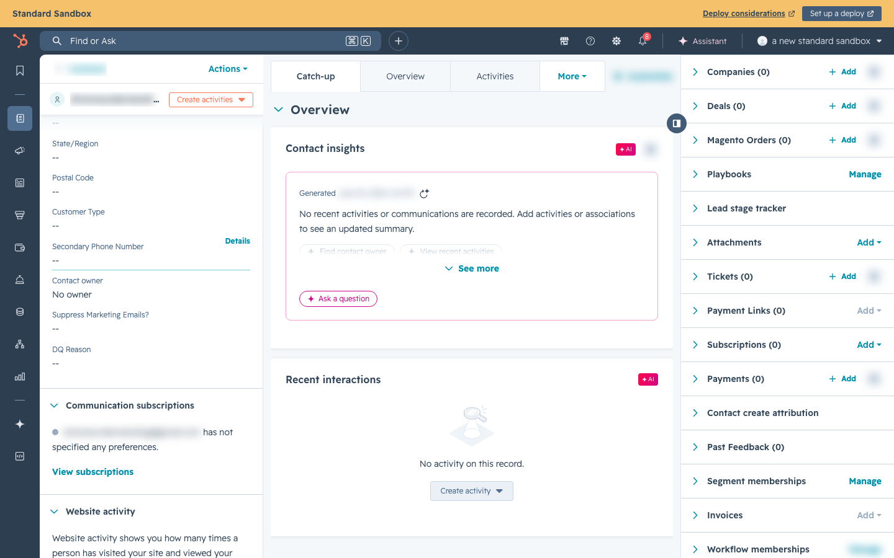

# Admin Actions — Invoicing & Order Management

## Overview

For **Check and Wire** orders, the order sits in **Pending Payment** until an admin confirms the payment and invoices the order. This page covers the admin's day-to-day workflow.

> **Credit Terms (NET30) orders no longer need manual invoicing** (July 2026). Because those customers are pre-approved, the system auto-creates the invoice at checkout, emails it to the customer, and moves the order straight to Processing/ShipEdge. See [Checkout & Payment Methods](checkout-payment-methods.md). The manual steps below apply to Check and Wire orders — and to credit-terms orders migrated from Magento, which are not auto-invoiced.

***

## Finding Pending Payment Orders

### In HubSpot

1. Navigate to **Ecommerce Orders** from the top menu
2. Click **Filters** → **Status** → select **Pending**
3. The list shows all orders waiting for admin action

You can also add the **Payment Method Type** column to the table view:

1. Click **Edit columns**
2. Add **Payment Method Type** and **PO Number**
3. Save the view



_Ecommerce Orders list — add the Payment Method Type column to quickly identify Check, Wire, and PO orders waiting for admin action._

### Identifying the Payment Type

| Payment Method Type | What to Do                                                              |
| ------------------- | ----------------------------------------------------------------------- |
| `purchase_order`    | (Credit Terms) Auto-invoiced at checkout — should not sit in Pending. A Pending one is either migrated from Magento (invoice manually) or worth investigating |
| `check`             | Wait for the check to arrive and clear, then invoice                    |
| `ach_wire`          | Check the bank portal for the transfer (match by Order #), then invoice |
| `credit_card`       | Should not be in Pending — investigate if you see this                  |

***

## Invoicing an Order

When you've confirmed payment has been received (check cleared, wire arrived, PO approved):

### Step 1: Find the Order

Click on the Ecommerce Order in HubSpot to open the detail view.

Verify:

* **Status:** Pending
* **Payment Method Type:** The offline method used
* **PO Number:** (for credit-terms orders) — verify against the customer's credit limit
* **Total:** Matches the payment received


_An Ecommerce Order record — verify Status, Payment Method Type, PO Number, and Total before invoicing._

### Step 2: Invoice the Order

Call the invoice endpoint. This can be done via:

**Option A: HubSpot Invoice Button** _(if deployed in your portal)_

* Click the **"Invoice Order"** button on the Ecommerce Order record
* The button calls the SCW Commerce API automatically

**Option B: Direct API Call**

```
POST https://hubspot.getscw.com/api/admin/orders/{ORDER_ID}/invoice
```

Where `{ORDER_ID}` is the internal order ID (shown as `eo_source_id` on the Ecommerce Order). The endpoint also accepts the SCW order number (e.g., `1268879530`) when calling it directly.

The invoice endpoint accepts orders in either `pending_payment` or `pending` status.

> **Safe against double-clicks:** confirming payment / invoicing an order is protected against duplicate submits. If the button is clicked twice, or two admins act on the same order at once, only the first request creates the invoice. A duplicate submit gets back **"Payment confirmation is already in progress for this order"** (while the first one is still running) or **"This order has already been invoiced"** (once it's done) instead of creating a second invoice. This also prevents the sale from being reported to TaxJar twice.



_The Data highlights section shows ORDER ID (the internal database ID / eo\_source\_id), used when calling the invoice endpoint directly._

### Step 3: What Happens After Invoicing

When the invoice endpoint is called, the following happens automatically:

1. **Invoice created and marked paid** in SCW Commerce database
2. **Order status** changes from `pending_payment` → `processing`
3. **HubSpot Ecommerce Order** status updates to `processing`
4. **ShipEdge** receives the order for fulfillment
5. The shipping team can now pick, pack, and ship the order

From this point, the order follows the normal fulfillment flow — ShipEdge creates a shipping label, tracking syncs back, and the customer gets a shipping notification.


_After invoicing, the order status moves to Processing and the Ecommerce Invoice appears in the sidebar._

***

## Cancelling an Order

### Automatic Cancellation (Check & Wire Only)

* **Check orders:** Automatically cancelled after **14 days** in Pending Payment
* **Wire orders:** Automatically cancelled after **21 days** in Pending Payment
* **Credit Terms (NET30) orders:** Never auto-cancelled — and since auto-invoicing (July 2026) they move to Processing at checkout rather than waiting in Pending Payment

This runs daily at 3 AM UTC. When an order is auto-cancelled:

* Status changes to `cancelled` in SCW Commerce
* HubSpot Ecommerce Order status updates to `cancelled`
* Because pending-payment orders have not been invoiced, they have not been pushed to ShipEdge

### Manual Cancellation

There is no public cancel button in the current documented admin workflow. For a manual cancellation before the auto-cancel deadline, use an internal admin/engineering status correction. If the order was already pushed to ShipEdge, coordinate the ShipEdge cancellation or stop-work separately.

> **A shipped or delivered order cannot be cancelled — refund it instead.** Once an order has been fulfilled, a status change to `cancelled` is rejected: it would leave the customer charged and would not stop the warehouse or reverse sales tax. To unwind a fulfilled order, issue a **refund** (below). A full refund reverses the Authorize.net charge and the TaxJar transaction and then marks the order `cancelled`. Direct cancellation is only possible before the order ships (through `processing`).

***

## Reviewing a Credit Terms (NET30) Order

Since July 2026 these orders **auto-invoice at checkout** — the credit limit check (including open NET30 exposure) is enforced by the system before the order is created, so there is no manual gate. What an admin still does:

1. **Monitor** — the order appears in HubSpot already in Processing with its Ecommerce Invoice attached; the PO Number is on `eo_po_number`
2. **Collect** — the customer pays the emailed NET30 invoice; chase overdue invoices per normal AR process
3. **Manual invoicing remains only for Magento-migrated credit-terms orders**, which follow the old flow: verify the PO number and credit limit, then invoice



_The Contact record — scroll the left panel to find the Approved for Credit Terms and Credit Limit properties before approving a PO order._

### Demo PO Orders

If a customer enters "demo" as the PO number, the order should still be processed normally. The admin team handles these by applying a special "Demo" template to the invoice rather than standard NET30 branding.

***

## Verifying a Wire Transfer

When a wire/ACH order comes in:

1. **Note the Order Number** from the Ecommerce Order (e.g., `1268879530` for current sequence-generated orders; older orders may use the earlier `ORD-000406` format, and Magento-migrated orders use a numeric string or the legacy `SCW-YYYYMMDD-XXXX` format)
2. **Check the bank portal** for an incoming transfer with that order number in the memo
3. **Verify the amount** matches the order total
4. If funds are confirmed, **invoice the order**
5. If the customer emailed a remittance advice, that can serve as additional confirmation

***

## Verifying a Check

When a check order comes in:

1. **Wait for the physical check** to arrive at: 11 Richland Street, Asheville, NC 28806
2. **Verify the check amount** matches the order total
3. **Verify the order number** is referenced on the check
4. **Deposit the check** and wait for it to clear
5. Once cleared, **invoice the order**

> **Important:** Do not move a check order to `processing` just to avoid auto-cancellation. `processing` means payment has been confirmed and fulfillment can begin. If a check needs more time to clear near the 14-day deadline, leave the order in `pending_payment` and escalate for an admin/engineering extension instead of bypassing the invoice workflow.

***

## Tax Exemptions (View Only)

The **Tax Exemptions** page is accessible under the **Operations** group in the admin navigation at `/admin/tax-exemptions`.

### What it shows

| Column         | Description                                                                                                                                                                                                            |
| -------------- | ---------------------------------------------------------------------------------------------------------------------------------------------------------------------------------------------------------------------- |
| Email          | Email address of the exempt customer                                                                                                                                                                                   |
| Name           | First and last name of the exempt customer                                                                                                                                                                             |
| Exemption Type | `wholesale`, `government`, or `other`                                                                                                                                                                                  |
| Exempt Regions | The US states where tax exemption applies                                                                                                                                                                              |
| Source         | Provenance of the exemption: `admin` (set via the admin exemption-request approval flow), `org` (set via an org-level email-domain rule), or `hubspot_legacy` (migrated from the old HubSpot-managed exemption system) |
| Validated By   | The person or system that validated the exemption document                                                                                                                                                             |
| Document       | A "View" link to the supporting document (e.g., the uploaded reseller certificate). Shows "—" when no document is on file                                                                                              |

### Important: view only

This page is read-only. Exemptions cannot be created, edited, or removed directly on this page. All changes go through the **Exemption Requests** workflow: admins submit a request at `/admin/tax-exemption-requests`, upload supporting documents, and approve or reject via the admin approval flow (`POST /api/admin/tax-exemption-requests/[id]/approve` or `/reject`). There is no `POST /api/webhooks/tax-exemption` endpoint.


_The SCW Admin Tax Exemptions page showing the table with Email, Name, Type, Regions, Source, Validated By, and Document columns._

***

## Managing Categories

The **Categories** page (`/admin/categories`, under **Catalog** in the admin sidebar) manages the storefront category tree — hierarchy, menu visibility, and metadata. Before this page existed, category changes required developer scripts.

The page is split into two panes: a searchable category tree on the left, and an editor for the selected category on the right.

### Creating a category

Click **New category** (top right) for a top-level category, or use a tree row's **⋯ → Add child** to create underneath a specific parent. Name and slug are required; the slug must be kebab-case (lowercase letters, numbers, single hyphens) and unique among its sibling categories. New categories are appended at the end of their parent's list.

### Editing a category

Select a category in the tree to edit its name, slug, active toggle, navigation settings (include in menu, mega-menu mode, custom URL, position), image URL, and SEO metadata (meta title/description/keywords). A save bar appears when there are unsaved changes; switching to another category with unsaved edits prompts for confirmation first.

**Slug changes break old URLs.** Changing a slug shows a warning: the old URL is not redirected — search engines and existing links to it will 404. Only change slugs deliberately.

Category **descriptions** (the rich content on category pages) are not edited here — they are built as typed React components by the development team.

### Moving a category

Use **⋯ → Move** on a tree row. Pick the new parent (or "Top level") and where the category should sit among that parent's children. A category can never be moved into itself or one of its own subcategories. Moving preserves the category's products and subcategories.

### Deleting a category

Use **⋯ → Delete**. The confirmation dialog shows the blast radius first: how many subcategories and product assignments will be removed. **Deleting cascades** — the category and its entire subtree are permanently removed (same behavior as Magento). The products themselves are **not** deleted; they just lose the category assignment. Deleting a top-level category additionally requires typing the category's name to confirm.

### When changes appear on the storefront

- **Navigation / mega menu:** updates within about 5 minutes (menu cache).
- **Category pages:** update within about 60 seconds.
- **Search:** active categories are updated in site search immediately after a save; a full reindex also runs on every deploy.

***

## Quick Reference: Admin Actions by Payment Method

| Scenario                                            | Action                                                                   | Result                                         |
| --------------------------------------------------- | ------------------------------------------------------------------------ | ---------------------------------------------- |
| Credit Terms (NET30) order placed                   | Nothing — auto-invoiced at checkout                                      | Status → Processing → Ships; customer pays invoice |
| Migrated (Magento) credit-terms order, PO verified  | Invoice the order                                                        | Status → Processing → Ships                    |
| Check received and cleared                          | Invoice the order                                                        | Status → Processing → Ships                    |
| Wire transfer confirmed in bank                     | Invoice the order                                                        | Status → Processing → Ships                    |
| Check not received in 14 days                       | Nothing — auto-cancels                                                   | Status → Cancelled                             |
| Wire not received in 21 days                        | Nothing — auto-cancels                                                   | Status → Cancelled                             |
| Customer wants to cancel (not yet shipped)          | Escalate for internal admin/engineering cancellation                     | Status → Cancelled                             |
| Customer wants to cancel (already shipped/delivered)| Issue a **refund** — a direct cancel is rejected on a fulfilled order    | Refund reverses charge + tax, then Status → Cancelled |
| Check arrived but not cleared, 14-day deadline near | Escalate for deadline extension; do not move to Processing until cleared | Avoids bypassing invoice and ShipEdge workflow |
