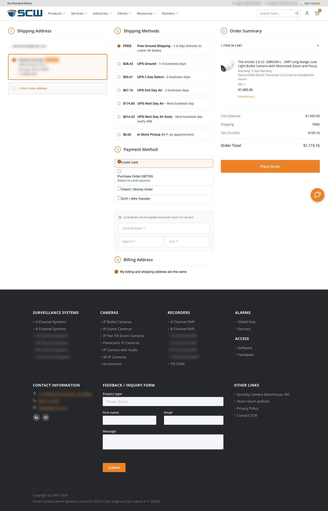

# Checkout — Payment Methods

## Overview

SCW Commerce supports four payment methods at checkout. The available methods depend on the customer's account settings.

| Payment Method | Available To | Payment Collected At Checkout? | Ships Immediately? |
|---|---|---|---|
| **Credit Card** | All customers | Yes — charged via Authorize.net | Yes — sent to ShipEdge automatically |
| **Purchase Order (NET30)** | Approved B2B customers only | No — invoiced later by admin | No — ships after admin invoices |
| **Check / Money Order** | All customers | No — mailed by customer | No — ships after check clears |
| **ACH / Wire Transfer** | All customers | No — wired by customer | No — ships after admin verifies funds |

*Checkout payment-method selector showing Credit Card, Purchase Order (NET30), Check/Money Order, and ACH/Wire Transfer radio options for an approved B2B customer*

---

## Credit Card

The standard payment method. Available to all customers.

### Customer Experience
1. Customer selects **Credit Card**
2. Card form appears (Card Number, MM/YY, CVV)
3. Card details are tokenized via Accept.js — **they never touch SCW servers**
4. Customer clicks **Place Order**
5. Payment is charged immediately via Authorize.net
6. Order confirmation email is sent

### What Happens in the System

| Step | SCW Commerce DB | HubSpot | ShipEdge |
|---|---|---|---|
| Order placed | Order created: `status = pending` | — | — |
| Payment processed | Status → `paid`; invoice created | Ecommerce Order and Invoice sync are enqueued; order displays as `processing` in HubSpot because HubSpot has no separate `paid` order status | — |
| ShipEdge accepts | Status → `processing` | Status remains `processing` | Order received in queue |
| Warehouse ships | Status → `shipped` | Status → `shipped` | Tracking number created |
| Carrier delivers | Status → `delivered` | Status → `delivered` | — |
| Manual cancel / correction (before delivery) | Status → `cancelled` | Status → `cancelled` | Stop or cancel fulfillment separately in ShipEdge if the order was already pushed |

> [SCREENSHOT: Credit card entry form at checkout with Card Number, MM/YY and CVV fields and an encrypted-card security notice — images/checkout-credit-card-form.png]

### Auth-Only Mode (Manual Capture)

For some orders — typically high-value ones or ones that need internal review — the card is **authorized but not charged** at checkout. The customer's card has the amount on hold but no money moves until an admin captures it through the HubSpot action or direct admin API.

This is an admin-initiated mode; it is not a customer choice at checkout.

| Step | SCW Commerce DB | HubSpot | ShipEdge |
|---|---|---|---|
| Order placed | Order created: `status = authorized`, card authorization held | Ecommerce Order sync is enqueued and displays as `processing` in HubSpot | **Order pushed to ShipEdge** — auth-only is part of the credit-card flow, so the order is sent to ShipEdge automatically at checkout (the same step credit-card orders use), not at capture |
| Admin captures (HubSpot action or admin API, see [Admin Actions](admin-actions.md)) | Status → `paid`, Invoice created locally | Order remains `processing` in HubSpot | No new push — the order already has a ShipEdge ID, so the capture-time push detects it and skips (`already_synced`) |
| ShipEdge accepts | Status → `processing` | Status → `processing` | Order received in queue |
| Warehouse ships | Status → `shipped` | Status → `shipped` | Tracking number created |
| Carrier delivers | Status → `delivered` | Status → `delivered` | — |
| Manual cancel / correction (before delivery) | Status → `cancelled` | Status → `cancelled` | Stop or cancel fulfillment separately in ShipEdge if the order was already pushed |

See [Order Lifecycle](order-lifecycle.md) for the full auth-only status flow.

### Duplicate-Charge & Failed-Order Safeguards

Credit-card checkout protects against the "money taken but no order" failure mode:

- **Before** the gateway is called, a durable payment-attempt record is written. If the same card/cart is submitted twice (double-click, retry), the second request is caught and returns a *"This checkout is already being processed"* message (`CHECKOUT_IN_PROGRESS`) — it does **not** charge again.
- If two requests race past that check and the gateway charges twice, the duplicate charge is **automatically voided/refunded** and the customer is returned the original order.
- If the gateway **succeeds but the order fails to save**, checkout flags the attempt for manual finance review, attempts to roll the charge back, and shows *"Your payment went through but we hit a snag finalizing the order. Our team has been alerted."* (`CHECKOUT_PERSISTENCE_FAILED`). These cases are logged and alerted for reconciliation.

---

## Purchase Order (NET30)

For pre-approved B2B customers only. The customer buys now and pays within 30 days.

### Who Can See This Option

Only customers with **"Approved for Credit Terms"** set to **Yes** on their HubSpot Contact record. See [Credit Terms Management](credit-terms.md) for how to approve a customer.

If the customer is not approved, this option is hidden — they only see Credit Card, Check, and Wire.

### Customer Experience
1. Customer selects **Purchase Order (NET30)**
2. A required **Purchase Order Number** field appears
3. Customer enters their company's PO reference (e.g., `PO-2026-0412`)
4. A note explains: *"This order is subject to NET30 terms and will be reviewed by our admin team. Your order will be processed once the PO is verified against your credit limit."*
5. Customer clicks **Submit Purchase Order**
6. Two emails sent:
   - Order confirmation showing the PO details
   - A separate **"Purchase Order Received"** instruction email containing the PO number and the *"pending admin review"* message — *"Your order is currently pending admin review. Once the PO is verified against your credit limit, the order will be processed and shipped."*

> [SCREENSHOT: Purchase Order form showing PO Number field and NET30 note — images/checkout-purchase-order-form.png]

### What Happens in the System

| Step | SCW Commerce DB | HubSpot | ShipEdge |
|---|---|---|---|
| Order placed | Order created: `status = pending_payment`, `payment_method = purchase_order`, `po_number = PO-2026-0412` | Ecommerce Order created: `status = pending`, `eo_payment_method_type = purchase_order`, `eo_po_number = PO-2026-0412` | **Nothing** — order is NOT sent to ShipEdge |
| Admin invoices (see [Admin Actions](admin-actions.md)) | Status → `processing`, Invoice created | Status → `processing` | Order pushed to ShipEdge |
| Warehouse ships | Status → `shipped` | Status → `shipped` | Tracking number created |
| Carrier delivers | Status → `delivered` | Status → `delivered` | — |
| Manual cancel / correction (before delivery) | Status → `cancelled` | Status → `cancelled` | Stop or cancel fulfillment separately in ShipEdge if the order was already pushed |

> [SCREENSHOT: HubSpot Ecommerce Order record for a purchase-order checkout showing pending status, payment method type purchase_order, and the PO number — images/hubspot-ecommerce-order-po.png]

### Important
- No payment is collected at checkout
- The order will **not** ship until an admin invoices it
- The PO Number is visible on the Ecommerce Order in HubSpot for admin reference
- There is **no automatic cancellation** for PO orders — they stay in Pending Payment until the admin acts

---

## Check / Money Order

Available to all customers. The customer mails a physical check.

### Customer Experience
1. Customer selects **Check / Money Order**
2. Payment instructions appear:
   - **Payable To:** Security Camera Warehouse
   - **Mail To:** 11 Richland Street, Asheville, NC 28806
   - Reference your Order # on the check
   - Warning: *"Your order will only ship once the check has been received and cleared. If a check is not received within 14 days, the order will be automatically canceled."*
3. Customer clicks **Place Order**
4. Two emails sent:
   - Order confirmation
   - Payment instructions email reiterating mailing address and 14-day policy

> [SCREENSHOT: Check/Money Order checkout instructions showing payee, Asheville NC mailing address, and 14-day auto-cancel warning — images/checkout-check-instructions.png]

### What Happens in the System

| Step | SCW Commerce DB | HubSpot | ShipEdge |
|---|---|---|---|
| Order placed | Order created: `status = pending_payment`, `payment_method = check` | Ecommerce Order created: `status = pending`, `eo_payment_method_type = check` | **Nothing** |
| Check received — admin invoices (see [Admin Actions](admin-actions.md)) | Status → `processing`, Invoice created | Status → `processing` | Order pushed to ShipEdge |
| **14 days pass without invoice** | **Status → `cancelled` (automatic)** | **Status → `cancelled`** | — |
| Warehouse ships (if invoiced) | Status → `shipped` | Status → `shipped` | Tracking number created |
| Carrier delivers | Status → `delivered` | Status → `delivered` | — |
| Manual cancel / correction (before delivery) | Status → `cancelled` | Status → `cancelled` | Stop or cancel fulfillment separately in ShipEdge if the order was already pushed |

> [SCREENSHOT: Check payment instruction email showing payee, Asheville NC mailing address, memo instruction, and 14-day cancellation warning — images/checkout-check-instruction-email.png]

### Important
- **14-day auto-cancel:** A daily automated process runs at 3 AM UTC and cancels any Check orders still in "Pending Payment" after 14 days. Because the order was never invoiced, it has not been pushed to ShipEdge.
- If the check arrives late but before auto-cancel, the admin should invoice the order promptly.
- If the admin needs more time (e.g., check arrived but hasn't cleared), escalate for an admin/engineering deadline extension. Do not move the order to "Processing" until payment has cleared.

---

## ACH / Wire Transfer

Available to all customers. The customer sends a wire transfer.

### Customer Experience
1. Customer selects **ACH / Wire Transfer**
2. Instructions appear:
   - *"Bank details (routing and account numbers) will be sent via email immediately after your order is placed."*
   - *"Please include your Order # in the transfer memo."*
   - *"To speed up processing, email a remittance advice or transfer confirmation to your sales representative."*
   - Warning: *"Your order will only ship once funds have been verified by our team."*
3. Customer clicks **Place Order**
4. Two emails sent:
   - Order confirmation
   - **Bank details email** containing routing number, account number, and account name

> [SCREENSHOT: ACH/Wire Transfer checkout instructions explaining bank details are emailed after order and the order ships only after funds are verified — images/checkout-ach-wire-instructions.png]

### What Happens in the System

| Step | SCW Commerce DB | HubSpot | ShipEdge |
|---|---|---|---|
| Order placed | Order created: `status = pending_payment`, `payment_method = ach_wire` | Ecommerce Order created: `status = pending`, `eo_payment_method_type = ach_wire` | **Nothing** |
| Admin verifies funds — invoices (see [Admin Actions](admin-actions.md)) | Status → `processing`, Invoice created | Status → `processing` | Order pushed to ShipEdge |
| **21 days pass without invoice** | **Status → `cancelled` (automatic)** | **Status → `cancelled`** | — |
| Warehouse ships (if invoiced) | Status → `shipped` | Status → `shipped` | Tracking number created |
| Carrier delivers | Status → `delivered` | Status → `delivered` | — |
| Manual cancel / correction (before delivery) | Status → `cancelled` | Status → `cancelled` | Stop or cancel fulfillment separately in ShipEdge if the order was already pushed |

> [SCREENSHOT: Wire transfer instruction email showing a bank details table with bank name, routing number, account number, and account name — images/checkout-wire-instruction-email.png]

### Important
- **21-day auto-cancel:** Wire orders are automatically canceled after 21 days if not invoiced (longer than Check because wire transfers can take more time internationally).
- Bank details are sent via email (not shown on the checkout success page) for security — the customer has a permanent record for their finance department.
- The admin should monitor the bank portal for incoming transfers and match them by Order # in the memo field.
- Once funds are confirmed, the admin invoices the order to trigger fulfillment.

---

## Payment Methods at a Glance

<section class="method-glance" aria-label="Payment methods at a glance">
  

    

      Customer at checkout
      Each payment method decides when payment is collected and when ShipEdge receives the order
    

    4 methods
  

  

    <article class="method-glance__card">
      <h4>Credit Card</h4>
      

        
Payment charged<small>Authorize.net captures payment at checkout</small>

        
Order: Processing<small>ShipEdge receives the order automatically</small>

        
Ships<small>Warehouse ships and tracking syncs back</small>

      

    </article>
    <article class="method-glance__card">
      <h4>Purchase Order</h4>
      

        
No payment<small>NET30 approved customers only; PO # saved</small>

        
Order: Pending Payment<small>Waits for admin review</small>

        
Admin invoices → ShipEdge → Ships<small>No automatic cancellation</small>

      

    </article>
    <article class="method-glance__card">
      <h4>Check</h4>
      

        
No payment<small>Mailing instructions shown and emailed</small>

        
Order: Pending Payment<small>Waits for admin to invoice after check clears</small>

        
Admin invoices → ShipEdge → Ships<small>Auto-cancels after 14 days if not invoiced</small>

      

    </article>
    <article class="method-glance__card">
      <h4>ACH / Wire</h4>
      

        
No payment<small>Bank details are emailed after checkout</small>

        
Order: Pending Payment<small>Waits for admin to verify funds</small>

        
Admin invoices → ShipEdge → Ships<small>Auto-cancels after 21 days if not invoiced</small>

      

    </article>
  

</section>

---

## Sales Tax at Checkout

Sales tax is calculated by **TaxJar** at checkout (and when a quote is saved with a shipping address). TaxJar sources tax from the **destination ZIP code**, not just the State dropdown — it resolves the actual jurisdiction from the full address. SCW collects sales tax only in the states where it has tax nexus (currently 29). Orders shipping to **no-sales-tax states (OR, DE, MT, NH)** and **US territories / military addresses (PR, GU, APO/FPO)** are correctly taxed at **$0**.

Customer **tax exemptions still apply** to everything below — an approved exempt customer is charged $0 regardless of pickup or ship-to. See the [Tax Exemption](key-concepts.md) glossary entry and the [Tax-Exemption Validation Webhook](tax-exemption-webhook.md).

### In-Store Pickup — Taxed at the NC Store Origin

When a customer chooses **in-store pickup** as the shipping method, the order is taxed at **SCW's North Carolina store origin (Asheville, NC 28806)** — the customer takes possession at the counter in NC — **not** at the address entered in the shipping fields.

| | Behavior |
|---|---|
| **Before** | Pickup tax was computed from the entered ship-to address. A pickup buyer with an out-of-state address could be charged **$0** (e.g., an Oregon address) or **another state's tax** (e.g., California's) — neither correct for a counter sale in NC. |
| **Now** | Every in-store-pickup order is taxed at **NC**, regardless of the address on file. The store-origin jurisdiction is saved on the order, so the figure SCW *files* with TaxJar matches what it *collected* — including on the retry path if the initial tax report is delayed. |

> Tax exemptions are unaffected: an exempt customer picking up in-store is still charged $0.

### Blocked — State / ZIP Tax Mismatch

Checkout now **blocks** an order when the customer selects a **sales-tax (nexus) state** but enters a **ZIP code that geolocates to a different jurisdiction** (or one where SCW collects no tax). That combination would otherwise return $0 tax for a state SCW actually collects in — i.e., **under-collected sales tax**. Blocking it forces the address to be corrected before the order is placed.

**What the customer sees**
1. The order is **not** placed.
2. An error explains: *"We couldn't verify your shipping address. Please double-check the state and ZIP code so we can apply the correct sales tax."*
3. Where TaxJar can supply a corrected (ZIP-resolved) address, checkout offers a one-click **"Use this address"** suggestion — *"Did you mean … ?"* — that fills in the canonical street, city, state, and ZIP. Editing any address field clears the suggestion.

> [SCREENSHOT: Checkout address-correction banner reading Did you mean … with a Use this address button after a state/ZIP mismatch — images/checkout-address-suggestion.png]

**What is _not_ blocked** — these are legitimate $0-tax orders and pass through normally:

- Orders shipping to **no-sales-tax states** — Oregon (OR), Delaware (DE), Montana (MT), New Hampshire (NH).
- Orders shipping to **US territories and military addresses** — e.g., Puerto Rico (PR), Guam (GU), and APO/FPO military addresses (AA/AE/AP) — none of which are nexus states.
- **In-store pickup** orders, which are origin-sourced to NC (above).

> **For admins / reps:** if a customer reports an "address" error at checkout, have them confirm the **state matches the ZIP code** — the most common cause is the right ZIP with the wrong state selected (or vice-versa). The **"Use this address"** button applies TaxJar's corrected address in one click. Internally this surfaces as the `ADDRESS_VALIDATION_FAILED` error code.

### Blocked — TaxJar Couldn't Calculate Tax

Separate from the address mismatch above: if **TaxJar itself is unreachable or fails** while the order ships to a nexus state, checkout would otherwise fall back to **$0 tax** — silently under-collecting in a state where SCW must collect. To prevent that, checkout **blocks the order** instead of letting a $0-tax fallback through in a nexus state.

**What the customer sees**
1. The order is **not** placed.
2. An error explains: *"We hit a snag calculating tax. Please try again in a moment."*

This is usually transient — a retry once TaxJar recovers succeeds. Internally this surfaces as the `TAX_CALCULATION_FAILED` error code. (Non-nexus destinations — the $0-tax states and territories listed above — are not affected, since $0 tax is correct there.)
