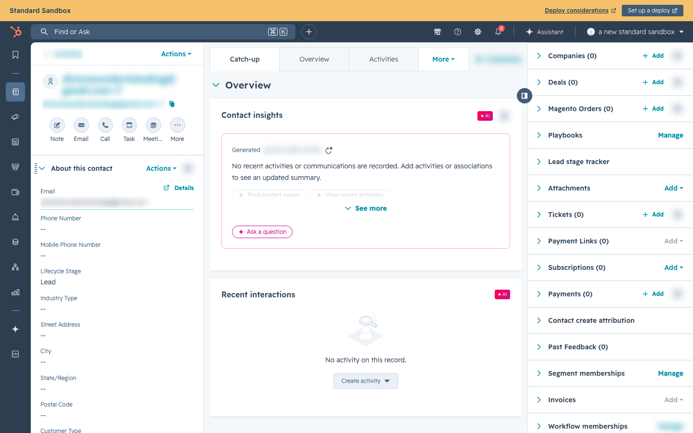
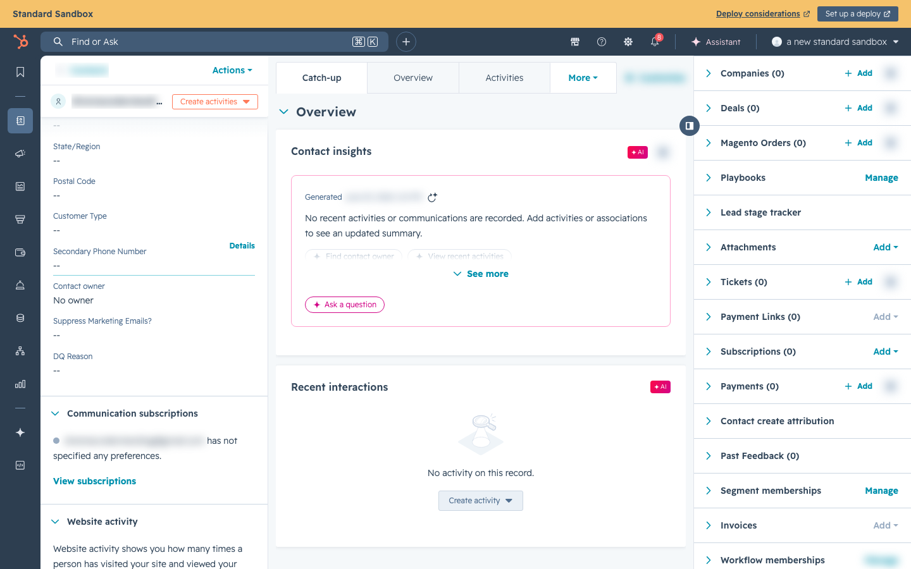

# Credit Terms Management

## Overview

Credit Terms (NET30, labeled "Purchase Order" at checkout before July 2026) allow approved B2B customers to place orders without paying upfront. Approval, the credit limit, and the **revalidation window** are managed in the **SCW Commerce admin → Entitlements → Credit Terms** panel. Every change is audit-logged and mirrored one-way to the customer's HubSpot contact (`approved_for_credit_terms`, `credit_limit`) for reference.

> **Note:** This supersedes the older "set the property in HubSpot" workflow described further below. The HubSpot contact properties are now a **mirror** of the admin panel, not the source of truth. (Those lower sections predate the admin panel and are kept for historical context.)

***

## Where Credit Terms Live: the Company

Credit terms belong to a **company**, and a person reaches them by being a **member** of that company. There are two ways to become a member: the person's own email domain is registered to the company, or an administrator approves a guest link filed from the HubSpot contact card. Both grant the same thing. A plain HubSpot association grants nothing.

The company holds **one shared credit pool**. Every open purchase order from any member counts against the company's limit until the order is paid. A blank limit means uncapped. The revalidation window (18 months by default) is checked at order time along with the pool balance.

Company membership and the shared pool are managed at **Admin → Entitlements → Organizations**. New approvals are worked from **Admin → Requests → Credit Terms Requests**. See [Entitlement Request Workflows](entitlement-request-workflows.md) for the request and approval flow.

> **Grandfathered personal approvals.** Credit terms granted to an individual account before the company model still work exactly as they did, and are never re-decided. The HubSpot Storefront Account card labels which is which: **(personal)** for a grant on the contact's own account, **via `<company>`** for one that comes through a membership.

***

## Revalidation Window (Revalidate After)

Each approved customer carries a **Revalidate after** value (default 18 months), set in the admin **Credit Terms** panel. Their credit terms stay active for that many months counted from the **later** of:

* their most recent order, or
* the last time their credit-terms agreement was revalidated (they re-signed the agreement, or an admin pressed **Revalidate**).

A customer can use the **Credit Terms (NET30)** option at checkout (labeled "Purchase Order (NET30)" before July 2026) only when they are **Approved** _and_ that window has not expired. Once it expires, the Credit Terms option is hidden at checkout, rejected by the server if a request is submitted directly, and quote conversion to a credit-terms order is blocked. A customer with no orders and no revalidation date on record never expires while approved.

The Credit Terms table shows an **Active now / Inactive** badge per customer, plus the computed invalidation date and which event anchors it ("Last order ..." or "Re-signed ...").

**Reactivating an expired customer:** when a customer re-signs the Credit Terms Agreement, open **Admin → Entitlements → Credit Terms**, find the customer, and press **Revalidate** (the button appears on approved but inactive rows). This stamps a fresh revalidation date and reactivates them immediately, no new order required. Newly approving a customer (flipping them from not approved to Approved) stamps the revalidation date automatically.

> **Note:** The revalidation window is enforced entirely in SCW Commerce. The revalidation date is not mirrored to HubSpot (only the approval flag and credit limit are).

***

## API: Setting Credit Terms by Email (Automation / Make.com)

For automated flows (for example Make.com scenarios), two admin API endpoints set credit terms without needing the internal customer ID. Both authenticate with either an admin session or the `X-Admin-Api-Key` header, and both write through the same path as the admin panel: the change is audit logged and mirrored to the customer's HubSpot contact.

### Set one customer: `POST /api/admin/credit-terms/by-email`

Request body:

```json
{
  "email": "customer@example.com",
  "approved": true,
  "creditLimit": "50000",
  "revalidationMonths": 18,
  "note": "Approved via Make scenario"
}
```

* `email` and `approved` are required. `creditLimit`, `revalidationMonths`, and `note` are optional: when omitted, the customer's current values are preserved. Sending `creditLimit: null` (or an empty string) clears the limit.
* Response `200`: `{ "ok": true, "customerId": 123 }`
* Response `404`: `{ "error": "customer_not_found" }` (the email does not match a store customer)
* Response `400`: `{ "error": "validation_error", ... }` for a malformed body

### Mass set (bulk): `POST /api/admin/credit-terms/bulk`

Sets eligibility for up to **500 customers** in one call.

```json
{
  "items": [
    { "email": "a@example.com", "approved": true, "creditLimit": "25000" },
    { "email": "b@example.com", "approved": false }
  ],
  "note": "Quarterly eligibility refresh"
}
```

* Each item takes the same fields as the by-email endpoint (minus `note`, which applies to the whole batch).
* Items are processed independently: a customer that is not found (or fails) never blocks the rest of the batch.
* Duplicate emails in one request are rejected with `400` and a `duplicates` list.
* Response `200`: `{ "ok": true, "updated": 42, "notFound": ["x@example.com"], "results": [{ "email": "...", "status": "updated" | "not_found" | "error" }] }`

> **Note:** Customers must already exist in SCW Commerce. A contact that exists only in HubSpot and was never a store customer has no account to attach credit terms to, so the endpoint returns `customer_not_found` for them. (Admins can create the account first with the **Create ecommerce account** button on the HubSpot contact card — see [Customer Accounts](customer-accounts.md).)

***

## Credit Terms Record — Agreement Copy, Notes, Xero Link

Each row in **Admin → Entitlements → Credit Terms** has a **Record** button that opens the customer's credit-terms record. It holds three things (all optional):

| Field | What it's for |
| --- | --- |
| **Signed agreement (PDF)** | Upload the customer's signed Credit Terms Agreement so the paperwork lives with the approval. The Record button shows a green dot when an agreement is on file, and the stored file opens via a short-lived secure link. Uploading a new file replaces the current one. |
| **Notes** | Free-text internal notes about the account (context for approvals, collection history, special arrangements). Never shown to the customer. |
| **Xero Contact ID** | The customer's Xero contact identifier, so finance can jump from the SCW record to the matching Xero contact. This is a reference field only — it does not connect to Xero. |

Saving the Record dialog changes **only** these reference fields. It never touches the customer's approval, credit limit, or revalidation window, and it does not generate audit events or sync anything to HubSpot.

***

## Approving a Customer for Credit Terms (Legacy HubSpot workflow)

> **⚠️ Deprecated, historical reference only.** Credit terms are now approved in the **SCW Commerce admin → Entitlements → Credit Terms** panel (see **Overview** and **Validity Window** above). The HubSpot-entry steps below predate the admin panel and are kept only for historical context. **Do not follow them:** the "2 AM UTC reconciliation cron" and the `GET /api/cron/sync-credit-terms` endpoint mentioned in Step 3 **no longer exist**, and setting the HubSpot property by hand does **not** change a customer's approval. Credit terms now flow one-way **SCW → HubSpot**; the inbound HubSpot webhook ignores credit-terms changes.

### Step 1: Open the Contact in HubSpot

Navigate to the customer's Contact record in HubSpot.



_Navigate to a Contact record to find and update credit-terms properties._

### Step 2: Set the Properties

In the **"About this Contact"** section, find and set:

| Property                      | Value         | Description                                                                                                             |
| ----------------------------- | ------------- | ----------------------------------------------------------------------------------------------------------------------- |
| **Approved for Credit Terms** | Yes           | Enables the Purchase Order payment option at checkout                                                                   |
| **Credit Limit**              | e.g., `50000` | Maximum credit amount in USD. SCW Commerce enforces this for Purchase Order creation; HubSpot mirrors it for reference. |



_The "About this Contact" panel — scroll down to find Approved for Credit Terms and Credit Limit in the custom SCW properties section._

If you don't see these properties in the default view:

1. Click **"View all properties"** on the Contact
2. Search for "approved" or "credit"
3. Set the values
4. Optionally, click **"Actions" → "Customize properties"** to pin them to the default view

### Step 3: Save and Verify

The storefront updates from the HubSpot contact webhook within a few seconds when the webhook subscription is active. A daily **2 AM UTC** cron also reconciles the same fields in case a webhook was missed. After the update:

* The customer's storefront account is updated with the approval flag
* Next time they go to checkout, the **Purchase Order (NET30)** option appears

> **Note:** The checkout page fetches the customer's approval status fresh from `/api/customers/{id}` on every page load. A customer who was approved _after_ their last login will see the Purchase Order option on their next checkout page load — they do **not** need to log out and back in.

To trigger an immediate sync (for testing or urgent approvals), an admin can call:

```
GET https://hubspot.getscw.com/api/cron/sync-credit-terms
```

with the cron authorization header.

***

## Revoking Credit Terms (Legacy HubSpot workflow)

> **⚠️ Deprecated, historical reference only.** Revoke credit terms in the **SCW Commerce admin → Entitlements → Credit Terms** panel by toggling the customer's approval off. The HubSpot steps below are retired; editing the HubSpot property does **not** sync back to SCW.

To remove a customer's ability to use Purchase Orders:

1. Open their Contact in HubSpot
2. Set **"Approved for Credit Terms"** to **No**
3. Wait for the webhook update, or trigger the reconciliation sync manually if needed
4. The Purchase Order option will no longer appear at their checkout

> **Note:** Revoking credit terms does not affect existing orders. Any PO orders already placed will remain in their current status.

***

## What the Customer Sees

### Approved Customer (4 payment methods)

> \[SCREENSHOT: Checkout showing Credit Card, Credit Terms (NET30), Check / Money Order, ACH / Wire Transfer]

The approved customer sees four payment methods: **Credit Card**, **Credit Terms (NET30)** (labeled "Purchase Order (NET30)" before July 2026), **Check / Money Order**, and **ACH / Wire Transfer**. The Credit Terms option shows the subtitle "Subject to credit approval."

### Non-Approved Customer (3 payment methods)

> \[SCREENSHOT: The checkout payment method section showing only three options: Credit Card, Check / Money Order, ACH / Wire Transfer — no Credit Terms. — images/checkout-payment-methods-not-approved.png]

The Credit Terms option is completely hidden — the customer has no way to select it. The remaining three methods (**Credit Card**, **Check / Money Order**, **ACH / Wire Transfer**) are always available.

***

## How the Sync Works (Technical)

Credit terms are **admin-owned in SCW Commerce** (the admin panel is the source of truth). When an admin saves a credit-terms change, the system:

1. Writes the new values (`approved_for_credit_terms`, `credit_limit`, revalidation months, and when applicable a fresh revalidation date) to the local customer row inside a transaction.
2. Appends an audit event to `credit_terms_events`.
3. Enqueues a `customer.credit_terms_changed` row in the HubSpot outbox (part of the same transaction — failure rolls back the edit).
4. Kicks off async delivery of that outbox row: `approved_for_credit_terms` + `credit_limit` are pushed to the matching HubSpot Contact via `PATCH /crm/v3/objects/contacts/{id}`.

The sync is one-way: **Storefront → HubSpot**. The HubSpot contact values are a mirror for reference only. Changes made directly in HubSpot are **not** synced back to SCW (the webhook handler does not subscribe to or process `approved_for_credit_terms` changes from HubSpot).

### Sync Summary

| Direction            | What Syncs                                  | Frequency                                        |
| -------------------- | ------------------------------------------- | ------------------------------------------------ |
| Storefront → HubSpot | `approved_for_credit_terms`, `credit_limit` | Real-time via HubSpot outbox on every admin save |
| HubSpot → Storefront | Nothing (one-way sync)                      | —                                                |

***

## Credit Limit Enforcement

The credit limit is enforced by SCW Commerce for every new Purchase Order order, including checkout and admin/automation-created orders.

When a Purchase Order order is created, the order service:

* Re-checks that the customer has active credit terms
* Locks the customer row so concurrent PO orders cannot race past the same limit
* Sums open PO exposure for that customer
* Rejects the order when `open exposure + this order total` exceeds the customer's credit limit

Open exposure is calculated per Purchase Order order (excluding cancelled orders) as the order total minus what has been settled through paid or refunded invoices, never below zero. A partial invoice only clears the portion it covers — a paid deposit invoice does not release the rest of the order's credit. Shipped-but-unpaid NET30 orders still consume credit until their invoices are paid.

If the limit is exceeded, the order is not created and checkout shows: _"Purchase Order total exceeds the approved credit limit. Please contact your account manager."_ Support should review the customer's open PO balance, paid/refunded invoice state, and configured credit limit before retrying, increasing the limit, or directing the customer to Credit Card, Check, or ACH/Wire.

Leaving **Credit Limit** blank means the customer is approved for uncapped credit terms while their approval is active.

When the buyer is billing a **company** rather than a personal approval, the same rules run against the company's shared pool: open purchase orders from every member of that company count together against the company limit, and the company's revalidation window applies. The pool balance is visible on the company page at **Admin → Entitlements → Organizations**.

When existing per-customer approvals were converted into a company, the company took the **highest** credit limit among them, and any uncapped account overrode the ceiling entirely.

***

## Tax Exemptions

### Overview

Tax exemptions allow qualifying B2B customers to check out without paying sales tax in states where they hold a valid exemption. Common exempt customer types include wholesale/reseller businesses, government entities, and non-profit organizations.

Tax exemptions are **not** managed through HubSpot. They are managed through the **admin review queue inside SCW Commerce**. A customer (or an admin) submits an exemption request with supporting documents, an admin reviews and approves it in the admin panel, and approval immediately writes the customer record and pushes the exemption to TaxJar, which then applies $0 tax automatically during checkout.

***

### How a Tax Exemption Gets Set Up

There are three ways a customer becomes exempt:

**1. Customer-submitted request (self-service)**

1. A logged-in customer submits their exemption documents from the account portal (`POST /api/account/tax-exemption`).
2. The request lands in the admin review queue.
3. An admin opens **Admin → Tax Exemption Requests** (`/admin/tax-exemption-requests`), reviews the certificate, and approves or rejects it.
4. On approval (`POST /api/admin/tax-exemption-requests/[id]/approve`), the system calls `applyExemption()`, which writes the customer's exemption type and exempt regions to the database and pushes the record to TaxJar.

**2. Admin-created exemption**

An admin can create or edit an exemption directly from **Admin → Tax Exemptions** (`/admin/tax-exemptions`) without waiting for a customer request — for example when migrating a known wholesale account. This runs through the same `applyExemption()` path.

**3. Company membership**

A tax exemption approved for a company applies to every member of that company. Membership comes from an email domain match or from an administrator-approved guest link, and either one carries the exemption. This is what covers large accounts (a school district or a government agency) where everyone buying with an `@org.gov` address should be exempt, and it is also what covers the buyer on a personal address whom an admin has linked to the company.

Companies and their members are managed at **Admin → Entitlements → Organizations**.

For every path, the exemption value is one of:

* `non_exempt` — Default, pays sales tax (no certificate required)
* `wholesale` — Resellers buying for resale (needs a resale certificate on file)
* `government` — Gov agencies, public schools, public universities (needs an exemption cert / PO)
* `other` — 501(c)(3) nonprofits, churches, diplomats, qualifying manufacturers (needs the specific exemption cert)

The **exempt regions** are a comma-separated list of state codes (e.g. `CA,NY,TX`):

* **Leave exempt regions EMPTY** to exempt the customer in **every nexus state** (blanket exemption).
* **List specific states** for partial exemption (e.g., a wholesaler with a KY cert but not NC → set `KY` → they'll still pay NC tax).

> **Warning:** Never approve an exempt type without a valid exemption certificate on file. If the customer is audited, SCW pays the unpaid tax.


_The SCW admin Tax Exemption Requests review queue showing a pending request with the customer's certificate, exemption type, and exempt regions_

***

### Exemption Provenance & Audit Trail

Every customer's exemption carries a **source** so an admin can see how it was set:

| `exemption_source` | Meaning                                                                             |
| ------------------ | ----------------------------------------------------------------------------------- |
| `admin`            | Set by an admin via the review queue or the Tax Exemptions admin page               |
| `org`              | Applied by a company exemption reaching this account through its email domain       |
| `hubspot_legacy`   | Migrated from the previous Magento/HubSpot data — the default for pre-existing rows |

Alongside the source, the customer record stores who validated it and when (`exemption_validated_by`, `exemption_validated_at`), a reference to the document on file (`exemption_document_reference`), and the last update time (`exemption_updated_at`). Every change is also written to an **append-only `tax_exemption_events` audit table**, so the full history of who changed an exemption and when is preserved.

***

### How the Sync Works

The exemption write path is **SCW Admin → SCW Database → TaxJar** — HubSpot is not involved.

1. An admin approves a request (or a company exemption reaches the account), calling `applyExemption()`.
2. `applyExemption()` is **idempotent** — if the exemption type and regions are unchanged it does nothing (no DB write, no audit row, no TaxJar call).
3. When the exemption changed, it pushes the customer record to the **TaxJar Customer API** (`POST/PUT /v2/customers/{id}`) — this is what makes TaxJar apply $0 tax during calculation — and stores the returned TaxJar customer id on `customers.taxjar_customer_id`. The TaxJar push runs whenever the new type is not `non_exempt`, or whenever a TaxJar record already exists for the customer (so revocations are pushed too).
4. It writes `customers.exemption_type` / `customers.exempt_regions` (plus provenance fields) and appends a row to `tax_exemption_events`.

Changes take effect **immediately** on approval — there is no daily reconciliation cron for tax exemptions (the 2 AM UTC cron reconciles credit terms only).

### Applying Changes Immediately

Tax exemption changes apply the moment an admin approves the request in the admin panel — there is no separate sync step or cron endpoint to trigger. To re-push a customer to TaxJar (for example after a TaxJar environment switch), an admin re-runs the approval / save flow for that customer.

### What the Customer Sees

* At checkout, if the customer is exempt in the shipping destination state, sales tax shows as **$0**
* No special action is required from the customer — the exemption applies automatically
* If the customer is not exempt in the shipping state, normal tax rates apply

***

### Exemption Types

| Type         | Description                                           |
| ------------ | ----------------------------------------------------- |
| `wholesale`  | Wholesale or reseller customers purchasing for resale |
| `government` | Federal, state, or local government entities          |
| `other`      | Non-profits or other qualifying exempt organizations  |

***

### Important Notes

* **Exemptions are state-specific by default.** If you list specific states in the customer's exempt regions, the customer is exempt **only** in those states. To exempt a customer in **every** SCW nexus state, leave the exempt regions **empty**.
* **Changes apply immediately on approval.** Approving an exemption request writes the database and pushes to TaxJar in the same operation — there is no waiting period and no daily reconciliation cron for tax exemptions.
* **Exemptions are managed in SCW Commerce, not HubSpot.** There are no `tax_exemption_type` or `tax_exempt_regions` properties in HubSpot, and no webhook or cron that reads exemptions from HubSpot. All exemption changes go through the admin review queue, or reach an account through its company membership.
* **Revoking an exemption** is done in the SCW admin panel — an admin sets the customer's exemption type back to `non_exempt` through the **Tax Exemption Requests** or **Tax Exemptions** admin UI. Because a TaxJar record already exists, the revocation is pushed to TaxJar too.

***

### Troubleshooting — Tax Still Charged When Customer Is Marked Exempt

If a quote or order is still charging tax for a customer you set as exempt, work through these in order:

1. **Is the exempt region the same as the ship-to state?**
   * A customer exempt only in TN (exempt regions = `TN`) will still pay IL tax on an IL order. This is correct behavior.
   * Fix: clear the restrictive state(s) for a blanket exemption, or add the ship-to state to the customer's exempt regions.
2. **Has the exemption actually been approved?**
   *   Check `customers.exemption_type` in the SCW Commerce database by email:

       ```sql
       SELECT id, email, exemption_type, exempt_regions, taxjar_customer_id, exemption_source
       FROM customers WHERE email = '<customer-email>';
       ```
   * If `exemption_type` is still `non_exempt` → the request was never approved. Approve it in **Admin → Tax Exemption Requests**.
   * If `taxjar_customer_id` is empty → the TaxJar customer record was never created. The record is created during admin approval (`applyExemption → syncCustomerExemption`), and only when the exemption is non-`non_exempt`. Re-run the approval / save flow for the customer to force creation.
3. **Are you on staging with sandbox TaxJar?**
   * Sandbox and production TaxJar have **separate customer records**. A customer synced to prod TaxJar does **not** exist in sandbox TaxJar. Re-running the admin approval flow creates/updates whichever environment staging is currently pointed at.
4. **Is the customer covered by a company exemption?**
   * Open the company at **Admin → Entitlements → Organizations** and confirm three things: the company holds an exemption, its exempt regions include the ship-to state, and this customer appears in the member list.
   * If they are missing from the member list, their email domain is not registered to the company and no guest link has been approved for them. A HubSpot association on its own grants nothing. File **Link Guest Email to Company** from the contact card and approve it under **Requests → Membership Requests**.

***

### Complete System Flow

Here is the full end-to-end flow of how tax exemptions work across all three systems:

Tax exemption system flow An admin approves the exemption, SCW stores it, TaxJar applies it at checkoutApplied immediately on approvalExemption Requestcustomer-submitted, admin-created, or matched to an exempt org SCW Admin Reviewadmin approves via /admin/tax-exemption-requests → applyExemption() SCW Databasecustomers.exemption\_type, exempt\_regions, exemption\_source, taxjar\_customer\_id + tax\_exemption\_events audit row TaxJar Customer APIPOST/PUT /v2/customers/{id} Tax CalculationPOST /v2/taxes returns amount\_to\_collect: 0.00 when exemptEmpty exempt regions means exempt in all nexus states; populated regions are synced as state-specific TaxJar exemptions. HubSpot is not in the tax-exemption data path.

***

### How Tax Calculation Works at Checkout

When a customer reaches checkout and enters a shipping address, the system:

1. **Checks nexus** — Does SCW have a sales tax obligation in that state? SCW has nexus in 29 states. If no nexus, tax is always $0 (no API call needed).
2. **Builds the request** — Sends to TaxJar:
   * **From address:** SCW warehouse in Asheville, NC
   * **To address:** Customer's shipping address
   * **Line items:** Each product with quantity, price, and product tax code
   * **Shipping amount:** After discounts
   * **Customer ID:** Links to the customer's TaxJar exemption record
3. **TaxJar processes** — For each line item, TaxJar:
   * Looks up the customer's exemption type and exempt regions
   * Checks if the product tax code has state-specific rules
   * Calculates tax by jurisdiction (state, county, city, special district)
   * Returns $0 for exempt items/states
4. **Tax is displayed** — The checkout shows the total tax. Exempt customers see $0 in their exempt states.

***

### Product Tax Codes

Most SCW products are standard taxable goods. However, some product types are taxed differently by state:

| Product Type                         | Tax Code | Examples                                        | Tax Treatment                                            |
| ------------------------------------ | -------- | ----------------------------------------------- | -------------------------------------------------------- |
| **Hardware** (cameras, NVRs, cables) | Default  | All cameras, recorders, accessories             | Standard sales tax in all nexus states                   |
| **SaaS / Software Licensing**        | `30070`  | SCW AI Licenses, OpenPath Licenses, VSAAS Cloud | Some states exempt software; others tax at reduced rates |
| **Installation Services**            | `10040`  | (Not currently sold online)                     | Service tax rules vary by state                          |

Product tax codes are automatically mapped from the product's `tax_class_id` field. No manual configuration is needed — the system handles this at checkout.

***

### SCW Nexus States (29 states)

SCW is registered to collect sales tax in these states:

```
AK  AZ  CA  CO  FL  GA  HI  ID  IL  IN
KS  KY  LA  MA  MD  MI  MO  NC  ND  NJ
OH  OK  PA  SC  TN  TX  VA  WA  WI
```

Orders shipping to states **not** on this list are never taxed, regardless of exemption status.

***

### Current Exempt Customer Data

The system was seeded with exempt customers migrated from the previous Magento 2 platform. These migrated rows carry `exemption_source = 'hubspot_legacy'`, and each has its exempt regions (specific US states) already configured. New exemptions are managed through the SCW admin review queue going forward (`exemption_source = 'admin'`) or reach an account from its company through a registered email domain (`exemption_source = 'org'`).

> To get current counts by exemption type, query the production database:
>
> ```sql
> SELECT exemption_type, COUNT(*)
> FROM customers
> WHERE exemption_type <> 'non_exempt'
> GROUP BY exemption_type;
> ```

***

### Troubleshooting

**Customer says they should be tax-exempt but are seeing tax:**

1. Check `customers.exemption_type` in the SCW Commerce database — is it set to something other than `non_exempt`?
2. Check `customers.exempt_regions` — does it include the shipping state (or is it empty for a blanket exemption)?
3. Confirm the admin has **approved** the customer's exemption request in **Admin → Tax Exemption Requests**. There are no HubSpot webhook subscriptions for tax exemptions and no daily tax-exemption cron — approval is what applies the exemption.
4. If the exemption should come from their company, open the company at **Admin → Entitlements → Organizations** and confirm the customer is in its member list. A HubSpot association on its own grants nothing; membership comes from a registered email domain or an approved guest link.

**Tax is $0 for a customer who shouldn't be exempt:**

1. Check `customers.exemption_type` in the SCW Commerce database — make sure it is `non_exempt`. If it is exempt, revoke it in the **Tax Exemptions** admin UI.
2. Verify the shipping state is in SCW's nexus list (non-nexus states always show $0).

**How to check a customer's exemption status in the database:** An admin can verify by checking the customer's record in the SCW Commerce database for `exemption_type` and `exempt_regions` fields.
