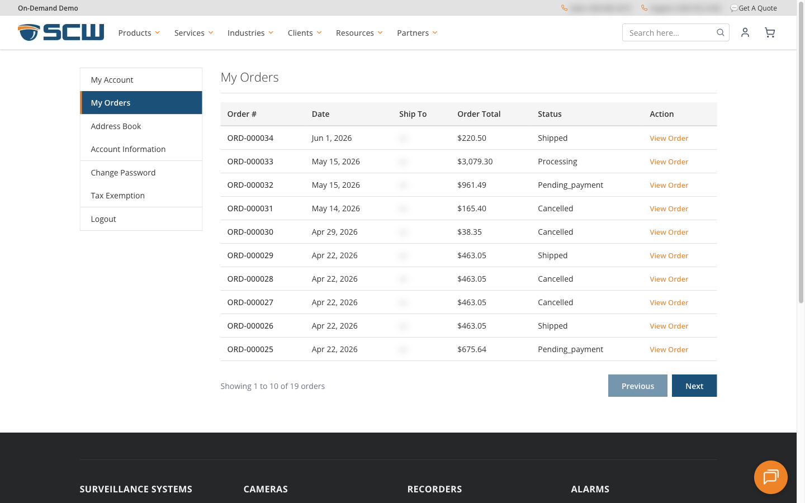
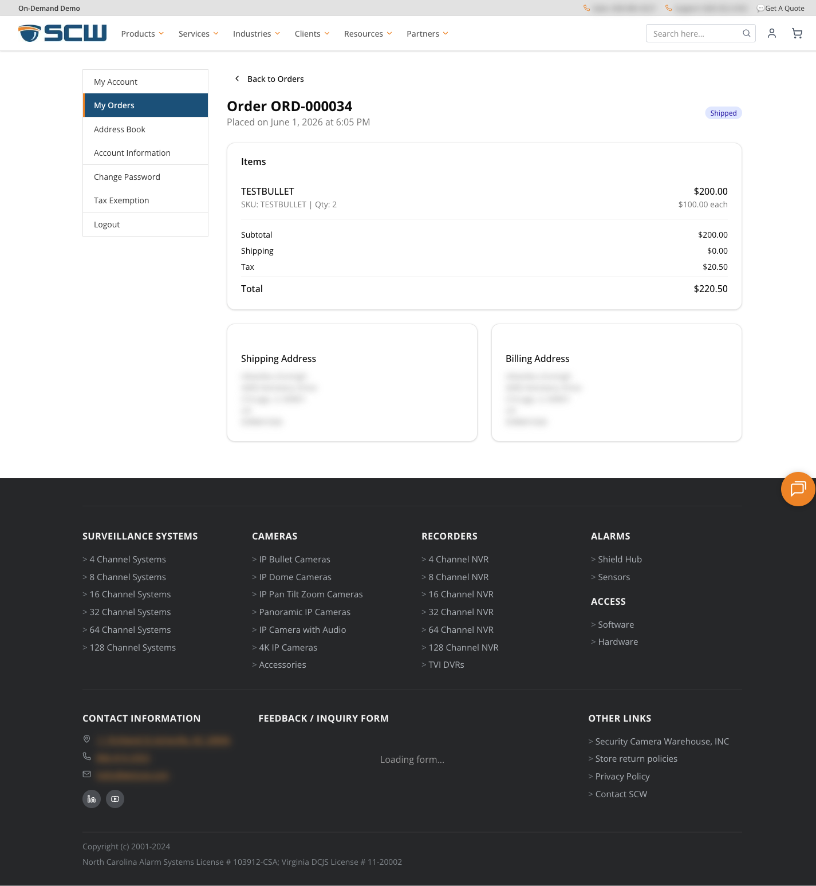

# Customer Account Flows

## Overview

SCW Commerce uses **AWS Cognito** for authentication and a local **PostgreSQL** database for customer profiles. Customers migrated from Magento go through a one-time password reset flow.

---

## Customer Login

### New Customers (created on SCW Commerce)

1. Customer clicks **Sign In** or navigates to `/login`
2. Enters email and password
3. Cognito authenticates → NextAuth creates a session (30-day max)
4. Customer is redirected to their account page

> [SCREENSHOT: The full /login page showing the two-column layout (Registered Customers with email/password form and Forgot Password link; New Customers with Create an Account button) — images/customer-accounts-login-page.png]

### Migrated Customers (from Magento)

Customers migrated from Magento have a special first-login flow:

1. Customer enters their email and password on the login page
2. The system detects their Cognito status is `FORCE_CHANGE_PASSWORD` (migrated account) — at this point a password reset code is **automatically sent to their email**
3. Instead of an error, the customer sees an info message: *"Your account has been migrated to our new site. We've sent a password reset code to your email. Please check your inbox and use the link below to set a new password."* with a **"Reset Your Password →"** link
4. Customer clicks the link → taken to `/reset-password?email=<their-email>&migrated=true` (the reset form is pre-filled with their email)
5. The code was already sent in step 2, so the customer does not need to request a new one — they enter the code from their inbox and choose a new password
6. After reset, they can log in normally going forward

> [SCREENSHOT: The login page after a migrated-user login attempt, showing the info-box message 'Your account has been migrated to our new site...' and the Reset Your Password link in place of an error — images/customer-accounts-login-migrated-message.png]

> [SCREENSHOT: Reset password page]

---

## Customer Registration

### Self-Registration (customer-initiated)

1. Customer clicks **Create Account** or navigates to `/register`
2. Fills in: First Name, Last Name, Email, Password
3. The account is created in **Cognito only** (the local database record is created later, on first sign-in)
4. Cognito emails a 6-digit verification code. The form moves to a **verify** step where the customer enters that code to confirm their email
5. After verification, the customer sees *"Email verified! You can now sign in."* — they are **not** logged in automatically and must sign in on the `/login` page

> [SCREENSHOT: The /register page showing the Create New Customer Account form with Personal Information and Sign-in Information fieldsets — images/customer-accounts-register-page.png]

### Auto-Provisioned by Sales Rep (via HubSpot webhook)

When a sales rep creates a new Contact in HubSpot, the customer account can be **automatically created** in SCW Commerce within seconds — **but only when auto-provisioning is turned on**.

> **Auto-provisioning is gated OFF by default.** It runs only when `HUBSPOT_WEBHOOK_AUTOPROVISION=true` is set in the environment. This guard exists so bulk/migration contact creation never silently provisions accounts. Without the flag, a brand-new HubSpot contact does **not** get an SCW account from the webhook (existing SCW customers are still linked). Set the flag at go-live to enable this flow for real sales-created contacts.

When the flag is enabled:

1. Rep creates a Contact in HubSpot (enters email, name, company, etc.)
2. HubSpot fires a webhook to SCW Commerce (`POST /api/webhooks/hubspot/contact`)
3. SCW Commerce:
   - Fetches the full contact details from HubSpot API
   - Creates a Cognito login account (with temporary password)
   - Creates a customer record in the local database, linked to the HubSpot Contact
   - Sends a welcome email: **"Your SCW Account Has Been Created"** with a "Set Your Password" button — **only if `HUBSPOT_WEBHOOK_WELCOME_EMAIL=true` is also set** (a separate flag, also off by default, so a migration backfill doesn't mass-email stale Magento addresses). When suppressed, the account is still created but no email goes out.
4. The customer can set their password whenever they want — no urgency
5. The sales rep can immediately use Payment Links or the Quote Builder for this customer

**What the customer receives (when the welcome email is enabled):**
- A welcome email explaining their account was created by their sales representative
- A link to set their password at `/reset-password?email=<their-email>&welcome=true`

**What the rep can do immediately:**
- Build a quote and generate a payment link for the customer
- Check out on behalf of the customer (the order is assigned to the customer's record)

### Invitation by Sales Rep (manual invite link)

Separate from the webhook auto-provision path, the sales team can manually invite a HubSpot contact to register:

1. Sales creates an invitation → the system generates a secure token (valid for 7 days), stored in the database
2. An email goes out with a registration link: `/register?token=xxx`
3. The customer clicks the link → the token is validated and the registration form is shown
4. The customer sets a password → the invitation is accepted, creating a Cognito user **and** a local customer record

This path always requires the customer to set their own password through the tokenized link; it does not depend on the `HUBSPOT_WEBHOOK_AUTOPROVISION` flag.

### Property Sync (real-time via webhook)

When a rep updates a Contact in HubSpot, the HubSpot private app (**"Frantic-Actor / claude code key"**, app id `35018267` on portal `51265320`) fires a signed webhook at **`POST https://hubspot.getscw.com/api/webhooks/hubspot/contact`**. SCW Commerce verifies the signature, groups the events by HubSpot object ID (so a contact's creation is processed before its property changes), and updates the matching `customers` row. (Note: there is no event-ID deduplication — events are ordered, not de-duplicated.)

| HubSpot Property | SCW Commerce Field | Webhook Subscribed? | Handler? |
|---|---|---|---|
| `email` | `customers.email` | ✅ | ✅ |
| `firstname` | `customers.firstName` | ✅ | ✅ |
| `lastname` | `customers.lastName` | ✅ | ✅ |
| `company` | `customers.company` | ❌ not subscribed — add in HubSpot if needed | ✅ |
| `phone` | `customers.phone` | ❌ not subscribed — add in HubSpot if needed | ✅ |
| `approved_for_credit_terms` | `customers.approvedForCreditTerms` | ✅ | ✅ |
| `credit_limit` | `customers.creditLimit` | ✅ | ✅ |
| `tax_exemption_type` | — (intended `customers.exemptionType`) | ❌ no such Contact property in HubSpot | ❌ **not handled** — falls through to a `webhook_unhandled_property` log |
| `tax_exempt_regions` | — (intended `customers.exemptRegions`) | ❌ no such Contact property in HubSpot | ❌ **not handled** — falls through to a `webhook_unhandled_property` log |

The webhook handler only maps `email`, `firstname`, `lastname`, `company`, `phone`, `approved_for_credit_terms`, and `credit_limit`. `tax_exemption_type` and `tax_exempt_regions` do **not** exist as HubSpot Contact properties and have no handler case — any unmapped property change is logged as `webhook_unhandled_property` and ignored.

Properties not in the list above **are not synced**. Daily reconciliation covers **credit terms only** (`approved_for_credit_terms` and `credit_limit`); there is **no** daily reconciliation job for tax-exemption fields. Profile fields flow only through the webhook. If a sales rep edits something outside this list, it stays in HubSpot.

### Viewing & Editing Webhook Subscriptions

1. HubSpot → gear icon (Settings) → **Integrations → Private Apps**
2. Open the **"Frantic-Actor / claude code key"** app
3. **Webhooks** tab → scroll to **Event subscriptions → Contact**
4. To add a new property subscription: **Create subscription** → Object type: *Contact* → Event: *Property change* → pick the property → Save, then **Activate** at the top.

Direct link (sandbox portal): `https://app.hubspot.com/private-apps/51265320/35018267/webhooks`

> **Error counts shown in the HubSpot webhooks tab** (e.g., 19/28 errors on `email` changes) indicate events where SCW Commerce returned a non-200. Common causes: signature clock drift, timeouts, or the matching customer row not existing yet. To triage, run `pm2 logs scw-app` on the server (or open Sentry) and look for `event=webhook_contact_error` lines. The app logs to stdout via the pino logger — there is no `/logs/api.log` file.

### Contact Deletion

When a Contact is deleted in HubSpot, the customer account is **NOT deleted** (they may have order history). The HubSpot link is removed (`hubspotContactId` set to null).

### When Does the Customer Get a HubSpot Contact?

There are two paths:

**Path A (sales-initiated):** The rep creates the Contact in HubSpot first → webhook auto-creates the SCW account. The HubSpot Contact exists from the start.

**Path B (self-registration):** The customer registers on the website → a HubSpot Contact is created when they place an order and that order syncs to HubSpot. Contact resolution runs on **every** order sync (not just the first) and is idempotent — it looks the contact up by `hubspotContactId`, then by email, and only creates a new one if neither matches, so repeat orders never create duplicates. On each sync the system:
1. Checks if a HubSpot Contact already exists for this email
2. If not, creates one
3. Associates the Ecommerce Order with the Contact

---

## Password Reset

1. Customer clicks **Forgot Password?** on the login page
2. Enters their email
3. Cognito sends a verification code to the email
4. Customer enters the code and new password on `/reset-password`
5. Password updated — customer can log in with the new password

> [SCREENSHOT: Forgot password form]

---

## My Account Dashboard

After logging in, the customer can access their account at `/account`:

*The /account page for a logged-in customer showing the sidebar navigation (My Account, My Orders, Address Book, Account Information, Change Password, Tax Exemption) and the main content area*

### Account Sections

| Section | Path | What It Shows |
|---|---|---|
| **My Account** | `/account` | Overview with contact info and default addresses |
| **My Orders** | `/account/orders` | All orders with status, date, total |
| **Address Book** | `/account/addresses` | Saved shipping and billing addresses |
| **Account Information** | `/account/profile` | Edit name, phone, company (email is read-only — *"Email cannot be changed. Contact support if needed."*) |
| **Change Password** | `/account/change-password` | Update password via Cognito |
| **Tax Exemption** | `/account/tax-exemption` | View/manage tax-exemption status |

---

## Order History

The **My Orders** page shows all orders associated with the customer's account:

| Column | Description |
|---|---|
| **Order #** | Order number (e.g., `SCW-20260406-A1B2`) |
| **Date** | When the order was placed |
| **Ship To** | Shipping address (if available) |
| **Order Total** | Grand total |
| **Status** | Current status. The display only capitalizes the **first character** of the raw status, so the values a customer sees are: Pending, `Pending_payment` (with the underscore), Authorized, Paid, Processing, Shipped, Delivered, Cancelled |
| **Action** | "View Order" link to order detail page |

*The /account/orders page showing the My Orders table with columns Order #, Date, Ship To, Order Total, Status, Action and several orders in differing statuses*

### Order Detail Page

Click **View Order** to see:
- Full order summary (items, quantities, prices)
- Order totals (subtotal, shipping, tax, grand total)
- Shipping and billing addresses
- Order status
- Customer notes (if any)

> The customer-facing order detail page does **not** currently display the payment method or tracking/shipment information — those fields are not part of the order shape passed to this view.

*An order detail page at /account/orders/{orderNumber} showing the items table, totals, shipping address card, and billing address card*

### Which Orders Appear Here?

- Orders placed by the customer directly (credit card checkout)
- Orders placed by a sales rep on behalf of the customer (via payment link)
- Historical orders migrated from Magento (order numbers like `1068857454`)
- **Offline payment orders** (Check, Wire, PO) — these show with status "Pending_payment" until the admin invoices them

---

## Address Book

Customers can save multiple shipping and billing addresses:

1. Navigate to **Address Book** → `/account/addresses`
2. Click **Add New Address**
3. Fill in the address form
4. Select **Default Shipping** and/or **Default Billing** if desired
5. Save

Saved addresses are available:
- At checkout (as selectable cards instead of manual entry)
- When a sales rep checks out on behalf of the customer (addresses load automatically)

*The /account/addresses page showing saved shipping and billing address cards with Set as Default and Delete actions*

> [SCREENSHOT: Checkout showing saved address cards]

---

## Account Lifecycle — How Data Flows

### Path A: Sales-Initiated (most B2B customers)

<section class="modern-flow" aria-label="Sales-initiated customer account lifecycle">
  

    

      Path A
      Sales-created HubSpot contacts automatically become SCW customer accounts
    

    B2B default
  

  

    HubSpot Contact<small>Sales rep creates Contact</small>
    
    Auto-provision<small>Cognito user, local customer row, and welcome email</small>
    
    Quote link<small>Rep builds quote and sends payment link</small>
    
    Checkout + fulfillment<small>Order links to Contact; ShipEdge receives order if invoiced</small>
  

  
Auto-provisioning (and the welcome email) is gated OFF by default — it runs only when <code>HUBSPOT_WEBHOOK_AUTOPROVISION=true</code> (and <code>HUBSPOT_WEBHOOK_WELCOME_EMAIL=true</code>) is set. When sales updates credit terms in HubSpot, the webhook updates SCW instantly and the PO option appears at checkout for that customer.

</section>

### Path B: Self-Service (website registration)

<section class="modern-flow" aria-label="Self-service customer account lifecycle">
  

    

      Path B
      Self-service customers start local, then sync to HubSpot on first order
    

    Website
  

  

    Register<small>Customer registers on SCW Commerce</small>
    
    Local account<small>Cognito user and local customer profile are created</small>
    
    First order<small>HubSpot Contact is created or matched</small>
    
    Linked order<small>Ecommerce Order links to Contact and local customerId</small>
  

</section>
