# Purchase Order Terms, Tax Exemption, and Installer Partner Requests

## Overview

SCW Commerce gives customers, sales representatives, and administrators one review workflow for three business entitlements:

* Purchase order terms with NET30 checkout
* Tax exemption
* Trusted Installer access with Partner Pro pricing

All three belong to the **company**, not to a person. A person receives them by being a **member** of a company that holds them. Membership is therefore the fourth request family in the same queue system.

Every path creates a request first. A customer or sales representative can supply the information, but only an authorized SCW Commerce administrator can approve or reject it. Approval is the step that changes pricing, tax treatment, purchase order access, or company membership.

The same request record supports customer submissions, HubSpot submissions, and requests created directly by an administrator. This gives the team one queue, one decision history, one customer notification path, and one set of Make events for each program.

> Customer and company details are blurred in the screenshots in this guide.

## The Entity Model

Three rules cover the whole model.

**1. Entitlements are held by the company.** An organization record carries the tax exemption and its states, the credit approval with its shared limit and revalidation window, and the partner status.

**2. There are exactly two ways to become a member.**

| Path | How it happens | Who maintains it |
| --- | --- | --- |
| Email domain match | The person's own email domain is registered to the company. Membership is computed from the address and applies to existing and future accounts on that domain. | Automatic |
| Approved guest link | A sales representative files **Link Guest Email to Company** on the HubSpot contact card. An administrator approves it under **Requests > Membership Requests**. | Administrator decision, revoked with the HubSpot association |

An administrator can also add a member by hand on the company page in **Entitlements > Organizations**. That is the same grant, entered directly rather than through the queue.

**3. Both paths grant all three entitlements.** A member of a company gets the company's tax exemption, purchase orders against the company's shared credit pool, and its partner pricing. There is no partial membership and no per entitlement difference.

A **plain HubSpot association grants nothing**. A representative associating a contact with a company in the CRM is a sales note. It creates no membership and no entitlement on its own. It is still the thing an approved guest link rests on, which is why removing it takes the approval back.

### What the Member Sees

Membership is visible to the customer on two storefront surfaces, both resolved through the same functions the credit gate and tax computation use, so neither can promise something an order would be refused for:

* **My Companies** (`/account/organizations`) lists the companies the customer can buy for and what each one grants: exempt states, whether NET30 is available and why not when it is not, and partner pricing. See [Customer Accounts](customer-accounts.md).
* **"Who is this order for?"** at checkout is where the customer chooses between a personal order and a company order. A member of exactly one company has it preselected; a member of several picks explicitly. See [Checkout & Payment Methods](checkout-payment-methods.md).

### Removing Access

| Membership | Effect of removing the HubSpot association |
| --- | --- |
| Approved guest link | Revoked within seconds. The company page records an audit entry naming who lost the membership and which HubSpot company it rested on. |
| Email domain match | Unaffected. It is computed from the buyer's own address, so a CRM edit cannot take it back. |

Removing a domain matched person is a manual admin task: remove them on the company page in **Entitlements > Organizations**, and revoke any personal grants on their account.

### Grandfathered Personal Grants

Approvals made before the company model keep working exactly as they did. Personal NET30 terms, personal tax exemptions, and roughly 300 partner accounts on personal email addresses are all still honored and are never re-decided by this system.

The HubSpot Storefront Account card labels where each entitlement comes from, so a representative can tell the two apart at a glance:

* **(personal)** means the grant sits on the contact's own account and survives any company change.
* **via `<company>`** means the grant comes through a company membership and ends with that membership.

## What Was Shipped

| Area | Capability |
| --- | --- |
| SCW Admin | Four request queues (tax exemption, partner applications, credit terms, company membership) grouped above the entitlements they produce |
| Customer storefront | Native forms for tax exemption, purchase order terms, and Trusted Installer |
| HubSpot | A Storefront Account card showing current status, entitlement provenance, and the buttons that file each request |
| Review process | Document review, approval and rejection controls, customer notes, internal reasons, and decision emails |
| Organizations | A company view with members, domains, tax status, credit status, partner status, and the shared credit pool |
| Automation | Make events for request status changes |
| Reliability | Durable event delivery, retries, decision locking, and audit records for every entitlement change |

## End to End Flow

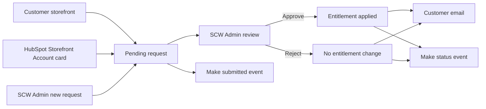

The request source does not change the approval rules. HubSpot and the storefront submit into the same SCW Commerce queues used by administrators.

## Start in SCW Admin

The left navigation separates work waiting for a decision from entitlements that are already active. The two groups sit next to each other and list their items in the same order, so the eye travels from a queue straight down to the grants it feeds.

### Requests

* **Exemption Requests** contains tax certificate submissions.
* **Partner Applications** contains Trusted Installer applications.
* **Credit Terms Requests** contains purchase order and NET30 applications.
* **Membership Requests** contains guest link requests filed from the HubSpot contact card.

Each queue has Pending, Approved, and Rejected tabs, a search field, status counts, and a button for creating a request on behalf of a customer.

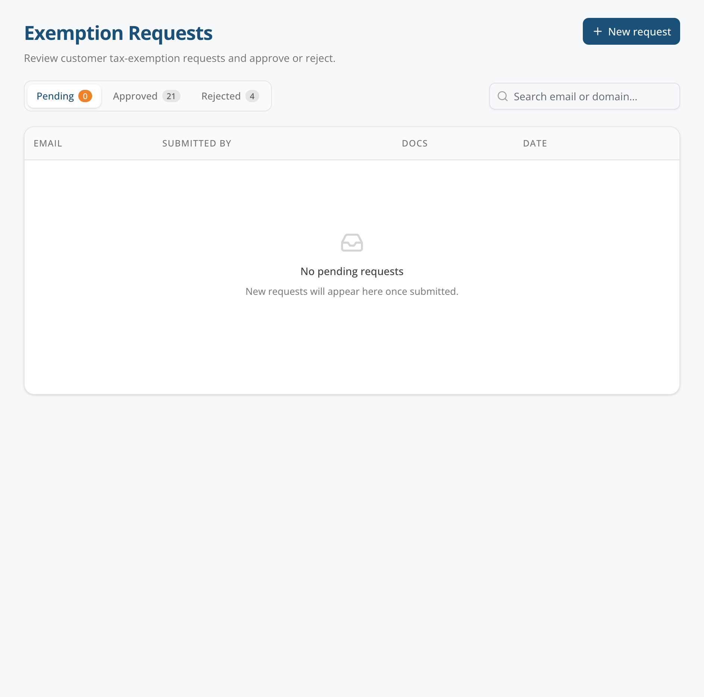

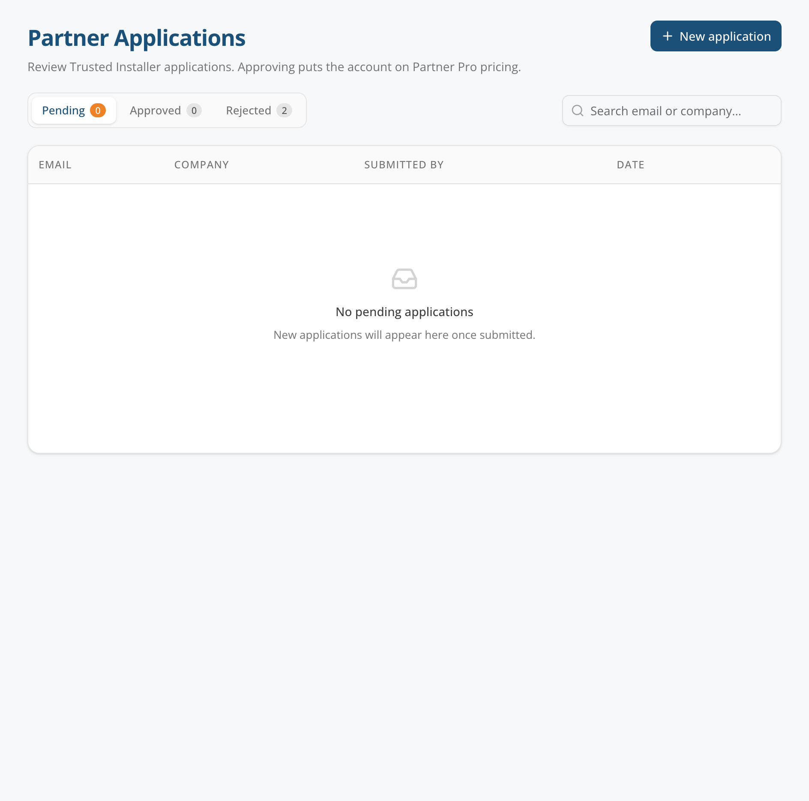

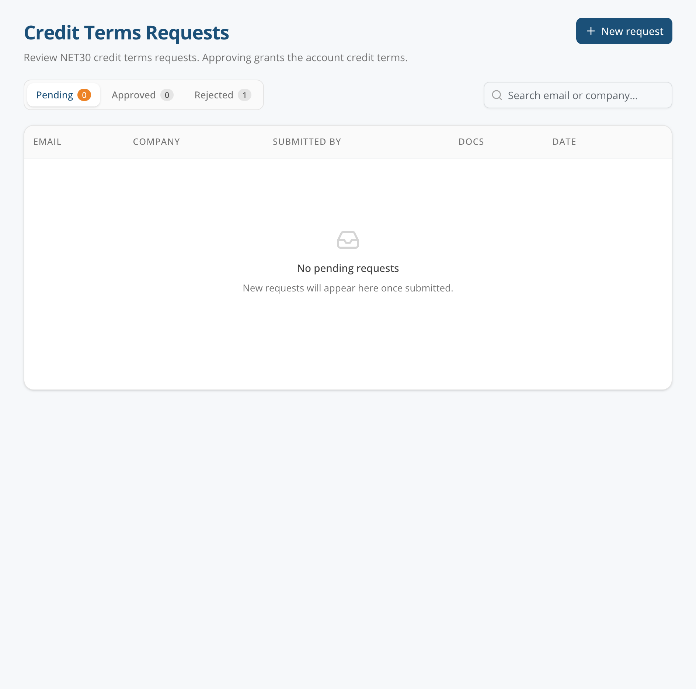

> \[SCREENSHOT: The Membership Requests queue with Pending, Approved, and Rejected tabs, the contact and company columns, and the Personal email marker on a free email applicant - images/entitlement-admin-membership-queue.png]

### Entitlements

* **Tax Exemptions** is the searchable list of active customer tax exemptions.
* **Organizations** is the company, membership, and shared credit view.
* **Credit Terms** is the active credit terms list and manual management surface.

### Integrations

* **Make Webhooks** controls the destination and enabled state for each outbound event.
* **Sync Observability** is used when the team needs to inspect delivery health or troubleshoot an external sync.

## Common Admin Review Process

Open a pending record from the appropriate request queue. The review page shows who the request is for, who submitted it, the answers supplied, supporting documents, and the current entitlement state.

The reviewer should follow this sequence:

1. Confirm that the request belongs to the correct customer and company.
2. Review all answers and supporting documents.
3. Add or replace documents when the customer or sales representative supplied a corrected copy. Documents can be attached at any time.
4. Review the exact approval scope shown in the confirmation dialog.
5. Approve with the program specific settings, or reject with an internal reason and an optional customer note.
6. Confirm that the request moved out of Pending and that the entitlement appears in the appropriate active view.

The internal rejection reason is retained for the SCW team. It is not included in the customer email. The optional customer note is the only text that reaches the applicant.

Every entitlement change is audited, whichever queue produced it.

## Company Membership

### Requesting a Guest Link

A person whose email domain does not match the company needs an approved guest link. The site manager on a personal address who genuinely buys for the church is the case this exists for.

Sales opens the contact in HubSpot and chooses **Link Guest Email to Company** on the Storefront Account card. The card explains that approval lets the contact use the company's purchase order terms, tax exemption, and partner profile.

* When the contact has one associated company, the card names it and shows where it stands.
* When the contact has several, the representative picks. Companies that already cover the contact, or that already have a request open, are listed but not offered.
* The button disappears once every associated company already covers the contact, because the request could then only be refused.

An administrator can also add a member directly on the company page in **Entitlements > Organizations**.

### Admin Review and Approval

The membership request detail page names the contact, the company, the submitter, and any note. A free email applicant is marked **Personal email** in both the queue and the detail page, so the reviewer knows there is no company domain that could link the account.

Approval attaches the membership, writes the company audit rows, and marks the request approved in one transaction, so a request can never read Approved over a customer who is not attached. When the company already holds partner status, the new member is moved onto Partner Pro pricing immediately after.

Rejection changes nothing about the customer or the company.

### Revocation

An approved guest link rests on the HubSpot association that created it. When a representative removes the contact from the company in HubSpot, the membership is revoked within seconds and the company page records the audit entry. Domain matched and admin added memberships are never touched by a CRM edit.

## Tax Exemption

### Admin Review and Approval

The tax exemption detail page contains the certificate set, requested hints, submitter, and outcome. Administrators can add documents while a request is pending or approved. A rejected request is closed and its documents are locked.

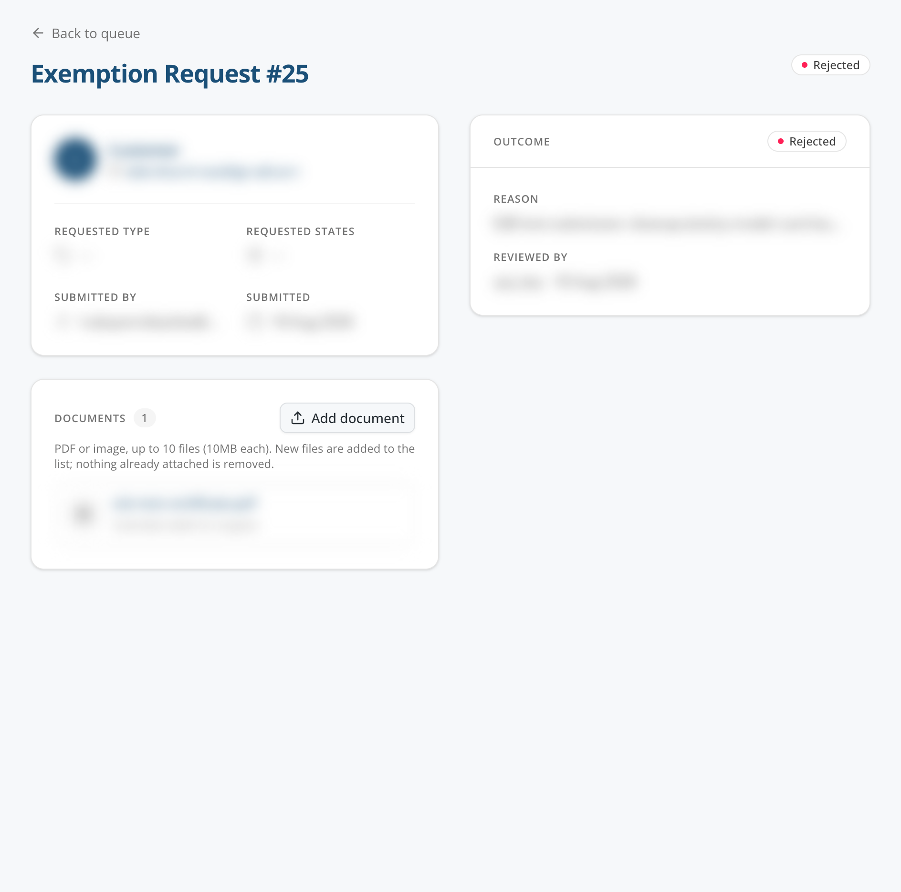

To approve a tax exemption, the administrator selects:

* Exemption type: Wholesale, Government, or Other
* One or more exempt states
* Certificate expiry date, when one is available

At least one supporting document and one exempt state are required for approval. SCW Commerce applies the exemption before it closes the request. If the TaxJar update fails, the request is not marked approved and no success email is sent.

For a company email domain, approval creates or updates the company exemption and applies it to existing and future accounts on that domain. A public email domain such as Gmail or Yahoo stays limited to the individual account, and a person on such an address reaches a company exemption through an approved guest link instead.

An approved request can be amended in place if the reviewer selected the wrong type or state. Reapproval applies the corrected values and records a new audit event.

### Customer Submission

A signed in customer opens **Account > Tax Exemption** or the `/tax-exemption` page, attaches the certificate, and submits it for review.

The customer upload supports PDF and image files, with up to 10 files at 10 MB each. The customer may suggest an exemption type or states, but the administrator makes the final assignment.

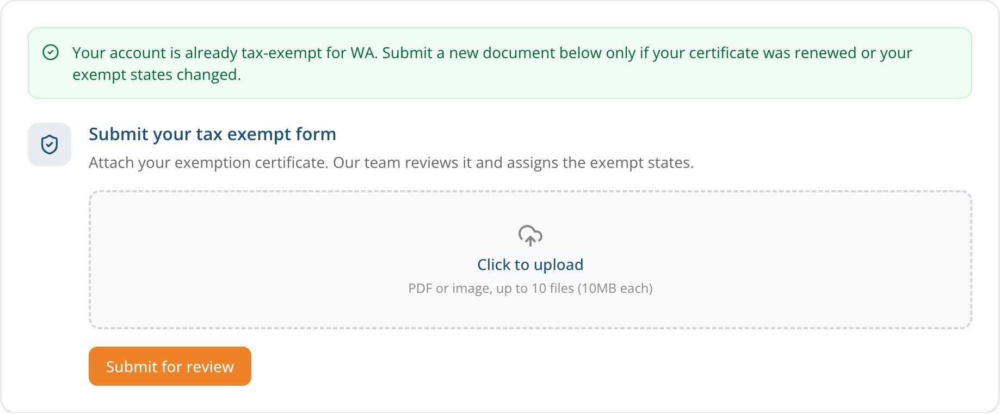

### Sales or Admin Submission

Sales opens the contact in HubSpot and uses the **Storefront Account** card. When the contact has an SCW Commerce account and is not already exempt, the card shows **Create tax exemption request**.

The sales form accepts the customer's certificate, optional exemption type, and optional state hints. Files are sent directly to SCW Commerce private document storage. HubSpot does not retain a public copy.

An administrator can also choose **New request** from the Exemption Requests queue. The administrator supplies the customer's account email, at least one document, and optional type and state hints.

### Approval Result

Approval applies the selected type and states, updates TaxJar, records the decision, sends the customer an approval email, and creates a `tax_exemption.approved` Make event. Rejection leaves tax treatment unchanged, records the reason, sends the customer a rejection email, and creates a `tax_exemption.rejected` event.

## Trusted Installer and Partner Pro

### Admin Review and Approval

The partner application detail page contains the applicant's company details, service areas, support and marketing answers, tax ID, licenses, expertise, agreements, submitter, and outcome.

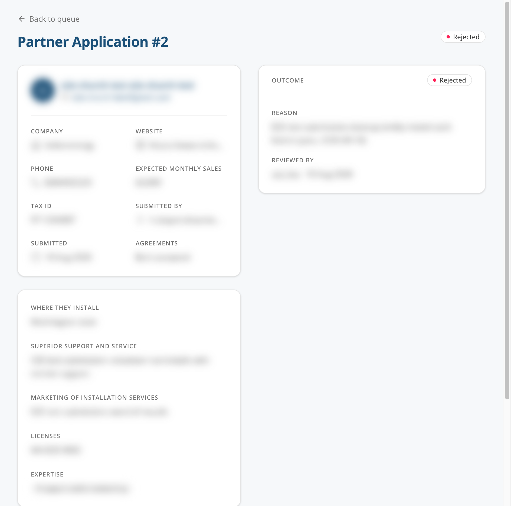

Partner status is granted to a company. The confirmation dialog explains exactly how many accounts will be affected.

**Company email applicant.** Approval marks the company a partner and moves eligible existing accounts on that domain, plus future accounts that sign up with it, onto Partner Pro pricing.

**Free email applicant.** Approval grants partner status to the company the applicant is already linked to. If nobody has linked them, the approval is refused with the instruction on screen: link the contact to their company first with **Link Guest Email to Company** in HubSpot, then approve. If the applicant is linked to more than one company, the approval is refused as ambiguous and the reviewer grants partner status on the correct company's page instead. The reviewer reads the same sentence before the click that the service would answer with after it.

The approval screen warns the reviewer if the applicant is already in a better pricing group or a fraud group. The company cascade never downgrades colleagues who already have better pricing.

### Customer Submission

A signed in customer opens the `/installer-accounts` page and completes the application. The form collects:

* Name, phone, company, and website
* Expected monthly sales
* Installation territory
* Support and service approach
* Marketing approach
* Tax ID and license information
* Areas of expertise
* Code of conduct and reseller certificate acknowledgments

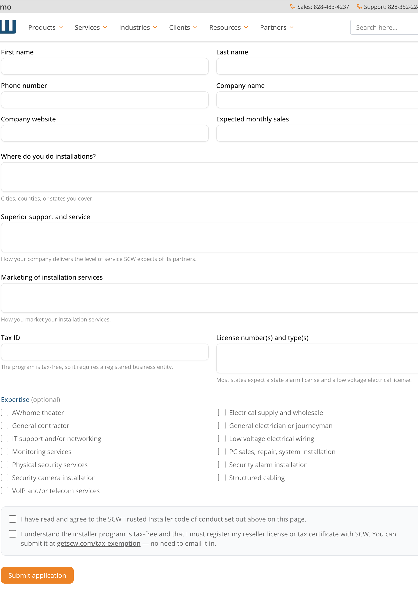

The customer is shown what the application covers. Approval does not happen during submission.

### Sales or Admin Submission

Sales opens the HubSpot contact and chooses **Create partner request** from the Storefront Account card. Contact and company values are prefilled when HubSpot already knows them. Sales completes the same program questions that appear on the customer form.

This path can create the underlying storefront account when one does not yet exist. Account provisioning does not grant partner pricing and does not send a password or approval message. The request still waits for an SCW Admin decision.

An administrator can use **New application** from the Partner Applications queue for the same on behalf submission workflow.

### Approval Result

Approval marks the company a partner, applies Partner Pro pricing to its eligible members, records the decision, updates the related HubSpot status, emails the applicant, and creates a `partner_application.approved` Make event. Rejection leaves pricing unchanged, records the reason, emails the applicant, and creates a `partner_application.rejected` event.

## Purchase Order Terms and NET30

### Admin Review and Approval

The credit terms request detail page contains the company, tax ID, submitter note, documents, signed agreement slot, existing terms, and decision history. A free email applicant is marked **Personal email** so the reviewer can see there is no company domain to link the account by.

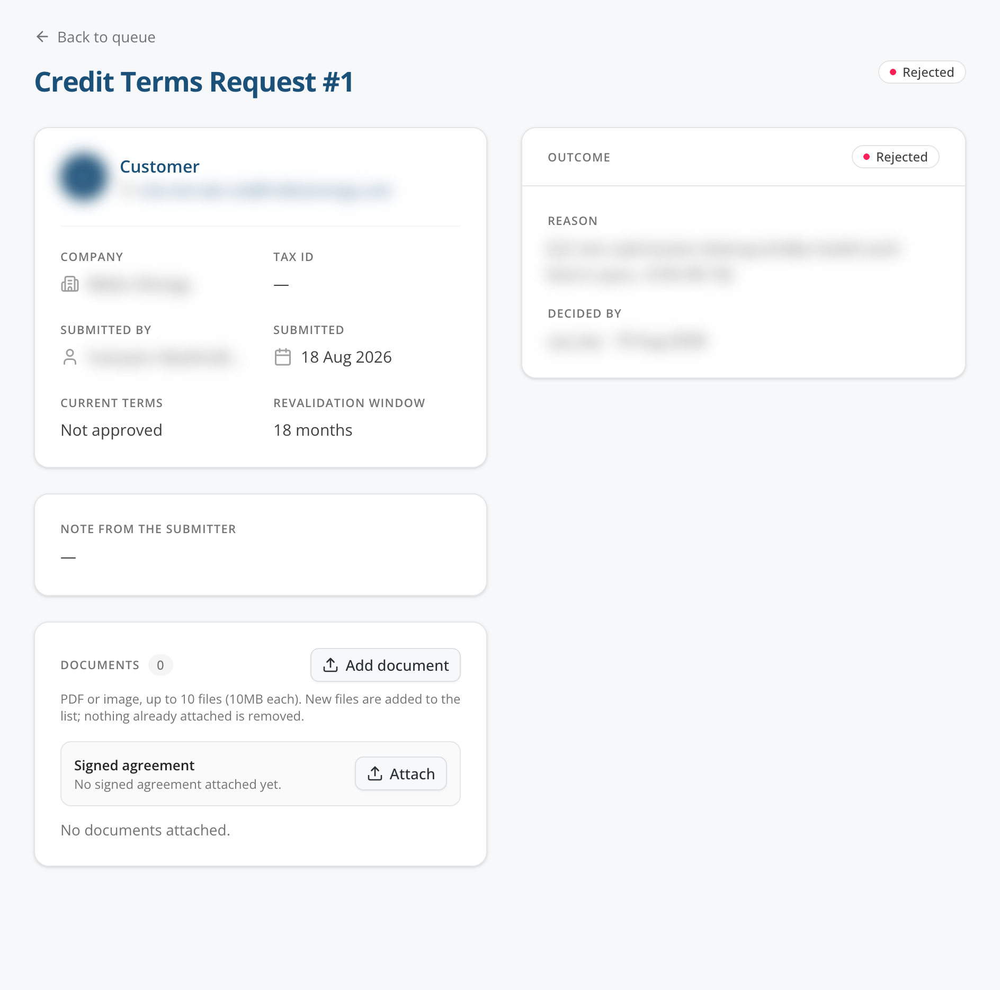

The administrator decides the financial terms at approval time:

* Credit limit, or no ceiling when the field is intentionally left blank
* Revalidation window in months
* An internal note for the credit terms audit record

The default review value is 18 months. The confirmation dialog explains that the customer can place NET30 purchase orders, shows the credit ceiling, and states when the terms lapse after the last order or re-signing.

A signed agreement is optional when the request is first filed. The administrator can attach it later and can still approve while the countersigned copy is being completed.

Approval uses the same audited credit terms operation as a manual grant. The request and terms change commit together so the request cannot say Approved unless the terms were applied.

### Customer Submission

The `/purchase-order-policies.php` page contains the public application, written as a native SCW Commerce form. A customer does not need to sign in first. SCW Commerce resolves or creates the internal customer record needed for the review, but it does not create login credentials for an unknown visitor.

The customer supplies:

* Contact and company information
* Company address
* Authorized signer, or the person who will sign
* Optional accounts payable email
* Optional W-9 PDF
* Optional note for the reviewer

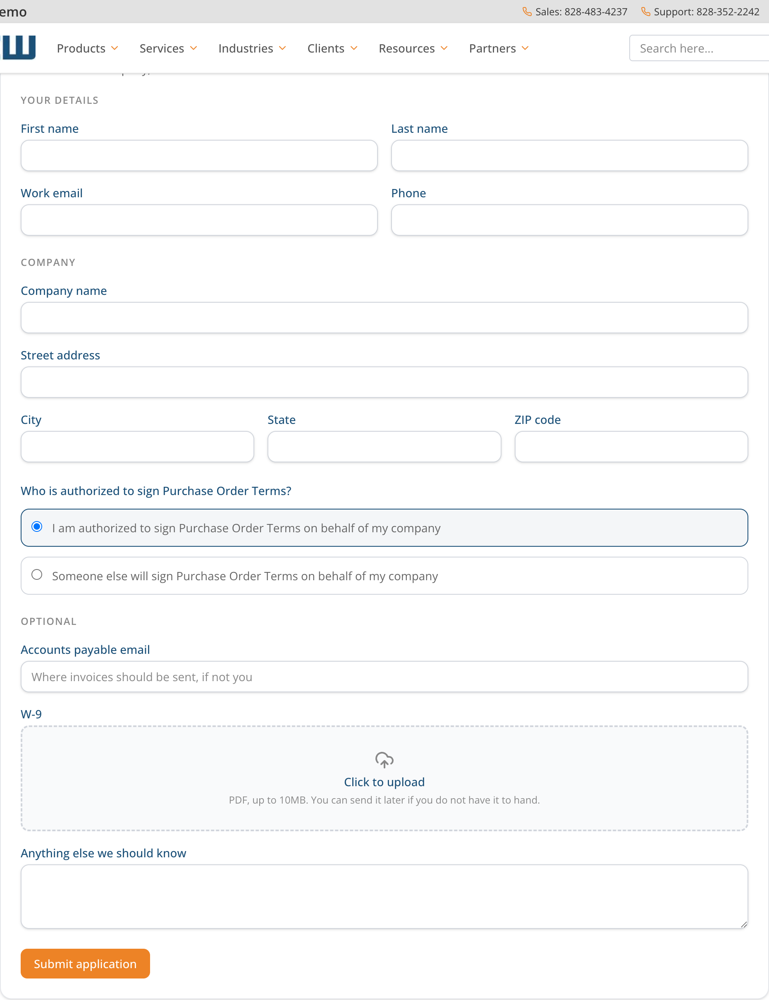

### Sales or Admin Submission

Sales opens the HubSpot contact and chooses **Create purchase order term request** from the Storefront Account card. The company value is prefilled from the contact or associated company when possible.

Sales can provide the company, optional tax ID, optional reviewer note, and optional signed agreement PDF. The card makes clear that submission does not grant terms. The credit limit and revalidation window remain an SCW Admin decision.

The contact must already have a storefront account. A request on a personal email address is accepted and flagged **Personal email** for the reviewer rather than refused at the card.

An administrator can file the same request from **Credit Terms Requests > New request**.

### Approval Result

Approval grants NET30 purchase order terms with the selected limit and revalidation window. It records the credit audit event, schedules the HubSpot update, emails the customer, and creates a `credit_terms_request.approved` Make event.

Rejection leaves the current terms unchanged, records the internal reason, sends only the customer-facing note or standard rejection copy, and creates a `credit_terms_request.rejected` event.

### The NET30 Application Chain

A purchase order terms application still drives the downstream chain the sales and compliance teams work from:

* An eSignatures agreement is raised for the credit terms paperwork.
* A ClickUp task is created for the review.
* A post lands in the **#admin-requests** Slack channel.

## The HubSpot Storefront Account Card

The Storefront Account card gives sales one place to answer five questions before submitting anything:

* Does the contact have an SCW Commerce account?
* Does the contact have Partner Pro installer pricing, and from where?
* Is the contact tax exempt, and from where?
* Is the contact approved for purchase order terms, and from where?
* Is the contact a member of a company, or waiting on a membership decision?

Each granted entitlement is labeled **(personal)** or **via `<company>`**. The card also shows when a request is already awaiting review so sales does not create a duplicate.

**Every request on this card requires an associated company.** When the contact has none, the buttons are disabled and the card says to associate them with the company in HubSpot first. The association itself grants nothing; it is what tells the card and the queue which company the request is about.

All entitlement actions on this card create requests. None of them grants pricing, credit, or tax treatment. Approval always remains in SCW Admin.

| Card state | Sales action |
| --- | --- |
| No storefront account | Create a storefront account. This does not grant any entitlement. |
| No associated company | Associate the contact with their company in HubSpot. Every request button is blocked until then. |
| No installer pricing and no pending request | Create partner request |
| Not tax exempt and no pending request | Create tax exemption request |
| Not approved for purchase order terms and no pending request | Create purchase order term request |
| Not covered by an associated company | Link Guest Email to Company |
| Request awaiting review | Wait for the SCW Admin decision. The card displays the pending state and hides the button. |

## Organizations and the Shared Credit Pool

The Organizations page brings company membership and entitlement scope into one view. It shows company domains, members, how each member joined, tax exemption, certificate expiry, credit terms, shared credit use, partner status, and the edit history.

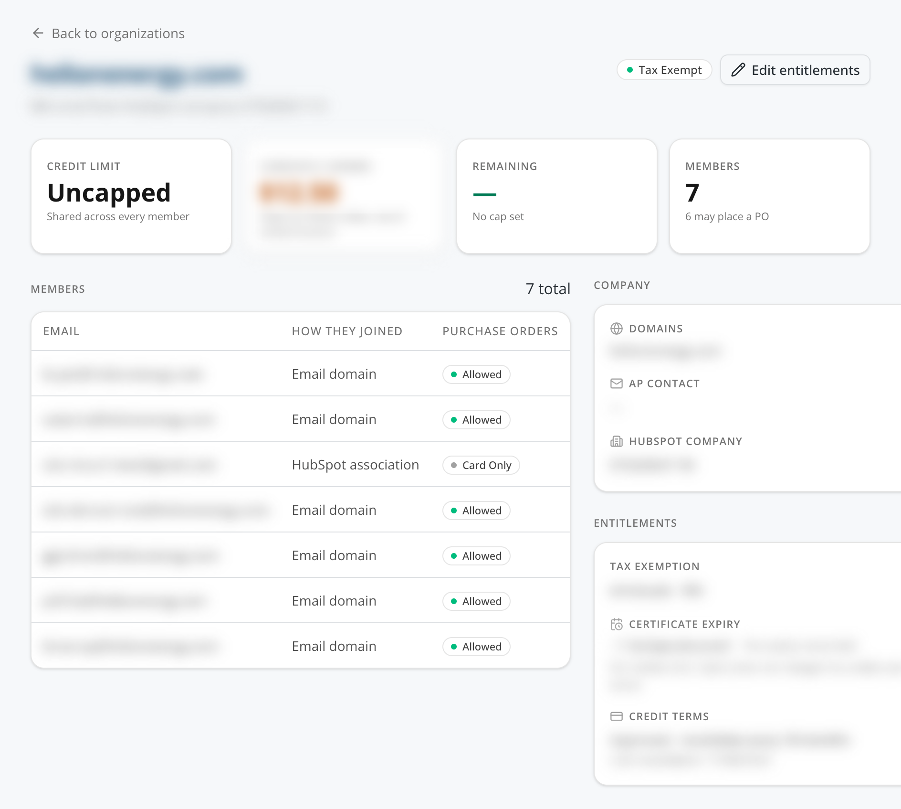

The member table names how each person joined: **Email domain**, **Approved request**, or **Added by admin**. All three carry the same entitlements.

**Credit is one shared pool per company.** Every open purchase order from any member counts against the company's limit until the order is paid. A blank limit means uncapped. When existing per customer approvals were converted into a company, the company took the highest credit limit among them, and an uncapped account overrode any ceiling. The revalidation window is 18 months by default and is enforced at order time along with the pool balance.

The company page also carries **Revoke** actions for credit terms, tax exemption, and partner pricing, and a **Remove** action per member. Each one is audited.

## Customer Decision Emails

Every approval and rejection sends a program specific email after the decision is recorded.

* Approval emails explain what was granted.
* Tax approval emails include the exempt states.
* Credit approval emails include the approved credit limit.
* Membership approval emails name the company and which of its entitlements the member now reaches.
* Rejection emails use the customer note when the reviewer supplied one.
* Internal rejection reasons are never copied into the customer email.

Email delivery is intentionally last in the decision sequence. The entitlement and durable automation events are already recorded before the email is attempted, so an email problem cannot undo an approval or suppress the integration event.

## Make Automation

SCW Commerce emits status events for each request family.

| Program | Submitted | Approved | Rejected |
| --- | --- | --- | --- |
| Tax exemption | `tax_exemption.submitted` | `tax_exemption.approved` | `tax_exemption.rejected` |
| Trusted Installer | `partner_application.submitted` | `partner_application.approved` | `partner_application.rejected` |
| Purchase order terms | `credit_terms_request.submitted` | `credit_terms_request.approved` | `credit_terms_request.rejected` |
| Company membership | `membership_request.submitted` | Not emitted | Not emitted |

Use **SCW Admin > Integrations > Make Webhooks** to review each event. Every card has a webhook URL, an Enabled switch, a source status, and a Save action.

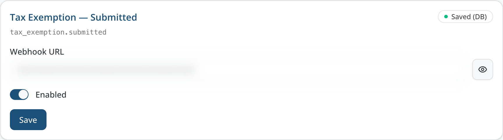

The source status means:

* **Saved (DB)** uses the URL saved in SCW Admin.
* **Environment fallback** uses the configured environment value because no saved override exists.
* **Not Configured** means no destination resolves. The event is recorded as skipped instead of being sent externally.
* Turning **Enabled** off intentionally suppresses delivery for that event.

A saved URL takes priority over the environment fallback. Keep webhook URLs private and do not copy them into tickets or documentation.

### Delivery Reliability

Submission and decision events are written to a durable outbox. SCW Commerce attempts immediate delivery, while a scheduled worker processes due rows every minute. Retryable failures use increasing delays. A permanently failed item is retained as abandoned for investigation and can be retried by an administrator.

This ordering keeps Make availability separate from the entitlement decision. A temporary Make outage does not roll back an approved request, and the durable row gives the system something to retry later.

## Administrator Checklist

Before approval:

* Verify the customer and company identity.
* Review every supplied answer and document.
* Confirm the entitlement scope shown in the approval dialog.
* For tax exemption, select at least one state and verify the certificate.
* For partner pricing, read any pricing downgrade or fraud warning, and check that a free email applicant is linked to exactly one company.
* For purchase order terms, confirm the limit and revalidation window.
* For membership, confirm the contact really buys for that company.

After approval or rejection:

* Confirm the record appears under the correct status tab.
* Confirm the active entitlement view reflects an approval.
* Check the organization when company membership or domain inheritance is expected.
* Confirm the HubSpot card updates from Awaiting review to the final status, with the right provenance label.
* Use Sync Observability when a HubSpot, TaxJar, or Make update needs investigation.

## Related Guides

* [Credit Terms Management](credit-terms.md) contains the detailed credit model, checkout behavior, and legacy history.
* [Tax-Exemption Management](tax-exemption-webhook.md) contains the detailed exemption data model and TaxJar behavior.
* [Make Automation Migration](make-automation-migration.md) contains the technical webhook and scenario reference.
