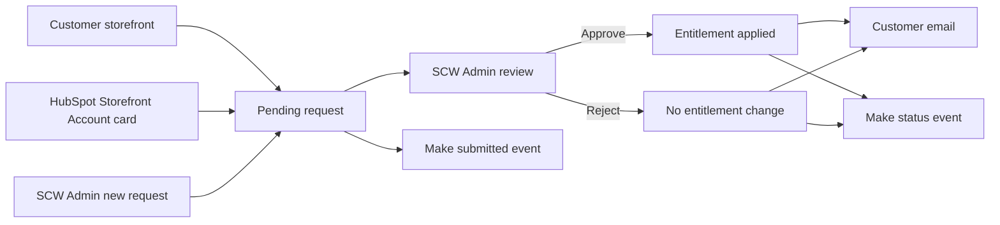

# Purchase Order Terms, Tax Exemption, and Installer Partner Requests

## Overview

SCW Commerce now gives customers, sales representatives, and administrators one review workflow for three business entitlements:

* Purchase order terms with NET30 checkout
* Tax exemption
* Trusted Installer access with Partner Pro pricing

Every path creates a request first. A customer or sales representative can supply the information, but only an authorized SCW Commerce administrator can approve or reject it. Approval is the step that changes pricing, tax treatment, or purchase order access.

The same request record supports customer submissions, HubSpot submissions, and requests created directly by an administrator. This gives the team one queue, one decision history, one customer notification path, and one set of Make events for each program.

> Customer and company details are blurred in the screenshots in this guide.

## What Was Shipped

| Area | New capability |
| --- | --- |
| SCW Admin | Separate request queues for tax exemptions, partner applications, and purchase order terms |
| Customer storefront | Native forms for all three programs |
| HubSpot | A Storefront Account card where sales can see current status and file a request for the customer |
| Review process | Document review, approval and rejection controls, customer notes, internal reasons, and decision emails |
| Organizations | A company view that brings together members, domains, tax status, credit status, partner status, and the shared credit pool |
| Automation | Make events for submitted, approved, and rejected status changes |
| Reliability | Durable event delivery, retries, decision locking, and audit records for consequential changes |

## End to End Flow

The request source does not change the approval rules. HubSpot and the storefront submit into the same SCW Commerce queues used by administrators.

## Start in SCW Admin

The left navigation separates work waiting for a decision from entitlements that are already active.

### Requests

* **Exemption Requests** contains tax certificate submissions.
* **Partner Applications** contains Trusted Installer applications.
* **Credit Terms Requests** contains purchase order and NET30 applications.

Each queue has Pending, Approved, and Rejected tabs, a search field, status counts, and a button for creating a request on behalf of a customer.

### Entitlements

* **Tax Exemptions** is the searchable list of active customer tax exemptions.
* **Organizations** is the company and membership view.
* **Credit Terms** is the active credit terms list and manual management surface.

### Integrations

* **Make Webhooks** controls the destination and enabled state for each outbound event.
* **Sync Observability** is used when the team needs to inspect delivery health or troubleshoot an external sync.

## Common Admin Review Process

Open a pending record from the appropriate request queue. The review page shows who the request is for, who submitted it, the answers supplied, supporting documents, and the current entitlement state.

The reviewer should follow this sequence:

1. Confirm that the request belongs to the correct customer and company.
2. Review all answers and supporting documents.
3. Add or replace documents when the customer or sales representative supplied a corrected copy.
4. Review the exact approval scope shown in the confirmation dialog.
5. Approve with the program specific settings, or reject with an internal reason and an optional customer note.
6. Confirm that the request moved out of Pending and that the entitlement appears in the appropriate active view.

The internal rejection reason is retained for the SCW team. It is not included in the customer email. The optional customer note is the text intended for the applicant.

## Tax Exemption

### Admin Review and Approval

The tax exemption detail page contains the certificate set, requested hints, submitter, and outcome. Administrators can add documents while a request is pending or approved. A rejected request is closed and its documents are locked.

To approve a tax exemption, the administrator selects:

* Exemption type: Wholesale, Government, or Other
* One or more exempt states
* Certificate expiry date, when one is available

At least one supporting document and one exempt state are required for approval. SCW Commerce applies the exemption before it closes the request. If the TaxJar update fails, the request is not marked approved and no success email is sent.

For a company email domain, approval creates or updates the organization exemption and applies it to existing and future accounts on that domain. A public email domain such as Gmail or Yahoo stays limited to the individual account.

An approved request can be amended in place if the reviewer selected the wrong type or state. Reapproval applies the corrected values and records a new audit event.

### Customer Submission

A signed in customer opens **Account > Tax Exemption** or the tax exemption page, attaches the certificate, and submits it for review.

The customer upload supports PDF and image files, with up to 10 files at 10 MB each. The customer may suggest an exemption type or states, but the administrator makes the final assignment.

### Sales or Admin Submission

Sales opens the contact in HubSpot and uses the **Storefront Account** card. When the contact has an SCW Commerce account and is not already exempt, the card shows **Create tax exemption request**.

The sales form accepts the customer's certificate, optional exemption type, and optional state hints. Files are sent directly to SCW Commerce private document storage. HubSpot does not retain a public copy.

An administrator can also choose **New request** from the Exemption Requests queue. The administrator supplies the customer's account email, at least one document, and optional type and state hints.

### Approval Result

Approval applies the selected type and states, updates TaxJar, records the decision, sends the customer an approval email, and creates a `tax_exemption.approved` Make event. Rejection leaves tax treatment unchanged, records the reason, sends the customer a rejection email, and creates a `tax_exemption.rejected` event.

## Trusted Installer and Partner Pro

### Admin Review and Approval

The partner application detail page contains the applicant's company details, service areas, support and marketing answers, tax ID, licenses, expertise, agreements, submitter, and outcome.

Approval places the applicant in the Partner Pro pricing group. The confirmation dialog explains exactly how many accounts will be affected.

For a company email domain, approval also applies partner pricing to eligible existing accounts on that domain and to future accounts that sign up with that domain. A personal email address remains limited to the applicant.

The approval screen warns the reviewer if the applicant is already in a better pricing group or a fraud group. The company cascade does not downgrade colleagues who already have better pricing.

### Customer Submission

A signed in customer opens the Trusted Installer page and completes the application. The form collects:

* Name, phone, company, and website
* Expected monthly sales
* Installation territory
* Support and service approach
* Marketing approach
* Tax ID and license information
* Areas of expertise
* Code of conduct and reseller certificate acknowledgments

The customer is shown whether the application covers only the account or the company domain. Approval does not happen during submission.

### Sales or Admin Submission

Sales opens the HubSpot contact and chooses **Create partner request** from the Storefront Account card. Contact and company values are prefilled when HubSpot already knows them. Sales completes the same program questions that appear on the customer form.

This path can create the underlying storefront account when one does not yet exist. Account provisioning does not grant partner pricing and does not send a password or approval message. The request still waits for an SCW Admin decision.

An administrator can use **New application** from the Partner Applications queue for the same on behalf submission workflow.

### Approval Result

Approval applies Partner Pro pricing, records the decision, updates the related HubSpot status, emails the applicant, and creates a `partner_application.approved` Make event. Rejection leaves pricing unchanged, records the reason, emails the applicant, and creates a `partner_application.rejected` event.

## Purchase Order Terms and NET30

### Admin Review and Approval

The credit terms request detail page contains the company, tax ID, submitter note, documents, signed agreement slot, existing terms, and decision history.

The administrator decides the financial terms at approval time:

* Credit limit, or no ceiling when the field is intentionally left blank
* Revalidation window in months
* An internal note for the credit terms audit record

The default review value is 18 months. The confirmation dialog explains that the customer can place NET30 purchase orders, shows the credit ceiling, and states when the terms lapse after the last order or re-signing.

A signed agreement is optional when the request is first filed. The administrator can attach it later and can still approve while the countersigned copy is being completed.

Approval uses the same audited credit terms operation as a manual grant. The request and terms change commit together so the request cannot say Approved unless the terms were applied.

### Customer Submission

The purchase order policy page contains the public application. A customer does not need to sign in first. SCW Commerce resolves or creates the internal customer record needed for the review, but it does not create login credentials for an unknown visitor.

The form requires a company work email. Personal webmail addresses are refused because purchase order credit is extended to a business.

The customer supplies:

* Contact and company information
* Company address
* Authorized signer, or the person who will sign
* Optional accounts payable email
* Optional W-9 PDF
* Optional note for the reviewer

### Sales or Admin Submission

Sales opens the HubSpot contact and chooses **Create purchase order term request** from the Storefront Account card. The company value is prefilled from the contact or associated company when possible.

Sales can provide the company, optional tax ID, optional reviewer note, and optional signed agreement PDF. The card makes clear that submission does not grant terms. The credit limit and revalidation window remain an SCW Admin decision.

The contact must already have a storefront account and must use a company work email. An administrator can file the same request from **Credit Terms Requests > New request**.

### Approval Result

Approval grants NET30 purchase order terms to the applicant account with the selected limit and revalidation window. It records the credit audit event, schedules the HubSpot update, emails the customer, and creates a `credit_terms_request.approved` Make event.

Rejection leaves the current terms unchanged, records the internal reason, sends only the customer-facing note or standard rejection copy, and creates a `credit_terms_request.rejected` event.

## The HubSpot Storefront Account Card

The Storefront Account card gives sales one place to answer four questions before submitting anything:

* Does the contact have an SCW Commerce account?
* Does the contact have Partner Pro installer pricing?
* Is the contact tax exempt?
* Is the contact approved for purchase order terms?

The card also shows when a request is already awaiting review so sales does not create a duplicate.

All entitlement actions on this card create requests. None of them grants pricing, credit, or tax treatment. Approval always remains in SCW Admin.

| Card state | Sales action |
| --- | --- |
| No storefront account | Create a storefront account. This does not grant any entitlement. |
| No installer pricing and no pending request | Create partner request |
| Not tax exempt and no pending request | Create tax exemption request |
| Not approved for purchase order terms and no pending request | Create purchase order term request |
| Request awaiting review | Wait for the SCW Admin decision. The card displays the pending state. |

## Organizations and Entitlement Scope

The Organizations page brings company membership and entitlement scope into one view. It shows company domains, members, how each member joined, tax exemption, certificate expiry, credit terms, shared credit use, and partner status.

The scope rules are intentionally different by entitlement:

| Entitlement | Company email domain | Personal or unrelated email |
| --- | --- | --- |
| Tax exemption | Existing and future accounts on the approved company domain inherit the exemption. | The exemption stays on the individual account. |
| Partner Pro | Eligible existing and future accounts on the approved company domain receive Partner Pro pricing. | Pricing stays on the individual applicant. |
| Purchase order terms request | Approval applies to the applicant account. | Personal webmail cannot file a credit terms request. |
| Shared company credit | Members whose own email is on a registered company domain may draw from the company pool. | A member added through another association can inherit tax exemption but cannot draw on company credit. |

The member table labels purchase order access as **Allowed** or **Card only**. Card only means the person can be associated with the company and inherit its tax exemption, but their email does not authorize them to use the company's purchase order credit.

## Customer Decision Emails

Every approval and rejection sends a program specific email after the decision is recorded.

* Approval emails explain what was granted.
* Tax approval emails include the exempt states.
* Credit approval emails include the approved credit limit.
* Rejection emails use the customer note when the reviewer supplied one.
* Internal rejection reasons are never copied into the customer email.

Email delivery is intentionally last in the decision sequence. The entitlement and durable automation events are already recorded before the email is attempted, so an email problem cannot undo an approval or suppress the integration event.

## Make Automation

SCW Commerce emits three status events for each request family.

| Program | Submitted | Approved | Rejected |
| --- | --- | --- | --- |
| Tax exemption | `tax_exemption.submitted` | `tax_exemption.approved` | `tax_exemption.rejected` |
| Trusted Installer | `partner_application.submitted` | `partner_application.approved` | `partner_application.rejected` |
| Purchase order terms | `credit_terms_request.submitted` | `credit_terms_request.approved` | `credit_terms_request.rejected` |

Use **SCW Admin > Integrations > Make Webhooks** to review each event. Every card has a webhook URL, an Enabled switch, a source status, and a Save action.

The source status means:

* **Saved (DB)** uses the URL saved in SCW Admin.
* **Environment fallback** uses the configured environment value because no saved override exists.
* **Not Configured** means no destination resolves. The event is recorded as skipped instead of being sent externally.
* Turning **Enabled** off intentionally suppresses delivery for that event.

A saved URL takes priority over the environment fallback. Keep webhook URLs private and do not copy them into tickets or documentation.

### Delivery Reliability

Submission and decision events are written to a durable outbox. SCW Commerce attempts immediate delivery, while a scheduled worker processes due rows every minute. Retryable failures use increasing delays. A permanently failed item is retained as abandoned for investigation and can be retried by an administrator.

This ordering keeps Make availability separate from the entitlement decision. A temporary Make outage does not roll back an approved request, and the durable row gives the system something to retry later.

## Administrator Checklist

Before approval:

* Verify the customer and company identity.
* Review every supplied answer and document.
* Confirm the entitlement scope shown in the approval dialog.
* For tax exemption, select at least one state and verify the certificate.
* For partner pricing, read any pricing downgrade or fraud warning.
* For purchase order terms, confirm the limit and revalidation window.

After approval or rejection:

* Confirm the record appears under the correct status tab.
* Confirm the active entitlement view reflects an approval.
* Check the organization when company domain inheritance is expected.
* Confirm the HubSpot card updates from Awaiting review to the final status.
* Use Sync Observability when a HubSpot, TaxJar, or Make update needs investigation.

## Related Guides

* [Credit Terms Management](credit-terms.md) contains the detailed credit model, checkout behavior, and legacy history.
* [Tax-Exemption Management](tax-exemption-webhook.md) contains the detailed exemption data model and TaxJar behavior.
* [Make Automation Migration](make-automation-migration.md) contains the technical webhook and scenario reference.
