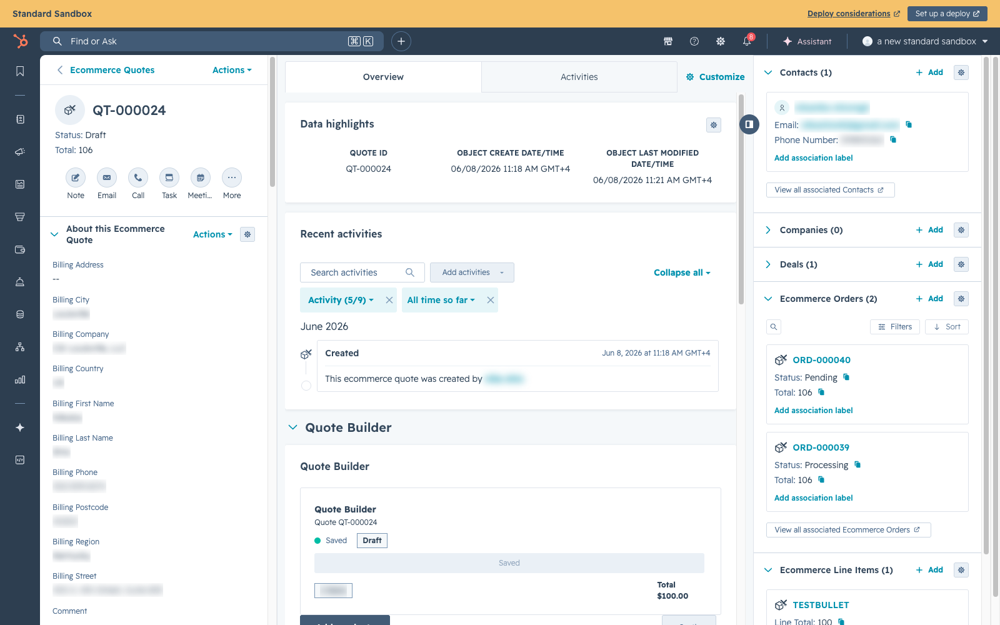
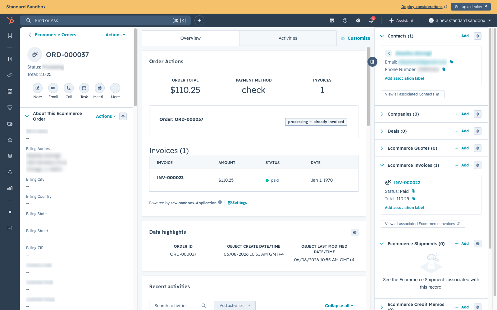
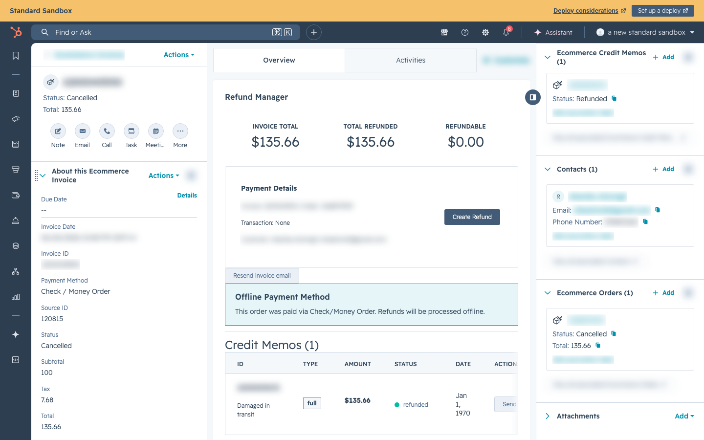
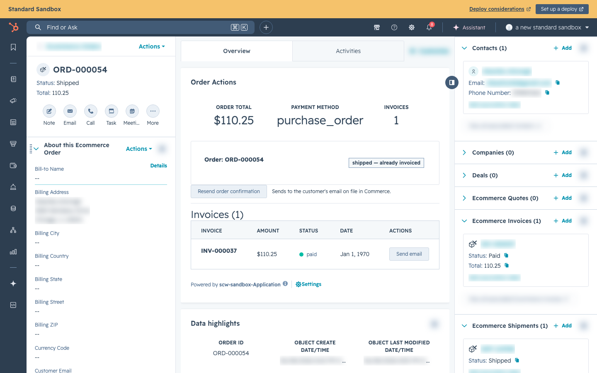

# Key Concepts

Before diving into specific workflows, it's important to understand the core objects and how they relate to each other. If you understand this page, everything else will make sense.

***

## The Core Objects

Think of the SCW Commerce system as a chain of objects that get created one after another as a sale progresses:

Core object chain A sale moves from customer identity to quote, order, billing, and fulfillmentLifecycleContactCustomer identity in HubSpot QuoteRep-built proposal OrderCustomer commits to buy InvoiceBilling record ShipmentFulfillment and tracking

Each object represents a stage in the sales lifecycle.

***

### Contact

**What it is:** A person or company that interacts with SCW. Every customer has a Contact record in HubSpot.

**Created when:** First order is placed (if the contact doesn't already exist in HubSpot).

**Key properties:**

* Name, email, phone
* Company
* Approved for Credit Terms (Yes/No)
* Credit Limit

**Where it lives:** HubSpot (primary), mirrored in SCW Commerce DB as a customer record.

_A HubSpot Contact record showing the "About this Contact" left panel and ecommerce associations._

***

### Ecommerce Quote

**What it is:** A price proposal built by a sales rep for a customer. Contains product line items with quantities and negotiated prices.

**Created when:** A sales rep clicks "Add" on the Ecommerce Quotes section of a Contact record and uses the Quote Builder.

**Key properties:**

* Quote ID
* Status (Draft, Approved, Accepted, etc. — see HubSpot native quote statuses)
* Line items (products, quantities, prices)
* Subtotal, tax, discount, total
* Customer billing and shipping address
* Payment Link (generated URL)

**Where it lives:** HubSpot only. Quotes do not exist in the SCW Commerce database.

**Relationships:**

* Linked to a **Contact** (the customer)
* Linked to **Ecommerce Line Items** (the products in the quote)
* After checkout: linked to an **Ecommerce Order**

_A HubSpot Ecommerce Quote record showing the Quote Builder card and the sidebar associations to Contact and Ecommerce Order._

***

### Ecommerce Order

**What it is:** A confirmed purchase. Created when a customer (or rep) completes checkout.

**Created when:** Checkout is completed — either by the customer directly or by a rep on their behalf.

**Key properties:**

* Order ID (e.g., `1268879530`) — a sequential bare-numeric number (no prefix, no dashes), generated via the `seq_order_number` PostgreSQL sequence. New orders count up from `1268879530`; this continues the numbering space of the historical Magento orders, which are also numeric. (Older records may carry the earlier `ORD-000001` or legacy `SCW-YYYYMMDD-XXXX` formats.)
* Status (Pending, Processing, Shipped, Delivered, Complete, Cancelled)
* Payment Method Type (Credit Card, Purchase Order, Check, ACH/Wire)
* PO Number (for Purchase Order payments)
* Totals (subtotal, shipping, tax, grand total)
* Shipping and billing addresses
* Source ID (internal database ID for API calls)

**Where it lives:** SCW Commerce DB (primary), synced to HubSpot as an Ecommerce Order object.

**Relationships:**

* Linked to a **Contact**
* Linked to an **Ecommerce Quote** (if the order originated from a quote/payment link)
* Linked to **Ecommerce Line Items** (the products ordered)
* Linked to **Ecommerce Invoices** (when invoiced)
* Linked to **Ecommerce Shipments** (when shipped)

_A HubSpot Ecommerce Order record showing eo\_order\_id, eo\_status, eo\_total, eo\_payment\_method\_type and associations to Contact, Invoice, Shipment, and Line Items._

***

### Ecommerce Invoice

**What it is:** A financial record confirming that payment has been accounted for. An invoice is the signal that an order is ready to ship.

**Created when:**

* **Credit card orders:** Automatically created at checkout (payment is immediate)
* **Offline payment orders:** Created by admin when payment is confirmed (this triggers fulfillment)

**Key properties:**

* Invoice Number — a bare-numeric number (no prefix), generated via the `seq_invoice_number` PostgreSQL sequence, continuing the migrated Magento invoice numbering
* Status (Pending, Paid, Cancelled) — HubSpot only accepts these three values. Locally the DB also tracks `Refunded` when fully credited, but that maps to `Cancelled` in HubSpot (the Credit Memo custom object records the actual refund)
* Amount
* Payment method and transaction details

**Where it lives:** SCW Commerce DB (primary), synced to HubSpot as an Ecommerce Invoice object.

**Important:** For offline payment methods, the **invoice is the trigger for shipping**. No invoice = no shipment. When an admin "invoices" a pending payment order, the system creates the invoice AND pushes the order to ShipEdge for fulfillment.

_A HubSpot Ecommerce Invoice record showing ei\_status, ei\_total, ei\_invoice\_date and its association to the parent Ecommerce Order._

***

### Ecommerce Shipment

**What it is:** A fulfillment record. Created when the warehouse creates a shipping label in ShipEdge.

**Created when:** ShipEdge fulfillment process creates a shipping label. The data syncs back to SCW Commerce through the ShipEdge webhook when configured, with the 5-minute cron as reconciliation.

**Key properties:**

* Shipment number — a bare-numeric number (no prefix), generated via the `seq_shipment_number` PostgreSQL sequence; also the shipment's key (`es_shipment_id`) on the HubSpot Ecommerce Shipment object
* Tracking number
* Shipping method
* Carrier (UPS)
* Shipped date
* Delivered date

**Where it lives:** ShipEdge (primary), synced to SCW Commerce DB and HubSpot.

> **Note:** Ecommerce Shipment records are created **automatically** by ShipEdge's fulfillment webhook when an order ships — they are not created by hand, so there is no manual screen to walk through. Each shipment carries its tracking number, shipping method, carrier, and ship date, and associates back to its parent Ecommerce Order.

***

## How the Objects Connect

Here's the full picture of how these objects relate to each other in HubSpot:

HubSpot object map A Contact can own quotes and orders; the order becomes the hub for invoice and shipment recordsAssociationsContactJohn Smith\
john@co.com Ecommerce Quotescw-nika\
$10,000 Ecommerce OrderSCW-0406..\
$10,000Quote associationQuote ↔ OrderConnects the original proposal to the resulting orderFulfillment recordsEcommerce InvoiceINV-000012\
$10,000 Ecommerce Shipment1Z999AA1..\
UPS Ground

_The Ecommerce Order right sidebar showing Contacts, Ecommerce Invoices, and Ecommerce Shipments — the order is the hub for all ecommerce records._

***

## Order Statuses — The Quick Reference

Every order has a status. Here's what each one means and what action (if any) is needed:

| Status              | What It Means                                                   | Action Needed?                                         |
| ------------------- | --------------------------------------------------------------- | ------------------------------------------------------ |
| **Pending**         | Order just created, payment being processed                     | No — wait (this state lasts milliseconds)              |
| **Pending Payment** | Offline payment order waiting for admin                         | **Yes — admin must invoice when payment is confirmed** |
| **Authorized**      | Credit card authorized (auth-only mode); awaiting admin capture | **Yes — admin must capture payment to proceed**        |
| **Paid**            | Payment captured; order entering ShipEdge queue                 | No — warehouse team handles it                         |
| **Processing**      | Order is in the ShipEdge warehouse queue                        | No — warehouse team handles it                         |
| **Shipped**         | Package is with the carrier, tracking available                 | No — customer has been notified                        |
| **Delivered**       | Carrier confirmed delivery                                      | No — order is complete                                 |
| **Complete**        | Order fully fulfilled and closed                                | No — closed                                            |
| **Cancelled**       | Order cancelled (manual or auto)                                | No — closed                                            |

The most important status for admins is **Pending Payment** — these are the orders that require action.

> **Note:** In HubSpot, the `eo_status` field collapses `Authorized`, `Paid`, and `Processing` all into `processing`. If an order shows "Processing" in HubSpot, check SCW Commerce admin for the precise local status.

***

## Payment Methods — The Quick Reference

| Method                     | Who Can Use It              | Payment Timing                  | Auto-Cancel                 |
| -------------------------- | --------------------------- | ------------------------------- | --------------------------- |
| **Credit Card**            | Everyone                    | Charged immediately at checkout | Never                       |
| **Purchase Order (NET30)** | Approved B2B customers only | Customer pays within 30 days    | Never (admin must act)      |
| **Check / Money Order**    | Everyone                    | Customer mails a check          | **14 days** if not invoiced |
| **ACH / Wire Transfer**    | Everyone                    | Customer sends a wire           | **21 days** if not invoiced |

***

## Glossary

| Term                                                        | Definition                                                                                                                                                                                                                                                                                                                                                                                                                                                                                                                                                                                                                                                                              |
| ----------------------------------------------------------- | --------------------------------------------------------------------------------------------------------------------------------------------------------------------------------------------------------------------------------------------------------------------------------------------------------------------------------------------------------------------------------------------------------------------------------------------------------------------------------------------------------------------------------------------------------------------------------------------------------------------------------------------------------------------------------------- |
| **Quote Builder**                                           | The custom HubSpot card where sales reps build quotes with products, prices, and customer info                                                                                                                                                                                                                                                                                                                                                                                                                                                                                                                                                                                          |
| **Payment Link**                                            | A URL generated from a quote that takes the customer (or rep) directly to checkout with products pre-loaded                                                                                                                                                                                                                                                                                                                                                                                                                                                                                                                                                                             |
| **Pending Payment**                                         | An order status meaning "we have the order but haven't received payment yet" — used for Check, Wire, and PO orders                                                                                                                                                                                                                                                                                                                                                                                                                                                                                                                                                                      |
| **Invoice (verb)**                                          | The admin action of confirming payment and creating an invoice record, which triggers ShipEdge fulfillment                                                                                                                                                                                                                                                                                                                                                                                                                                                                                                                                                                              |
| **ShipEdge**                                                | The warehouse management system where orders are fulfilled (picked, packed, shipped)                                                                                                                                                                                                                                                                                                                                                                                                                                                                                                                                                                                                    |
| **Credit Terms**                                            | The ability for a customer to buy now and pay later (NET30). Must be approved per customer in HubSpot.                                                                                                                                                                                                                                                                                                                                                                                                                                                                                                                                                                                  |
| **Tax Exemption**                                           | A customer-level flag that suppresses sales tax at checkout (in the applicable states). Customers submit exemption requests with supporting documents via `POST /api/account/tax-exemption`; admins then approve or reject via the SCW admin UI (`POST /api/admin/tax-exemption-requests/[id]/approve`). Exemption type (`wholesale`, `government`, `other`, `non_exempt`), exempt regions (US state codes), and provenance (validated-by, validated-at, document reference) are stored in SCW Commerce and pushed to TaxJar. Every change is recorded in the append-only `tax_exemption_events` audit table. There is no `/api/webhooks/tax-exemption` endpoint.                       |
| **Sales Tax Nexus**                                         | A state where SCW is registered to collect sales tax (currently 29). TaxJar calculates tax from the **destination ZIP**, not just the state field. Orders to no-sales-tax states (OR, DE, MT, NH) and US territories / military addresses (PR, GU, APO/FPO) are taxed at $0. See [Checkout & Payment Methods → Sales Tax at Checkout](checkout-payment-methods.md).                                                                                                                                                                                                                                                                                                                     |
| **In-Store Pickup Tax (origin-based)**                      | In-store-pickup orders are taxed at SCW's NC store origin (Asheville, 28806) — the customer takes possession at the counter — **not** at the entered ship-to address. The origin jurisdiction is saved on the order so filed tax matches collected tax. Customer tax exemptions still apply. See [Checkout & Payment Methods](checkout-payment-methods.md).                                                                                                                                                                                                                                                                                                                             |
| **Address Validation (State/ZIP Mismatch)**                 | A checkout guard that blocks an order when a nexus state is paired with a ZIP that geolocates to a different / no-tax jurisdiction (which would under-collect sales tax). The customer is asked to double-check the state and ZIP, and checkout offers a one-click "Use this address" correction (TaxJar's ZIP-resolved address). Error code `ADDRESS_VALIDATION_FAILED`. Legitimate no-tax-state and US-territory orders are unaffected.                                                                                                                                                                                                                                               |
| **PO Number**                                               | Purchase Order number — the customer's internal reference for the order, required for NET30 payments                                                                                                                                                                                                                                                                                                                                                                                                                                                                                                                                                                                    |
| **DLQ**                                                     | Dead Letter Queue — retry queue for non-outbox work: HubSpot → Cognito contact provisioning (`contact_import`), ShipEdge order push (`shipedge_order_sync`), TaxJar order reporting (`taxjar_order_report`), and TaxJar refund reporting (`taxjar_refund_report`). Runs every 5 minutes. HubSpot order/invoice/shipment/refund syncs and quote↔order association are handled by the HubSpot outbox, not the DLQ.                                                                                                                                                                                                                                                                        |
| **HubSpot Outbox**                                          | Durable sync queue for all SCW → HubSpot data flow (orders, invoices, shipments, refunds). Runs every minute with exponential-backoff retry. Replaces the old inline-sync approach — every sync event leaves an auditable row in `hubspot_outbox`. See **Platform Overview → How HubSpot Sync Works**.                                                                                                                                                                                                                                                                                                                                                                                  |
| **Ecommerce Objects**                                       | Custom HubSpot objects (Quote, Order, Invoice, Shipment, Credit Memo, Line Item) that mirror the storefront data                                                                                                                                                                                                                                                                                                                                                                                                                                                                                                                                                                        |
| **Idempotency Key**                                         | A unique identifier sent with every refund/sync request so retries and duplicates return the same result instead of creating duplicate records. Protects against double-clicks and Lambda retries.                                                                                                                                                                                                                                                                                                                                                                                                                                                                                      |
| **Fulfillment Flags (Dropship / Preorder / Special Order)** | Per-product checkboxes in the product editor that set the availability badge on the product page: **Preorder** → "Pre Order" (_"in production and will be available soon"_); **Special Order** or **Dropship** → "Special Order" (_"ships in 3-5 business days for small orders; contact us before purchasing for large orders"_); none set → "In Stock" (_"usually ships the same business day if ordered before 2PM EST"_). **Display only** — they set customer expectations but do **not** change stock (ShipEdge owns inventory) or whether the item can be purchased. Synced to HubSpot as the `scw_is_dropship` / `scw_is_preorder` / `scw_is_special_order` product properties. |
