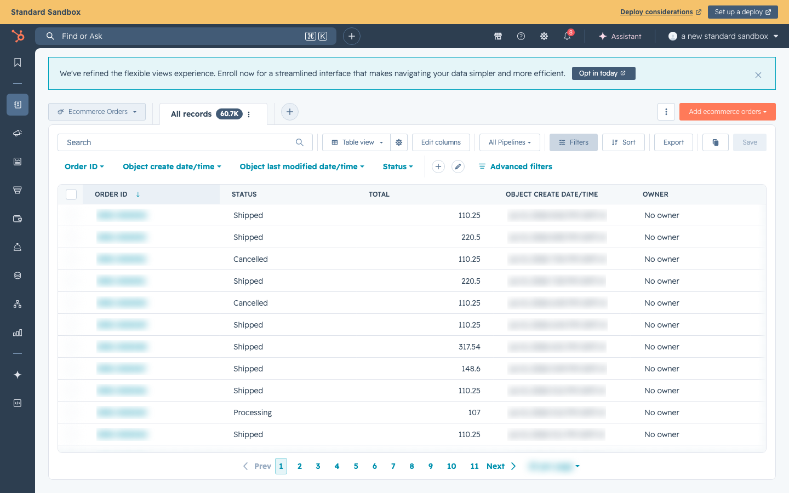
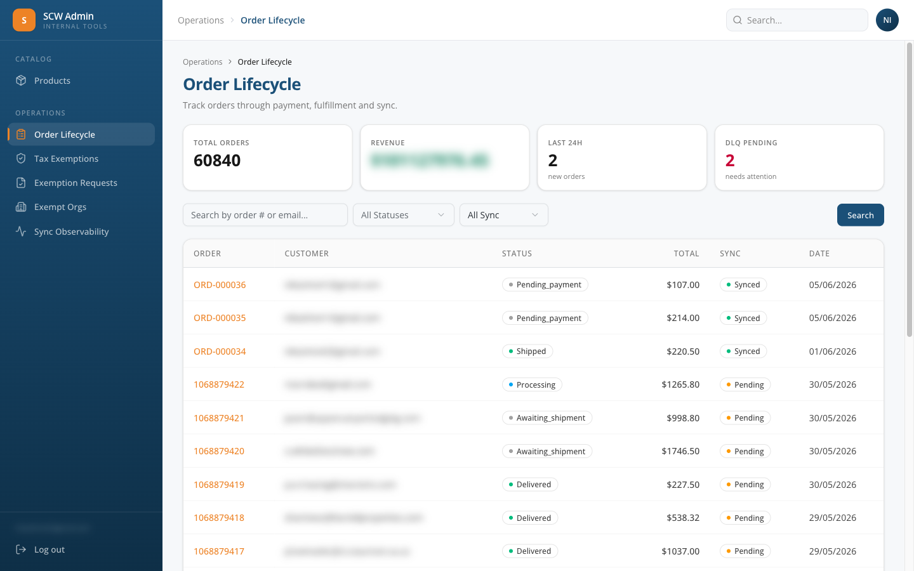
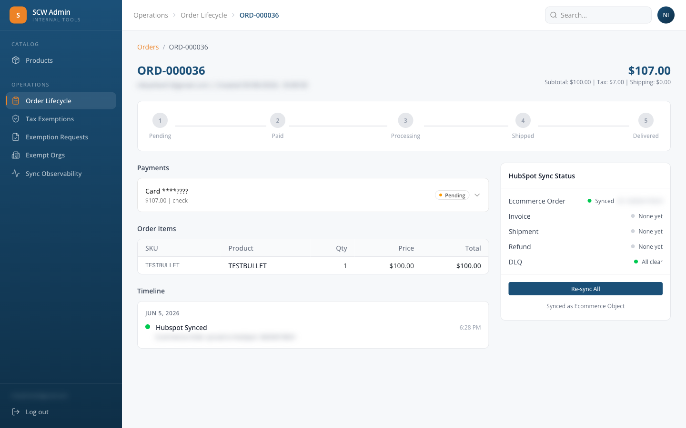

# Order Lifecycle & Status Flow

## Overview

Every order moves through a defined set of statuses. Each status transition is triggered by a specific event — either automatic (system) or manual (admin action).

***

## Status Flow Diagram

Order starts here

### Placed order enters the payment decision path

SCW CommerceOrder Placed Customer submits checkoutpending Order just createdCredit Card defaultpaid Payment chargedOffline Methods Check / Wire / POpending\_payment Waiting for admin invoiceAdmin clicks **Invoice**Auth-Only rareauthorized Card held, not chargedAdmin clicks **Capture**paid Payment capturedprocessing ShipEdge has the orderShipEdge creates shipping labelshipped Tracking # assignedCarrier deliversdelivered Order complete**Cancellation path:** Check / Wire orders auto-cancel from `pending_payment` when stale. A pre-fulfilment order (through `processing`) can be cancelled directly, but a **shipped or delivered order can only be unwound by issuing a refund** — a direct cancel of a fulfilled order is rejected because it would leave the customer charged (see the note under Status Definitions).

***

## Status Definitions

| Status            | Meaning                                            | Who Triggers It                                              | What's Happening                                                      |
| ----------------- | -------------------------------------------------- | ------------------------------------------------------------ | --------------------------------------------------------------------- |
| `pending`         | Order just created, payment not yet attempted      | System (automatic)                                           | Exists for milliseconds before payment result                         |
| `pending_payment` | Waiting for offline payment (Check, Wire, or a migrated credit-terms order) | System (automatic for offline methods)                       | Admin must invoice to proceed. **ShipEdge does NOT have this order.** New Credit Terms (NET30) orders skip this state — they auto-invoice at checkout. |
| `authorized`      | Card authorized but not charged (auth-only mode)   | System (rare — only for auth-only transactions)              | Admin must capture to proceed                                         |
| `paid`            | Payment successfully charged                       | System (Authorize.net confirms)                              | About to go to ShipEdge                                               |
| `processing`      | Order accepted by ShipEdge, in the warehouse queue | System (ShipEdge confirms) or Admin (invoices offline order) | Warehouse team is picking & packing                                   |
| `shipped`         | Shipping label created, package handed to carrier  | ShipEdge webhook or 5-minute sync fallback                   | Customer receives shipping notification email                         |
| `delivered`       | Carrier confirms delivery                          | ShipEdge webhook or 5-minute sync fallback                   | Order complete                                                        |
| `cancelled`       | Order cancelled                                    | System (auto-cancel for stale Check/Wire/PO) or the refund path once money is reversed | No further action                                                     |

> **A shipped or delivered order can never be cancelled directly.** Cancelling does no financial work — it does not void the card charge, does not tell the warehouse to stop (ShipEdge has no cancel API), and does not reverse sales tax with TaxJar. So a bare "cancel" on a fulfilled order would look done while leaving the customer charged. The only way to unwind a shipped/delivered order is a **refund** (see [Admin Actions](admin-actions.md)): a full refund reverses the Authorize.net charge and the TaxJar transaction, and *then* marks the order `cancelled`. A direct cancel of a fulfilled order is rejected with an error that points the admin to refunds. Orders that have not yet shipped (`pending`, `pending_payment`, `authorized`, `paid`, `processing`) can still be cancelled directly.

> **How ShipEdge statuses map to these four fulfillment statuses:** ShipEdge reports many granular remote statuses, and the sync collapses them into the local set. Anything in-warehouse-but-not-yet-shipped (`backorder`, `hold`, `error`, `incomplete`, `divided`, `dropship`, `editing`, `sent to shipedge`, `packing error`, `low balance`, and similar) maps to local **`processing`**. `shipped`, `shipped by shipedge`, and `shipped by cotim` map to **`shipped`**; `delivered` maps to **`delivered`**; `cancel` / `cancelled` map to **`cancelled`**. So a clean `processing → shipped → delivered` path is the happy case, but several distinct ShipEdge states all surface locally as `processing`.

> **Recovery step in the fallback sync:** the ShipEdge order-sync cron does more than poll status. On each batch run it first re-pushes any fulfillment-ready orders (status `paid` or `processing`) that are missing a ShipEdge order id, then polls open orders for status updates. This means an order that failed to push to ShipEdge initially gets retried automatically rather than being stuck.

***

## How Statuses Appear in HubSpot

The SCW Commerce status is mapped to HubSpot Ecommerce Order status:

| SCW Commerce Status | HubSpot `eo_status` | Notes                                                   |
| ------------------- | ------------------- | ------------------------------------------------------- |
| `pending`           | `pending`           | Brief transitional state                                |
| `pending_payment`   | `pending`           | **This is the one admins will see for offline orders**  |
| `paid`              | `processing`        | Mapped because HubSpot doesn't have a `paid` option     |
| `authorized`        | `processing`        | Same mapping                                            |
| `processing`        | `processing`        | Direct match                                            |
| `shipped`           | `shipped`           | Direct match                                            |
| `delivered`         | `delivered`         | Direct match                                            |
| `complete`          | `complete`          | Direct match                                            |
| `cancelled`         | `cancelled`         | Direct match                                            |
| `refunded`          | `cancelled`         | A refunded order is reflected as `cancelled` in HubSpot |

Any status not in this map falls back to `pending` in HubSpot.

**When the HubSpot Ecommerce Order is created**

* **Credit Card orders** — the Ecommerce Order is enqueued after payment is approved. HubSpot displays local `paid` and `authorized` as `processing` because HubSpot has no separate paid/auth-only order status; ShipEdge acceptance then moves the local order to `processing`.
* **Offline orders (Check, ACH / Wire)** — the Ecommerce Order is created at checkout with status `pending`, and updates to `processing` after the admin invoices. **Credit Terms (NET30) orders** are auto-invoiced, so they appear as `processing` right away.

> **Sequencing note:** a status-change is only pushed to HubSpot once the order already has its HubSpot Ecommerce Order object id. If a transition happens before the initial `order.created` sync has created that object, the transition isn't enqueued separately — the new status is instead reflected when `order.created` syncs the order's current status.

_The HubSpot Ecommerce Orders list — the Status column shows the current mapped status for each order._

***

## Status Transitions — What Triggers Each Change

### Credit Card Flow — Auth & Capture (Default)

The standard credit card path. Payment is authorized and captured in one step at checkout.

Credit card default Payment is captured automatically and the order moves straight to fulfillmentAutomaticpendingOrder created paidAuthorize.net approved processingShipEdge accepts order shippedLabel created deliveredCarrier confirms delivery

| Transition           | Trigger                         | Timing                                                      |
| -------------------- | ------------------------------- | ----------------------------------------------------------- |
| pending → paid       | Authorize.net returns approval  | Instant (at checkout)                                       |
| paid → processing    | ShipEdge accepts the order      | \~1 second after checkout                                   |
| processing → shipped | ShipEdge creates shipping label | When warehouse ships (webhook, with 5-minute fallback sync) |
| shipped → delivered  | Carrier confirms delivery       | When delivered (webhook, with 5-minute fallback sync)       |

**No admin action required.** The entire flow is automatic. The shipping-notification email is sent automatically as part of this status change — when (and only when) an order transitions to `shipped`, SCW Commerce sends the customer the shipping notification with carrier and tracking details from the latest shipment. Reps can resend that shipment email from the HubSpot Ecommerce Shipment card when needed.

### Credit Card Flow — Auth-Only (Admin Captures Later)

Used when an order should be authorized at checkout but not charged until an admin reviews it — for example a high-value order or one that needs internal approval. The customer's card has the amount on hold but no money moves until the admin captures.

Auth-only Admin captures the held card authorization before fulfillment beginsManual capturependingOrder created authorizedCard held, not charged Admin CapturesHubSpot action or admin API paidFunds captured processing → shipped → deliveredShipEdge fulfillment path

| Transition           | Trigger                                                                      | Timing                                                      |
| -------------------- | ---------------------------------------------------------------------------- | ----------------------------------------------------------- |
| pending → authorized | Authorize.net approves the auth-only request                                 | Instant (at checkout)                                       |
| authorized → paid    | **Admin captures the authorization** through the HubSpot action or admin API | When admin reviews and decides to charge                    |
| paid → processing    | ShipEdge accepts the order                                                   | \~1 second after capture                                    |
| processing → shipped | ShipEdge creates shipping label                                              | When warehouse ships (webhook, with 5-minute fallback sync) |
| shipped → delivered  | Carrier confirms delivery                                                    | When delivered (webhook, with 5-minute fallback sync)       |

**Admin action required at the `authorized → paid` step.** See [Admin Actions](admin-actions.md).

### Credit Terms (NET30) Flow

For approved B2B customers paying on NET30 terms. (Labeled "Purchase Order (NET30)" before July 2026.) Since auto-invoicing shipped in July 2026, these orders **do not wait for an admin**: the credit limit is enforced at checkout, the invoice is created automatically (status Pending — paid later by the customer), emailed, and the order moves straight to Processing.

Credit terms NET30 orders auto-invoice at checkout and go straight to fulfillmentNET30Order placedCredit limit enforced, invoice auto-created and emailed processing → shipped → deliveredShipEdge fulfillment path

| Transition           | Trigger                                                                             | Timing                                                      |
| -------------------- | ----------------------------------------------------------------------------------- | ----------------------------------------------------------- |
| pending → processing | Order placed on Credit Terms — **invoice auto-created and emailed**, ShipEdge push starts | Instant (at checkout)                                       |
| processing → shipped | ShipEdge creates shipping label                                                     | When warehouse ships (webhook, with 5-minute fallback sync) |
| shipped → delivered  | Carrier confirms delivery                                                           | When delivered (webhook, with 5-minute fallback sync)       |

**No auto-cancellation** for credit-terms orders. **Migrated (Magento) credit-terms orders** still follow the old manual flow: they wait in `pending_payment` until an admin invoices them. See [Admin Actions](admin-actions.md) and [Credit Terms Management](credit-terms.md).

### Check / Money Order Flow

The customer mails a physical check. The order waits until the admin confirms the check has arrived and cleared.

Check / money order Check orders ship after admin invoicing or auto-cancel after 14 days14-day timerpending\_paymentWaiting for check to clear Admin InvoicesCheck received and cleared processing → shipped → deliveredShipEdge fulfillment pathIf no invoice action happens within 14 days, the daily auto-cancel cron moves the order to `cancelled`.

| Transition                    | Trigger                                                              | Timing                                                      |
| ----------------------------- | -------------------------------------------------------------------- | ----------------------------------------------------------- |
| pending → pending\_payment    | Order placed with Check / Money Order method                         | Instant (at checkout)                                       |
| pending\_payment → processing | **Admin invoices the order** through the HubSpot action or admin API | When admin confirms the check has cleared                   |
| pending\_payment → cancelled  | **No invoice action within 14 days**                                 | Daily auto-cancel cron at 3 AM UTC                          |
| processing → shipped          | ShipEdge creates shipping label                                      | When warehouse ships (webhook, with 5-minute fallback sync) |
| shipped → delivered           | Carrier confirms delivery                                            | When delivered (webhook, with 5-minute fallback sync)       |

See [Admin Actions](admin-actions.md).

### ACH / Wire Transfer Flow

The customer sends a wire transfer. The order waits until the admin verifies the funds have landed.

ACH / wire transfer Wire orders ship after funds are verified or auto-cancel after 21 days21-day timerpending\_paymentWaiting for funds to land Admin InvoicesIncoming wire matched to order processing → shipped → deliveredShipEdge fulfillment pathIf no invoice action happens within 21 days, the daily auto-cancel cron moves the order to `cancelled`.

| Transition                    | Trigger                                                              | Timing                                                      |
| ----------------------------- | -------------------------------------------------------------------- | ----------------------------------------------------------- |
| pending → pending\_payment    | Order placed with ACH / Wire Transfer method                         | Instant (at checkout)                                       |
| pending\_payment → processing | **Admin invoices the order** through the HubSpot action or admin API | When admin matches the incoming wire to the order           |
| pending\_payment → cancelled  | **No invoice action within 21 days**                                 | Daily auto-cancel cron at 3 AM UTC                          |
| processing → shipped          | ShipEdge creates shipping label                                      | When warehouse ships (webhook, with 5-minute fallback sync) |
| shipped → delivered           | Carrier confirms delivery                                            | When delivered (webhook, with 5-minute fallback sync)       |

**Why 21 days instead of 14?** Wire transfers — especially international — can take longer to settle. See [Admin Actions](admin-actions.md).

### Auto-Cancellation

| Order Type             | Auto-Cancel After                | What Happens                                                                      |
| ---------------------- | -------------------------------- | --------------------------------------------------------------------------------- |
| Check / Money Order    | **14 days** in `pending_payment` | Status → `cancelled`; no ShipEdge order exists because the order was not invoiced |
| ACH / Wire Transfer    | **21 days** in `pending_payment` | Status → `cancelled`; no ShipEdge order exists because the order was not invoiced |
| Credit Terms (NET30)   | **Never**                        | Auto-invoiced at checkout; migrated Magento ones wait in `pending_payment` for an admin |
| Credit Card            | **Never**                        | Payment is immediate                                                              |

The auto-cancel process runs daily at 3 AM UTC.

### Cancellation Paths — Who Can Cancel and When

| How an order gets cancelled           | Who triggers it                      | When it can happen                                                                                                                                                                                                                                                      |
| ------------------------------------- | ------------------------------------ | ----------------------------------------------------------------------------------------------------------------------------------------------------------------------------------------------------------------------------------------------------------------------- |
| **Manual cancel / correction**        | Internal admin or engineering update | Any time before delivery — from `pending`, `pending_payment`, `authorized`, `paid`, `processing`, or `shipped`. The transition table also permits cancelling a `delivered` order (for example via a post-delivery full refund), so `delivered` is not strictly terminal |
| **Auto-cancel — Check / Money Order** | System (daily cron at 3 AM UTC)      | After **14 days** in `pending_payment`                                                                                                                                                                                                                                  |
| **Auto-cancel — ACH / Wire Transfer** | System (daily cron at 3 AM UTC)      | After **21 days** in `pending_payment`                                                                                                                                                                                                                                  |
| **No auto-cancel**                    | —                                    | Credit Card orders (payment is immediate) and Credit Terms (NET30) orders (auto-invoiced at checkout; no time limit)                                                                                                                                                    |

A cancelled order stays in HubSpot for reference. If the order had already been pushed to ShipEdge, the warehouse/admin team must also cancel or stop fulfillment in ShipEdge.

### Refunds and Order Status

Full refunds created through the refund APIs attempt to move the order to `cancelled` after the refund is processed. Partial and per-item refunds do **not** automatically change the order status; the admin decides whether any separate order correction is needed. Refunds are issued from the Refund Manager flow on the Ecommerce Invoice. See [Refunds & Credit Memos](refunds.md).

***

## Admin Action Reference

Admin payment actions are performed from the HubSpot action card when it is deployed, or by calling the SCW Commerce admin API directly. SCW Commerce updates the database, talks to Authorize.net / ShipEdge / email, and HubSpot records the result on the related Ecommerce object.

| Admin action                                      | Where to click                                      | Status transition                                                              | Side effects                                                                                                                                                                                                                                                                                                                                                                                                                                                                               |
| ------------------------------------------------- | --------------------------------------------------- | ------------------------------------------------------------------------------ | ------------------------------------------------------------------------------------------------------------------------------------------------------------------------------------------------------------------------------------------------------------------------------------------------------------------------------------------------------------------------------------------------------------------------------------------------------------------------------------------ |
| **Convert quote to order** (offline methods only) | Quote Builder card on the Ecommerce Quote record    | Creates a new order in `pending_payment` (Check / Wire) or straight to `processing` (Credit Terms — auto-invoiced) | This action handles only the offline payment methods on a quote (Check, ACH / Wire, or Credit Terms): it creates the order via `POST /api/admin/orders/from-quote`, creates a HubSpot Ecommerce Order, and emails the customer an order confirmation plus payment instructions. Credit-terms quote orders auto-invoice like checkout ones. It does **not** handle credit-card quotes and does **not** generate a payment link — credit-card quotes are paid via the customer payment link through standard checkout, which produces a `paid` order. |
| **Invoice offline order**                         | HubSpot action card or direct admin API             | `pending_payment` → `processing`                                               | SCW Commerce creates the invoice and pushes the order to ShipEdge; HubSpot Ecommerce Invoice record created                                                                                                                                                                                                                                                                                                                                                                                |
| **Capture auth-only credit card**                 | HubSpot action card or direct admin API             | `authorized` → `paid`                                                          | Authorize.net captures the held funds; SCW Commerce creates the invoice and pushes the order to ShipEdge                                                                                                                                                                                                                                                                                                                                                                                   |
| **Cancel order**                                  | Internal admin / engineering action                 | Any pre-delivery status → `cancelled`                                          | SCW Commerce updates the local order and HubSpot status; ShipEdge cancellation is separate if fulfillment already started                                                                                                                                                                                                                                                                                                                                                                  |
| **Issue refund (full / partial / per-item)**      | Refund Manager card on the Ecommerce Invoice record | Full refund → `cancelled`; partial/per-item → no automatic order status change | SCW Commerce processes the refund via Authorize.net or the offline refund path, creates a refund record, syncs a HubSpot Credit Memo, and marks the local invoice `refunded` when the invoice is fully refunded                                                                                                                                                                                                                                                                            |

_The Order Actions panel on an Ecommerce Order — Invoice and Capture buttons trigger SCW Commerce admin actions._

_The Ecommerce Invoice record — the Refund Manager card is the starting point for issuing refunds._

***

## Where to See Order Status

### In the SCW Admin (Order Lifecycle)

* Navigate to `hubspot.getscw.com/admin/order-lifecycle`
* The list shows every order, filterable by status, with search and per-row HubSpot sync indicators

_The SCW admin Order Lifecycle list at /admin/order-lifecycle showing the order table with status filter, search, and HubSpot sync status columns_

* Click any order row to open the detail page at `/admin/order-lifecycle/{orderNumber}` — it shows the order status stepper, invoice and shipment cards, refunds, the event timeline, and a HubSpot sync-status panel

_The admin Order Lifecycle detail page showing the OrderStatusStepper, invoices, shipments, refunds, events, and the sync-status panel_

### In HubSpot

* Navigate to **Ecommerce Orders** in the top navigation
* The **Status** column shows the current status
* Click any order to see full details

_The Ecommerce Orders list — filter by Status or add the Payment Method Type column to find pending orders._

### In Customer's Account (Storefront)

* Customer logs in at `hubspot.getscw.com/account`
* Click **My Orders**
* Status column shows: Processing, Shipped, Delivered, Cancelled, etc.

> \[SCREENSHOT: Customer's My Orders page showing order statuses]

### In the Database (Technical)

* `orders` table → `status` column
* `orders` table → `payment_method` column (credit\_card, purchase\_order, check, ach\_wire)
* `orders` table → `po_number` column (for PO orders)
