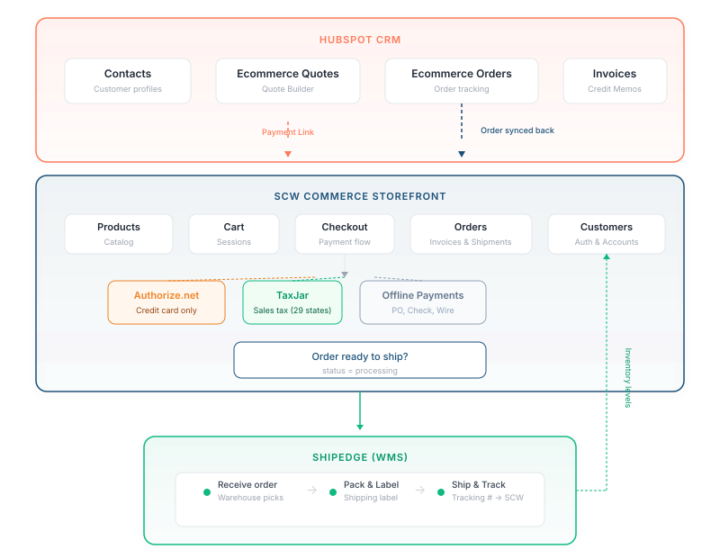
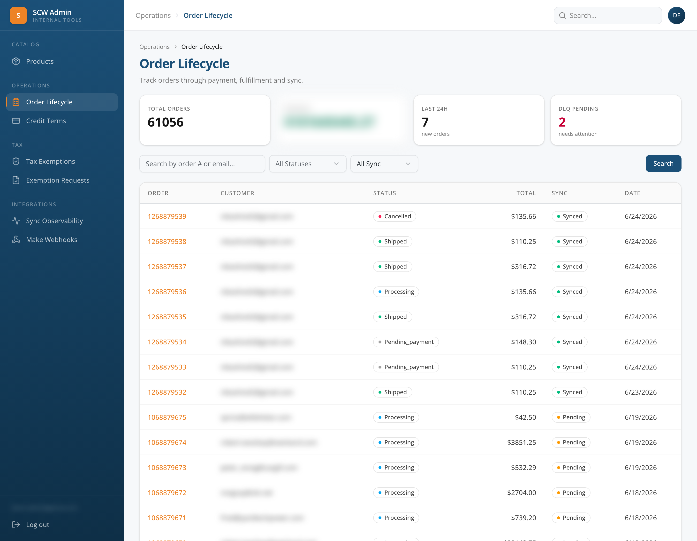
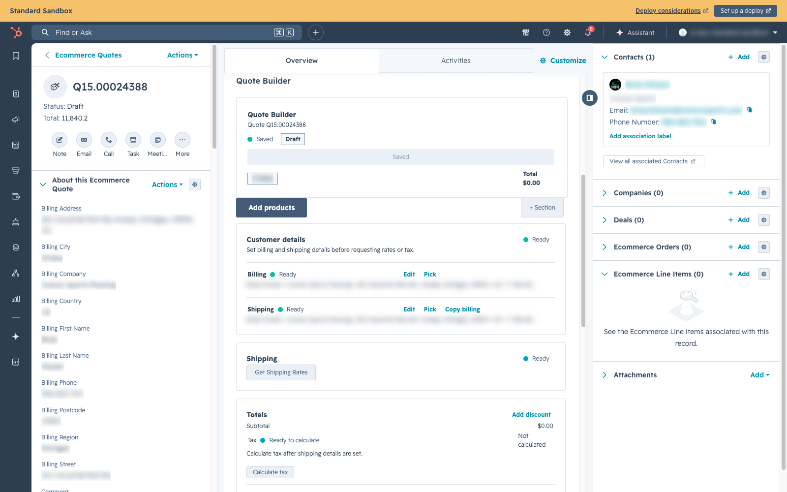
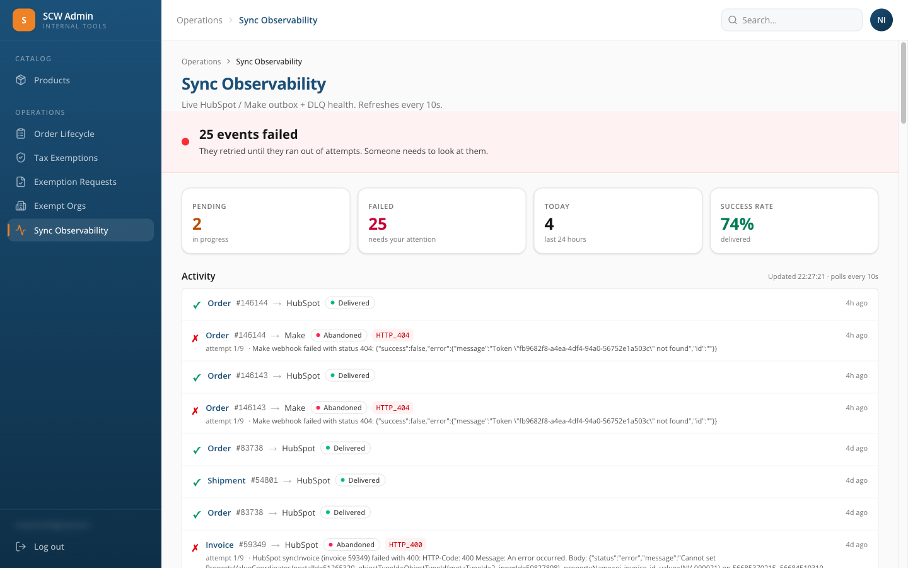

# Platform Overview

## What is SCW Commerce?

SCW Commerce is Security Camera Warehouse's e-commerce platform. It replaces the legacy Magento storefront with a modern system built on Next.js, integrated with HubSpot CRM for sales workflows, ShipEdge for fulfillment, Authorize.net for payments, and TaxJar for tax calculation.

The platform supports both **self-service** (customer buys directly on the website) and **sales-assisted** (rep builds a quote in HubSpot and checks out on behalf of the customer) workflows.

***

## The Systems

SCW Commerce is not a single application — it's a set of connected systems, each responsible for a specific part of the business. Understanding what each system does (and doesn't do) is the key to using the platform effectively.

### SCW Commerce Storefront

**What it is:** The customer-facing website where products are browsed, carts are built, and checkout happens. **URL:** `https://hubspot.getscw.com` (staging) **Who uses it:** Customers directly, or sales reps on behalf of customers. **What it stores:** Orders, invoices, shipments, customer accounts, addresses, carts, product catalog.

### HubSpot CRM

**What it is:** The sales team's workspace. Where contacts, quotes, orders, and invoices live for the sales and admin team. **Who uses it:** Sales reps and administrators. **What it stores:** Contacts, Ecommerce Quotes, Ecommerce Orders, Ecommerce Invoices, Ecommerce Shipments, Ecommerce Line Items, Ecommerce Credit Memos. **Key tool:** The **Quote Builder** — a custom HubSpot card where reps build quotes and generate payment links.

### ShipEdge (WMS / Fulfillment)

**What it is:** The warehouse management system. When an order is ready to ship, it's pushed to ShipEdge where the warehouse team picks, packs, and ships it. **Who uses it:** Warehouse / operations team. **What it stores:** Inventory levels, order fulfillment status, tracking numbers, shipment data. **Important:** SCW Commerce checks ShipEdge for real-time stock availability. ShipEdge is the **source of truth** for inventory.

### Authorize.net (Payment Gateway)

**What it is:** Processes credit card payments. Card data goes directly from the customer's browser to Authorize.net — it never touches SCW servers. **Who uses it:** Automatic — no manual interaction needed. **Note:** Only used for **credit card** payments. Offline methods (Check, Wire, PO) bypass Authorize.net entirely.

### TaxJar (Tax Calculation)

**What it is:** Calculates sales tax based on the shipping destination. SCW has tax nexus in 29 states. **Who uses it:** Automatic — tax is calculated at checkout and when quotes are saved with a shipping address.

### Meilisearch (Search)

**What it is:** Self-hosted search engine powering autocomplete and full-text search across the storefront. **Who uses it:** All site visitors — automatically triggered when typing in the search bar. **What it indexes:** Products (with images and pricing), CMS pages, and categories.

Key features:

* **Autocomplete dropdown** in the header — shows matching pages, categories, and products with images as you type
* **Full results page** — with filters (product type, manufacturer) and sort options
* **Typo tolerance** — built-in, handles common misspellings
* **Re-indexes automatically** — on every deploy and on the 15-minute product sync cron (incremental)

**Infrastructure:** Docker container running on the EC2 server at `127.0.0.1:7700` (not exposed publicly). Re-indexing can be triggered manually with `npm run search:reindex`.

**Future:** Semantic/vector search via pgvector is planned as a future enhancement.

***

## How the Systems Connect

_The admin dashboard landing page showing high-level sync status panels and key metric tiles._

***

## The Two Main Workflows

### Self-Service (Customer Buys Directly)

Self-service Customer buys directly through the storefrontNo rep neededBrowseCustomer browses website CartAdds products to cart CheckoutEnters account, shipping, and payment PaysPayment is captured ShipsOrder moves to fulfillment

The customer does everything themselves. No rep involvement. This is the standard e-commerce flow.

_The storefront checkout page showing the 3-column layout (shipping address form, shipping/payment methods, order summary) representing the self-service customer flow._

### Sales-Assisted (Rep Builds Quote)

Sales-assisted Rep creates the HubSpot quote and drives the checkout pathHubSpot → SCWContactRep creates Contact in HubSpot AccountOptional: webhook can auto-provision the account (flag-gated, off by default) QuoteRep builds quote and generates payment linkCustomer checkoutSend linkRep sends payment link to customer LoginCustomer logs in and checks out ShipsOrder moves to fulfillmentRep checkoutOpen linkRep opens payment link CheckoutRep checks out on behalf of customer ShipsUsed for phone orders and assisted sales

The rep starts by creating a Contact in HubSpot. A webhook receives the event. Account auto-provisioning (Cognito + database) and the welcome email are both gated behind feature flags (`HUBSPOT_WEBHOOK_AUTOPROVISION` and `HUBSPOT_WEBHOOK_WELCOME_EMAIL`), both disabled by default to prevent mass provisioning during bulk contact imports. When enabled, the webhook creates the Cognito + DB account and sends a welcome email. The rep can then use the **Quote Builder** to configure products, set prices, and generate a payment link. The link takes the customer (or the rep) to a pre-loaded checkout. This is used for B2B sales, phone orders, and custom pricing.

**Starting from the customer's website cart.** When a customer has already assembled a cart on the storefront, the rep doesn't have to re-key it. The **Website Cart → Quote** card on the Contact record shows that customer's live cart and turns it into a draft Ecommerce Quote in one click, ready to finish in the Quote Builder. See [Quote Builder & Payment Links](quote-builder.md#starting-a-quote-from-a-customers-website-cart).

_The HubSpot Quote Builder custom card showing product selection and the Payment Link button (Open/Copy)._

***

## Where Does Data Live?

This is important to understand. The same order exists in multiple systems, but each system has a different role:

| Data                                             | Source of Truth            | Also Exists In                      | Notes                                                                                                                                                                                                                                    |
| ------------------------------------------------ | -------------------------- | ----------------------------------- | ---------------------------------------------------------------------------------------------------------------------------------------------------------------------------------------------------------------------------------------- |
| **Customer account** (login, password)           | AWS Cognito                | —                                   | Passwords are managed by Cognito, never stored locally                                                                                                                                                                                   |
| **Customer profile** (name, email, addresses)    | SCW Commerce DB (AWS RDS)  | HubSpot (as Contact)                | Auto-synced via webhook when rep creates/updates Contact in HubSpot                                                                                                                                                                      |
| **Product catalog** (SKUs, prices, descriptions) | SCW Commerce DB (AWS RDS)  | HubSpot (as Products) + Meilisearch | Changed products (all statuses) sync from SCW Commerce to HubSpot every 15 minutes; search index updates after the sync                                                                                                                  |
| **Inventory / stock levels**                     | ShipEdge                   | —                                   | Real-time check on add-to-cart and checkout                                                                                                                                                                                              |
| **Quotes**                                       | HubSpot (Ecommerce Quotes) | —                                   | Quotes only exist in HubSpot                                                                                                                                                                                                             |
| **Orders**                                       | SCW Commerce DB (AWS RDS)  | HubSpot (Ecommerce Orders)          | Created locally, synced to HubSpot                                                                                                                                                                                                       |
| **Invoices**                                     | SCW Commerce DB (AWS RDS)  | HubSpot (Ecommerce Invoices)        | Created locally, synced to HubSpot                                                                                                                                                                                                       |
| **Shipments / Tracking**                         | ShipEdge                   | SCW Commerce DB + HubSpot           | ShipEdge creates, webhook updates in real time when configured; 5-minute cron is the fallback/reconciliation path                                                                                                                        |
| **Tax calculation**                              | TaxJar                     | —                                   | Calculated in real-time, not stored permanently                                                                                                                                                                                          |
| **Credit terms approval**                        | HubSpot (Contact property) | SCW Commerce DB                     | Set in HubSpot, synced by contact webhook in real time with a daily 2 AM UTC reconciliation job                                                                                                                                          |
| **Tax-exemption status**                         | SCW Commerce DB (AWS RDS)  | TaxJar                              | Set via SCW admin approval (POST /api/admin/tax-exemption-requests/\[id]/approve). HubSpot is not an input. Provenance and audit history stored in `tax_exemption_events`. There is no external signed webhook from a doc-review system. |
| **Search index**                                 | Meilisearch                | —                                   | Rebuilt from DB + CMS files on deploy and product sync                                                                                                                                                                                   |

***

## Automatic Sync Processes

The systems stay in sync through automated processes that run on a schedule:

| Process                          | Frequency                           | What It Does                                                                                                                                                                                                                                                                                                                        |
| -------------------------------- | ----------------------------------- | ----------------------------------------------------------------------------------------------------------------------------------------------------------------------------------------------------------------------------------------------------------------------------------------------------------------------------------- |
| **HubSpot entity sync (outbox)** | Every 1 minute                      | Delivers every order, invoice, shipment, and credit-memo change to HubSpot. Retries on failure with exponential backoff (1m→120m). See "How HubSpot sync works" below.                                                                                                                                                              |
| **Make.com webhook outbox**      | Every 1 minute                      | Delivers outbound events to Make.com workflows with retry: `order.created`, `order.created.monitoring_candidate`, `refund.created`, and `tax_exemption.submitted/approved/rejected`. See [Make Automation Migration](make-automation-migration.md).                                                                                 |
| **Product sync**                 | Every 15 minutes                    | Syncs changed products (all statuses) from the SCW Commerce database to HubSpot Products (including the dropship / preorder / special-order fulfillment flags → HubSpot product properties); also updates the Meilisearch product index                                                                                             |
| **ShipEdge order status sync**   | Real-time webhook + every 5 minutes | ShipEdge webhooks update shipped/delivered/cancelled states through the same status-sync service; the 5-minute cron reconciles missed webhooks and open orders                                                                                                                                                                      |
| **HubSpot Contact webhook**      | Real-time                           | When a rep creates or updates a Contact in HubSpot, syncs property changes (name, email, credit terms) instantly. Account auto-provisioning (Cognito + DB) is gated behind `HUBSPOT_WEBHOOK_AUTOPROVISION=true` (off by default). Tax exemption is **not** set via this webhook.                                                    |
| **Credit terms sync**            | On change (real-time)               | When an admin updates a customer's credit terms in SCW, a `customer.credit_terms_changed` event is enqueued in the HubSpot outbox and delivered within \~60 seconds. There is no separate daily reconciliation cron for credit terms.                                                                                               |
| **Tax exemption sync**           | Triggered on admin approval         | When an SCW admin approves or rejects a tax exemption request via the admin UI (POST /api/admin/tax-exemption-requests/\[id]/approve), SCW Commerce records the decision, writes an audit row to `tax_exemption_events`, and pushes the change to TaxJar immediately. There is no external signed webhook from a doc-review system. |
| **Auto-cancel stale orders**     | Daily at 3 AM UTC                   | Cancels Check (`check`) orders in `pending_payment` status older than 14 days and ACH/Wire (`ach_wire`) orders in `pending_payment` status older than 21 days                                                                                                                                                                       |
| **DLQ retry**                    | Every 5 minutes                     | Retries failed non-outbox work: HubSpot → Cognito contact provisioning (`contact_import`), ShipEdge order push (`shipedge_order_sync`), TaxJar refund reporting (`taxjar_refund_report`), and TaxJar order reporting (`taxjar_order_report`)                                                                                        |

These processes are fully automatic — no manual intervention needed unless something fails (which is logged and retried automatically).

***

## How HubSpot Sync Works

_The admin sync observability page showing the hubspot\_outbox/make\_outbox status distribution (pending / processing / delivered / retrying / abandoned), entity health rows, flow diagram, and KPIs._

All SCW Commerce → HubSpot data flow goes through a single durable outbox pattern. When something changes in SCW Commerce (new order, invoice paid, refund processed, shipment created), the change is atomically recorded in a `hubspot_outbox` table along with the business mutation. A cron worker picks up pending rows every minute and delivers them to HubSpot.

**Feature flag:** The outbox requires `HUBSPOT_OUTBOX_ENABLED=true` (or `1`) to function. When this flag is absent or off, `enqueue()` is a no-op and no HubSpot syncs are queued. This is a production kill-switch for emergency outbox suspension.

**Why this matters:**

* **Reliability:** If HubSpot is down or returns a transient error, the sync retries automatically (1m → 2m → 4m → 8m → 16m → 30m → 60m → 120m — up to 9 attempts over \~4 hours). No manual re-sync needed for transient failures.
* **Observability:** Every sync event has a row in the database with its status (pending / processing / delivered / retrying / abandoned), attempt count, delivery latency, and last error. One SQL query answers "did this sync?" without digging through logs.
* **Idempotency:** Retries and duplicate triggers never create duplicate HubSpot records — handlers check for existing objects by source ID before creating.
* **Atomicity:** The outbox row commits in the same database transaction as the business change. If the order is saved, the HubSpot sync is guaranteed to fire. No silent drift.

**Events delivered:**

| Event                           | When it fires                      | What it does in HubSpot                                                |
| ------------------------------- | ---------------------------------- | ---------------------------------------------------------------------- |
| `order.created`                 | New order inserted                 | Upsert Ecommerce Order + Line Items, associate to Contact              |
| `order.status_changed`          | Order transitions status           | Update Ecommerce Order status                                          |
| `invoice.created`               | New invoice                        | Upsert Ecommerce Invoice                                               |
| `invoice.paid`                  | Invoice marked paid                | Update Ecommerce Invoice status                                        |
| `shipment.created`              | ShipEdge creates a shipment        | Upsert Ecommerce Shipment                                              |
| `refund.processed`              | Refund reaches Processed status    | Create Credit Memo, associate to Order / Invoice / Contact             |
| `contact.exemption_changed`     | Tax exemption approved or rejected | Update `tax_exemption_type` + `tax_exempt_regions` on HubSpot Contact  |
| `customer.credit_terms_changed` | Credit terms updated in SCW admin  | Update `approved_for_credit_terms` + `credit_limit` on HubSpot Contact |

Admins and engineers can inspect sync health at any time by querying the `hubspot_outbox` table on the production database (see **Key Concepts → Outbox** for the exact queries).
