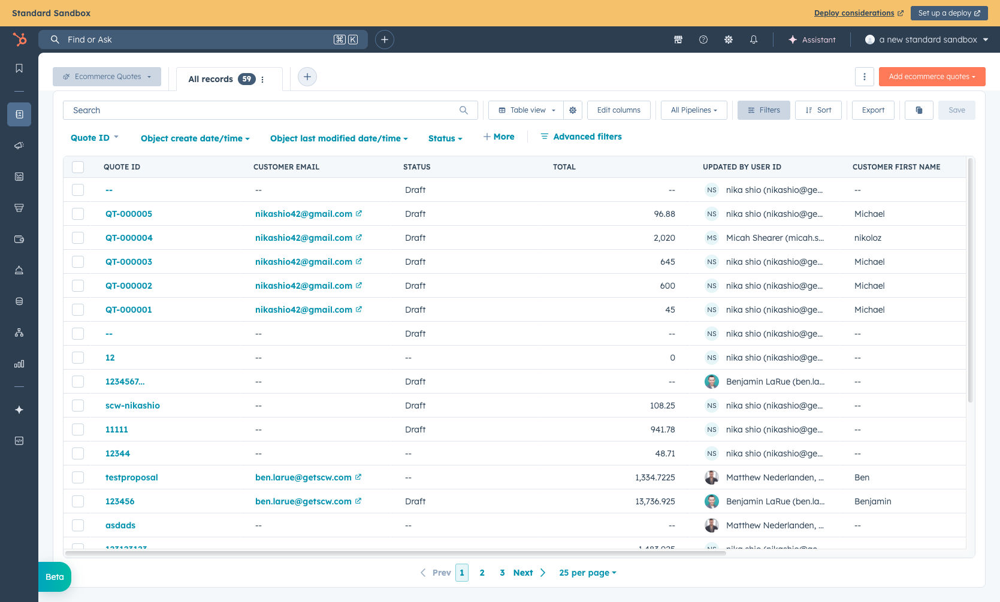

# Quote Builder & Payment Links

## Overview

The Quote Builder is a HubSpot CRM extension that lets sales reps create quotes, configure products, and generate payment links — all without leaving HubSpot. When a customer is ready to pay, the rep generates a payment link that takes the customer (or the rep) directly to checkout with all products pre-loaded.

---

## Where to Find the Quote Builder

The Quote Builder lives on the **Ecommerce Quote** object in HubSpot.

### From Any CRM Page (Recommended)

1. Navigate to any CRM page (e.g., Contacts, Deals)
2. Click the **Object Type Selector** dropdown at the top-left of the page (it shows the current object name, e.g., "Contacts")
3. Select **Ecommerce Quotes** from the list
4. This opens the Ecommerce Quotes grid — showing all quotes with status, totals, and customer info
5. Click **Create Ecommerce Quote** to start a new quote, or click an existing quote to open it
6. The **Quote Builder** card appears on the Ecommerce Quote record page

### From a Contact Record

You can also access quotes linked to a specific customer:

1. Navigate to a **Contact** record in HubSpot
2. In the right sidebar, find the **Ecommerce Quotes** association
3. Click **+ Add** to create a new quote linked to that contact, or click an existing quote

*The Ecommerce Quotes grid — shows all quotes with customer email, status, total, and more.*

*An individual Ecommerce Quote record showing the Quote Builder tab, product list, summary, and shipping details.*

---

## Building a Quote

### Adding Products

1. Click **Add Products** in the Quote Builder
2. Search for a product by name or SKU
3. Select the product — if it has configurable options (size, color, etc.), a modal appears to select them
4. Set the quantity and price
5. The product is added to the quote's line items

*The "Add products" panel — search for products by name or SKU to add them to the quote.*

### Editing Line Items

Each line item in the quote shows:
- **Item name** and SKU
- **Quantity**
- **Sell Price** (editable — this is the quoted price)
- **Total** (qty x price)
- **Actions** — Edit or Remove

Click **Edit** on any line item to change the quantity, price, or apply a line-level discount.

*A quote with a line item showing product name, quantity, price, Edit/Remove actions, total summary, shipping address, and Payment Link section.*

### Quote Summary

The right side of the Quote Builder shows:
- **Subtotal** — sum of all line items
- **Tax** — calculated automatically if a shipping address is set (via TaxJar)
- **Discount** — quote-level discount (click "Edit discount" to apply)
- **Total** — final amount the customer will pay

### Customer Address

The Quote Builder can auto-populate the customer's billing and shipping address from their HubSpot Contact record. The address is used for:
- Tax calculation (TaxJar needs a shipping address)
- Pre-filling the checkout form when the payment link is opened

---

## Generating a Payment Link

Once the quote is complete:

1. Click **Payment Link** button
2. The system validates the quote and generates a checkout URL
3. The payment link appears with **Open** and **Copy** buttons

The Payment Link, Shipping, and Address sections are visible in the quote screenshot above.

### What Happens When the Link is Generated

Behind the scenes:
1. The Quote Builder sends the line items, prices, and customer email to the SCW Commerce backend
2. A cart is created in the SCW Commerce database with:
   - All products at the quoted prices (prices are **locked** — they won't change even if the catalog price updates)
   - The customer's email (from the associated HubSpot Contact)
   - A link back to the Ecommerce Quote ID
3. The URL is saved to the `eq_payment_link` property on the Ecommerce Quote

### Two Ways to Use the Payment Link

#### Option 1: Send to Customer
Copy the link and send it to the customer via email, chat, or any channel. The customer opens the link, sees the pre-loaded cart, enters their shipping address and payment info, and completes checkout.

#### Option 2: Rep Checks Out on Behalf of Customer
The rep opens the link themselves (e.g., while on a phone call with the customer). The checkout page:
- Pre-fills the customer's email
- Loads the customer's **saved addresses** from their account (if they have one)
- The rep selects the shipping address, enters the customer's credit card (or selects an offline payment method), and completes the order

The order is associated with the **customer's account** (not the rep's), so it appears in the customer's order history.

<!-- TODO: Add screenshot of checkout page opened from payment link -->

---

## What Gets Created in HubSpot

After a successful checkout from a payment link:

| HubSpot Object | What Happens |
|---|---|
| **Ecommerce Order** | Created automatically with order number, status, totals, addresses |
| **Ecommerce Quote ↔ Order** | Association created — you can see the order on the quote and vice versa |
| **Contact** | Order is associated with the contact |
| **Ecommerce Line Items** | Each product in the order is created as a line item |
| **Ecommerce Invoice** | Created if payment was processed immediately (credit card) |

<!-- TODO: Add screenshot of Ecommerce Quote with linked Order in sidebar -->
<!-- TODO: Add screenshot of Ecommerce Order with linked Quote in sidebar -->

---

## Important Notes

- **Payment links expire after 30 days.** If the customer doesn't use it in time, the rep needs to generate a new one.
- **Each payment link creates a new cart.** If the rep generates multiple links for the same quote, only the latest one should be used.
- **Prices are locked.** The checkout uses the exact prices from the quote, not the current catalog prices. If a product's price changes after the quote is built, the customer still pays the quoted price.
- **A contact must be associated with the quote.** The system requires a contact email to generate the payment link. If no contact is associated, the link generation will fail with an error message.
