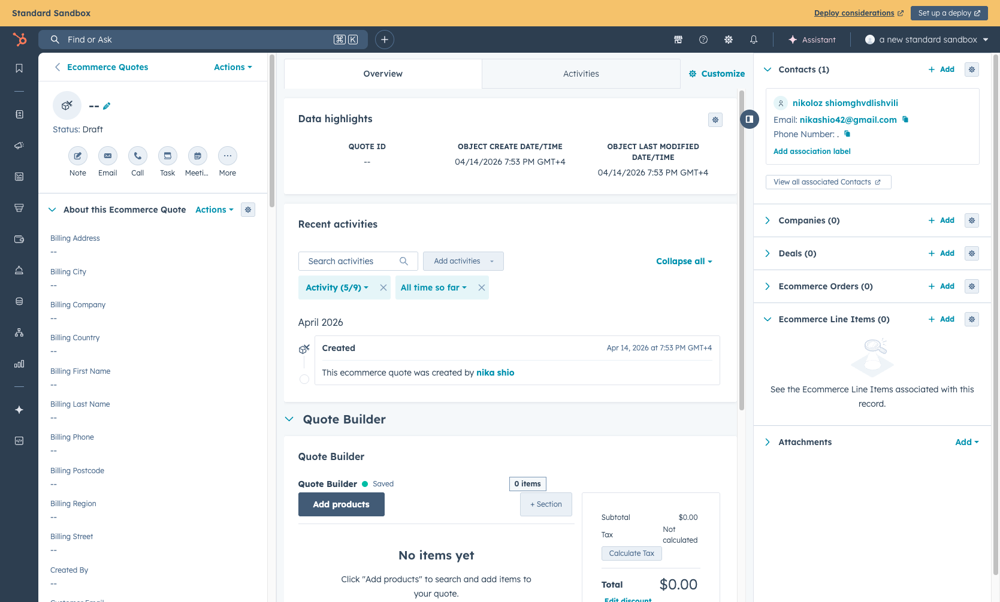
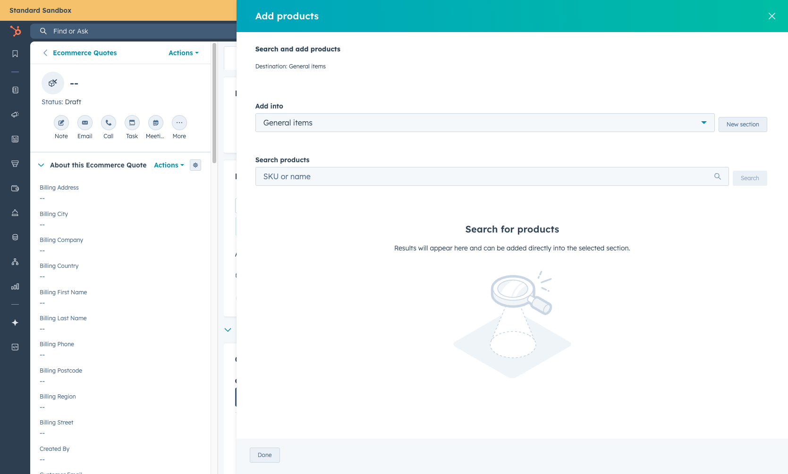
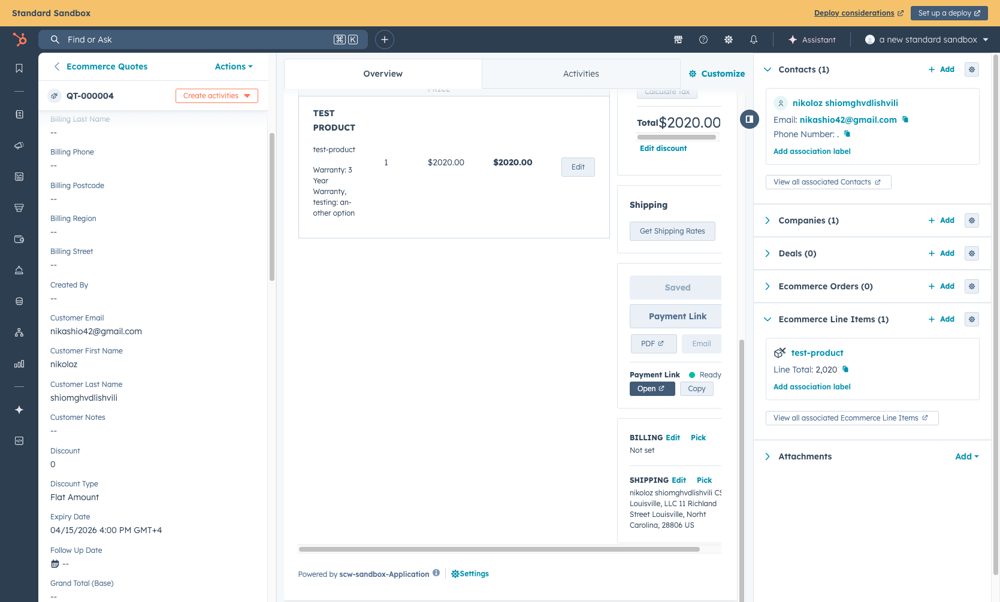
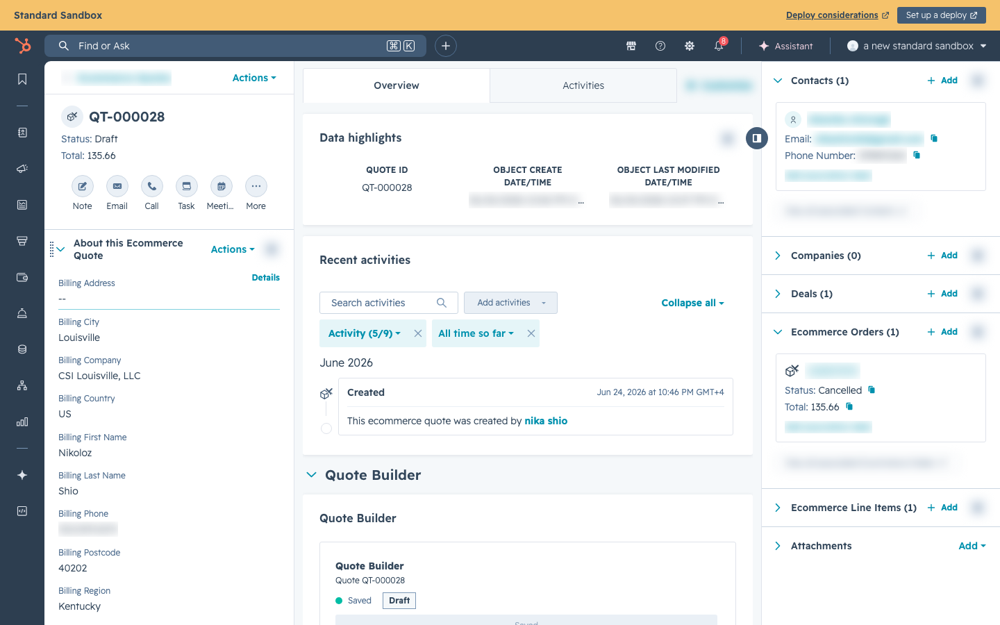

# Quote Builder & Payment Links

## Overview

The Quote Builder is a HubSpot CRM extension that lets sales reps create quotes, configure products, and generate payment links — all without leaving HubSpot. When a customer is ready to pay, the rep generates a signed payment link that takes the customer (or the rep) to checkout with the quote loaded from trusted HubSpot data.

***

## Where to Find the Quote Builder

The Quote Builder lives on the **Ecommerce Quote** object in HubSpot.

### From Any CRM Page (Recommended)

1. Navigate to any CRM page (e.g., Contacts, Deals)
2. Click the **Object Type Selector** dropdown at the top-left of the page (it shows the current object name, e.g., "Contacts")
3. Select **Ecommerce Quotes** from the list
4. This opens the Ecommerce Quotes grid — showing all quotes with status, totals, and customer info
5. Click **Create Ecommerce Quote** to start a new quote, or click an existing quote to open it
6. The **Quote Builder** card appears on the Ecommerce Quote record page

### From a Contact Record

You can also access quotes linked to a specific customer:

1. Navigate to a **Contact** record in HubSpot
2. In the right sidebar, find the **Ecommerce Quotes** association
3. Click **+ Add** to create a new quote linked to that contact, or click an existing quote

 _The Ecommerce Quotes grid — shows all quotes with customer email, status, total, and more._

 _An individual Ecommerce Quote record showing the Quote Builder tab, product list, summary, and shipping details._

***

## Starting a Quote from a Customer's Website Cart

When a customer assembles a cart on getscw.com and then calls or emails, you can pull their **live website cart** straight into a quote — no re-keying, and no asking them to screenshot their cart.

### The "Website Cart → Quote" Card

On a **Contact** record in HubSpot, the **Website Cart → Quote** card appears in the right sidebar. It matches the contact to their SCW Commerce account — by HubSpot contact ID first, falling back to the contact's email — and shows that customer's current website cart:

- **Items** and **Subtotal** at the top
- Each cart line: product name, SKU, any selected options, quantity, unit price, and line total
- If you've already built a quote from this cart, a **Quote {number}** tile with an **Open quote** button

Use **Refresh cart** to re-pull the latest cart if the customer just changed it.

> [SCREENSHOT: The "Website Cart → Quote" sidebar card on a Contact record — items list with qty/unit price/line total, the Items + Subtotal stats, and the Build quote button. — images/website-cart-card.png]

If there's nothing to show, the card explains why:

| Card message | What it means |
|---|---|
| No SCW Commerce account linked to this contact | The contact's HubSpot ID and email don't match any storefront account. |
| This customer has no items in their website cart | The account exists, but the cart is empty. |
| The customer's website cart has expired | The cart is older than 30 days (carts expire after 30 days of inactivity). |
| No email — cannot look up their website cart | The contact has no email address to match on. |

### Building the Quote

1. Click **Build quote**.
2. A confirmation panel summarizes what will be created — *"a new Ecommerce Quote with N line items ($X subtotal) for {email}."*
3. Confirm. A **draft Ecommerce Quote** is created with the cart's line items and associated to the contact.
4. The card shows a success message with the quote number and an **Open quote** button. Open it in the **Quote Builder** to adjust pricing, apply discounts, set the shipping address, and generate a payment link — the normal quote flow from here (see the sections below).

### Updating an Existing Quote

If you build again from the same cart (for example, the customer added items and called back), the button reads **Update quote**. The quote is matched to the cart, so updating **replaces** the linked quote's line items with the current cart contents instead of creating a duplicate. Re-apply any pricing or discounts in the Quote Builder afterward.

### Built-in Safeguards

- **Cart-changed protection.** If the cart changed between opening the card and clicking Build, the build is rejected and the card refreshes — review the new contents and try again. You can't accidentally quote a stale cart.
- **Unpriceable items block the build.** If any cart item can't be priced, the build stops and lists the affected SKUs rather than create an incomplete quote.
- **Unmapped products are kept, not dropped.** If a cart product isn't linked to a HubSpot product, it's still added as a line item with a warning noting it — so the quote is always complete.

### What Gets Created

A draft **Ecommerce Quote** plus its **Ecommerce Line Items**, associated to the Contact. From there it behaves like any other quote — continue with *Building a Quote* and *Generating a Payment Link* below.

---

## Building a Quote

### Adding Products

1. Click **Add Products** in the Quote Builder
2. Search for a product by name or SKU
3. Select the product — if it has configurable options (size, color, etc.), a modal appears to select them
4. Set the quantity and price
5. The product is added to the quote's line items

 _The "Add products" panel — search for products by name or SKU to add them to the quote._

### Editing Line Items

Each line item in the quote shows:

* **Item name** and SKU
* **Quantity**
* **Sell Price** (editable — this is the quoted price)
* **Total** (qty x price)
* **Actions** — Edit or Remove

Click **Edit** on any line item to change the quantity, price, or apply a line-level discount.

 _A quote with a line item showing product name, quantity, price, Edit/Remove actions, total summary, shipping address, and Payment Link section._

### Quote Summary

The right side of the Quote Builder shows:

* **Subtotal** — sum of all line items
* **Tax** — calculated automatically if a shipping address is set (via TaxJar)
* **Discount** — quote-level discount (click "Edit discount" to apply)
* **Total** — final amount the customer will pay

### Customer Address

When the quote email matches an SCW Commerce account, checkout auto-populates the customer's saved billing and shipping addresses from the SCW Commerce database (looked up by email), not from the HubSpot Contact record. The address is used for:

* Tax calculation (TaxJar needs a shipping address)
* Pre-filling the checkout form when the payment link is opened

***

## Generating a Payment Link

Once the quote is complete:

1. Click **Payment Link** button
2. The system validates the quote and generates a checkout URL
3. The payment link appears with **Open** and **Copy** buttons

The Payment Link, Shipping, and Address sections are visible in the quote screenshot above.

### What Happens When the Link is Generated

Behind the scenes:

1. The HubSpot action creates a signed URL with the Ecommerce Quote ID and expiration. The URL does **not** carry editable prices or quantities.
2. When the link is opened, SCW Commerce verifies the signature and fetches the quote, associated line items, and customer email from HubSpot server-side.
3. SCW Commerce matches every quoted line item to a storefront product by SKU. If any item cannot be matched, checkout stops instead of silently dropping it.
4. A cart is created in the SCW Commerce database with:
   * All products at the quoted prices (prices are **locked** — they won't change even if the catalog price updates)
   * The customer's email from the quote or associated HubSpot Contact, when available
   * A link back to the Ecommerce Quote ID
5. The customer is redirected to checkout with the new quote cart.

If the HubSpot action stores the generated URL on `eq_payment_link`, that property is only the saved link; SCW Commerce still re-reads quote prices from HubSpot when the link is used.

### Two Ways to Use the Payment Link

#### Option 1: Send to Customer

Copy the link and send it to the customer via email, chat, or any channel. The customer opens the link, sees the pre-loaded cart, enters their shipping address and payment info, and completes checkout.

#### Option 2: Rep Checks Out on Behalf of Customer

The rep opens the link themselves (e.g., while on a phone call with the customer). The checkout page:

* Pre-fills the customer's email when the quote or associated Contact has one
* Links the cart to the customer's SCW account when the email matches an existing customer
* Lets the rep select or enter the shipping address, enter the customer's credit card, or select an offline payment method

When the quote email matches an SCW customer, the order is associated with the **customer's account** (not the rep's), so it appears in the customer's order history.

> **Saved cards:** If the customer is signed in when opening the link, their saved cards (Authorize.net CIM wallet) will be available at checkout exactly as they are for a standard cart. Reps checking out on behalf of a customer while not signed in as that customer will not see the customer's saved cards — they must enter the card details manually.

> \[SCREENSHOT: The checkout page as it appears when a customer opens a HubSpot quote payment link — pre-loaded cart, pre-filled email, and the standard 3-column layout with locked prices. — images/quote-builder-checkout-from-link.png]

***

## What Gets Created in HubSpot

After a successful checkout from a payment link:

| HubSpot Object              | What Happens                                                                                                                                                                                                                      |
| --------------------------- | --------------------------------------------------------------------------------------------------------------------------------------------------------------------------------------------------------------------------------- |
| **Ecommerce Order**         | Created automatically with order number, status, totals, addresses                                                                                                                                                                |
| **Ecommerce Quote ↔ Order** | Association is attempted after the HubSpot order object exists; failures retry through the DLQ                                                                                                                                    |
| **Contact**                 | Order is associated with the contact                                                                                                                                                                                              |
| **Ecommerce Line Items**    | Each product in the order is created as a line item                                                                                                                                                                               |
| **Ecommerce Invoice**       | Created if payment was processed in `auth_capture` mode (immediate charge). Not created for `auth_only` mode, where the card is authorized but not yet charged; the invoice is created later when the admin captures the payment. |
| **Ecommerce Shipment**      | Created when ShipEdge marks the order shipped (synced via ShipEdge fulfillment webhook, not at checkout time)                                                                                                                     |

_The Ecommerce Quote record — after checkout, the resulting Order appears in the Ecommerce Orders sidebar section._

_The Ecommerce Order record — the originating Quote appears in the Ecommerce Quotes sidebar section._

***

## Important Notes

* **Payment links expire.** Signed quote links can expire, and the generated cart expires 30 days after the link is opened. If the customer doesn't use it in time, the rep needs to generate a new one.
* **Each opened payment link creates a new cart.** If the rep opens or sends multiple links for the same quote, use the newest checkout session.
* **Prices are locked.** The checkout uses the exact prices from the quote, not the current catalog prices. If a product's price changes after the quote is built, the customer still pays the quoted price.
* **Every quoted item must have a matching storefront SKU.** SCW Commerce blocks checkout if a HubSpot line item cannot be matched to a product.
* **Contact email improves checkout.** The quote can fall back to the associated Contact email for prefill and account linking, but product pricing always comes from the HubSpot quote and line items.
