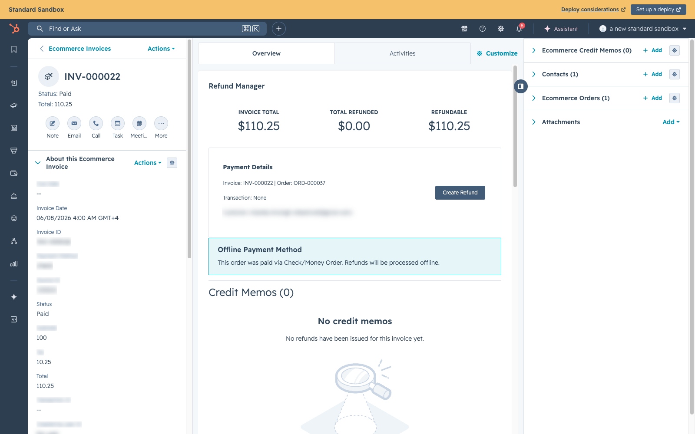

# Refunds & Credit Memos

## Overview

When a customer needs a refund, the process is managed entirely from HubSpot. Sales reps or admins use the **Credit Memo Card** on the Invoice record to create refunds. The system handles everything automatically: payment reversal through Authorize.net, customer email notification, TaxJar tax reporting, and HubSpot record creation.

---

## How to Issue a Refund

### Step 1: Find the Invoice

In HubSpot, navigate to the **Ecommerce Invoice** record for the order you need to refund. You can find it by:
- Going to the Ecommerce Order → clicking the associated Invoice in the sidebar
- Or searching Ecommerce Invoices directly

### Step 2: Open the Credit Memo Card



*The Refund Manager card on a HubSpot Ecommerce Invoice record — invoice total / total refunded / refundable amounts, payment details, and the Create Refund button (this check-paid invoice shows the offline-payment refund notice)*

On the Invoice record, click the **Credit Memo** tab. This shows:
- Invoice details (line items, totals)
- Authorize.net transaction status
- Any existing credit memos for this invoice

### Step 3: Choose Refund Type

| Type | When to Use | What Happens |
|---|---|---|
| **Full Refund** | Customer wants everything back | Refunds entire invoice amount. Order status → Cancelled |
| **Partial (Dollar Amount)** | Goodwill credit, price match, etc. | Refunds a custom dollar amount you specify |
| **Per Item** | Customer returning specific products | Select items and quantities to refund |

### Step 4: Submit

1. Select the refund type
2. Enter the reason (required)
3. For partial: enter the dollar amount
4. For per-item: select items and quantities
5. Click **Create Refund**

The system will:
1. Process the payment reversal through Authorize.net (credit card) or mark as offline refund (check/wire/PO)
2. Enqueue a HubSpot Credit Memo creation on the `hubspot_outbox` — delivered within ~1 minute with automatic retry on failure
3. Send a refund confirmation email to the customer
4. Report the refund to TaxJar as a negative transaction (with proportional tax)
5. Update the local invoice status to `refunded` if the invoice is fully refunded. HubSpot's Ecommerce Invoice enum has no refunded state, so the Credit Memo is the refund record there.
6. Update the order status to `cancelled` for full refunds. Partial and per-item refunds do not change order status automatically.

**Double-click safe:** Every refund request carries an idempotency key. If the card is clicked twice or the Lambda retries, SCW returns the existing refund instead of creating a duplicate. No risk of the customer being refunded twice.

---

## Refund Types Explained

### Full Refund

Refunds the entire invoice amount. The order moves to **Cancelled** status and is no longer eligible for fulfillment.

- **Use when:** Customer cancels the entire order, or the order can't be fulfilled
- **Payment:** Full amount returned to original payment method
- **Order status:** → Cancelled
- **Requires a clean invoice:** A full refund is only allowed when the invoice has no prior refunds. If the invoice has already been partially refunded, the system rejects the full refund — use a **Partial (Custom Amount)** or **Per-Item** refund for the remaining balance instead.

### Partial Refund (Custom Amount)

Refunds a specific dollar amount, up to the invoice total.

- **Use when:** Price adjustment, goodwill credit, shipping refund, damage discount
- **Payment:** Specified amount returned to original payment method
- **Order status:** No automatic change (admin decides)

### Per-Item Refund

Refunds specific line items by selecting products and quantities.

- **Use when:** Customer returns specific items from a multi-item order
- **Payment:** Calculated total for selected items returned
- **Order status:** No automatic change (admin decides)

---

## How Payment Reversal Works

The system automatically determines the correct payment reversal method:

| Transaction State | Method | What Happens |
|---|---|---|
| **Unsettled** (auth_only, same-day capture) | **Void** | Transaction is cancelled before it settles. Funds are released immediately. |
| **Settled** (captured, next business day+) | **Refund** | A new refund transaction is created. Funds typically appear in 5-10 business days. |

The system checks the original payment's transaction type:
- `auth_only` → Void
- `auth_capture` or `capture` → Refund

It then verifies settlement: if a captured transaction has not yet settled at Authorize.net, the refund is automatically routed to a **Void** instead — but only for a full refund (a void is all-or-nothing). A **partial** refund against a captured-but-unsettled transaction is blocked; the operator must wait until after the daily Authorize.net settlement batch and retry.

No manual decision is needed for the void-vs-refund choice — the system handles it automatically.

### When a Refund Is Blocked

A few conditions cause the refund to fail up front (before any money moves) and ask the operator to act:

| Condition | What the operator sees | What to do |
|---|---|---|
| **Partial refund on an uncaptured `auth_only` authorization** | Refund fails — a void is all-or-nothing, so a partial amount can't be voided | Capture the payment first, then issue the partial refund (or void the full amount) |
| **Partial refund on a captured-but-unsettled transaction** | Refund fails — Authorize.net won't issue a partial credit until the charge settles | Wait until after the next daily Authorize.net settlement batch, then retry |
| **Refund total exceeds the original captured amount** | Refund fails at the gateway boundary (e.g. inflated by shipping/restocking) | Lower the refund total so it does not exceed what was actually captured |
| **Card last-4 missing for a settled refund** | The system backfills it from the Authorize.net transaction-details lookup; only fails if both the DB and Auth.net lack it | Contact support if it still can't be resolved |

Refund creation is also concurrency-safe: the invoice row is locked while a refund is created, so two simultaneous refunds on the same invoice cannot over-refund it.

---

## What the Customer Receives

> [SCREENSHOT: The refund confirmation / credit memo email showing refund number, refund amount, refunded items, billing/shipping addresses, and the 5-10 business days note — images/refunds-customer-email.png]

When a refund is processed, the customer receives an email with:
- Refund number (e.g., RFD-000001)
- Refund amount
- Refunded items (for per-item refunds)
- Original billing and shipping addresses
- Note about 5-10 business days for the refund to appear

---

## Refund Status Flow

<section class="modern-flow" aria-label="Refund status flow">
  <div class="modern-flow__header">
    <div>
      <span class="modern-flow__eyebrow">Refund lifecycle</span>
      <span class="modern-flow__title">Refunds process automatically, record offline credits, or retry after failure</span>
    </div>
    <span class="modern-flow__badge">Credit Memo</span>
  </div>
  <div class="modern-flow__track">
    <span class="modern-flow__node modern-flow__node--start">Pending<small>Refund created</small></span>
    <span class="modern-flow__arrow" aria-hidden="true"></span>
    <span class="modern-flow__node modern-flow__node--action">Approved<small>Validated and ready</small></span>
    <span class="modern-flow__arrow" aria-hidden="true"></span>
    <span class="modern-flow__node modern-flow__node--done">Processed<small>Payment reversed and email sent</small></span>
  </div>
  <div class="modern-flow__branches">
    <div class="modern-flow__branch">
      <span class="modern-flow__branch-title">Offline cash refund</span>
      <div class="modern-flow__track">
        <span class="modern-flow__node modern-flow__node--wait">Operational payout<small>Check or wire handled by finance</small></span>
        <span class="modern-flow__arrow" aria-hidden="true"></span>
        <span class="modern-flow__node modern-flow__node--done">Processed<small>Credit memo recorded in SCW</small></span>
      </div>
    </div>
    <div class="modern-flow__branch">
      <span class="modern-flow__branch-title">Retry path</span>
      <div class="modern-flow__track">
        <span class="modern-flow__node modern-flow__node--fail">Failed<small>Payment gateway error</small></span>
        <span class="modern-flow__arrow" aria-hidden="true"></span>
        <span class="modern-flow__node modern-flow__node--start">Pending<small>Retry from pending</small></span>
      </div>
    </div>
  </div>
</section>

| Status | Meaning |
|---|---|
| **Pending** | Refund created, awaiting processing |
| **Approved** | Validated, ready to execute payment reversal |
| **Pending Settlement** | Supported state for a manually staged offline refund. HubSpot-created offline refunds currently skip this and process immediately when the credit memo is created. |
| **Processed** | Payment reversed or offline credit recorded, email sent, complete. HubSpot Credit Memo enqueued for sync. |
| **Failed** | Payment gateway error — can be retried |

In practice, when initiated from HubSpot:
- **Credit-card refunds**: Pending → Approved → Processed automatically in one step.
- **Offline cash refunds** (check / wire): Pending → Approved → Processed immediately when the admin creates the credit memo. Create it only after the offline payout is approved/issued operationally.
- **Offline credit memos** (PO / NET30): Pending → Approved → Processed (no payout, just reduces A/R).

---

## What Gets Created in HubSpot

> [SCREENSHOT: A HubSpot Credit Memo record showing the ecm_ properties (Credit Memo ID, Status, Refund Type [full/partial/custom_amount], Total Refund, Reason, Refund Date) and the associations to Order, Invoice, and Contact — images/hubspot-credit-memo-record.png]

When a refund is processed, a **Credit Memo** record is created with:

| Property | Description |
|---|---|
| Credit Memo ID | Refund number from SCW Commerce (e.g., RFD-000001) |
| Status | `refunded` (or `pending` when the source refund is still in `pending_settlement`) |
| Refund Type | `full`, `partial`, or `custom_amount` |
| Total Refund | Dollar amount refunded |
| Reason | Reason provided by the admin |
| Refund Date | When the refund was processed |

> **Refund Type values:** the Credit Memo stores the refund type verbatim as `full`, `partial`, or `custom_amount`. A **per-item** refund is stored as type `partial` (with the selected line items serialized onto the `ecm_refund_items` property), and a **custom dollar amount** is stored as `custom_amount`. The literal value "Per Item" is never written.

The Credit Memo is automatically **associated** with:
- The Ecommerce Order
- The Ecommerce Invoice
- The Contact

> **How it syncs:** the SCW outbox path is gated behind the `HUBSPOT_OUTBOX_ENABLED` flag. While the flag is off (the dual-write transition state), the SCW enqueue no-ops and the HubSpot Lambda creates the memo instead. Either path is **idempotent** on `ecm_source_id = scw-<refundId>`: if a memo already exists for the refund it is reused (and its associations repaired) rather than duplicated.

---

## Tax Compliance

Every refund is automatically reported to **TaxJar** as a negative transaction. This ensures:
- Tax collected on the original order is properly reversed
- TaxJar's filing reports reflect the correct net tax for each jurisdiction
- State/county/city tax amounts are adjusted accurately

### Proportional Tax on Partial Refunds

For **partial** and **per-item** refunds, the system refunds tax proportional to the goods returned. Formula:

```
taxRefund = invoice.taxAmount × (refundSubtotal + refundShipping) / (invoice.subtotal + invoice.shippingAmount)
```

Example: an invoice of $100 subtotal + $10 shipping + $7.70 tax ($117.70 total). Customer returns $50 of goods. Tax refund is `7.70 × 50 / 110 = $3.50`. The customer gets $53.50 back; TaxJar shows `-$3.50` sales tax. Without proportional math, TaxJar would see $0 refunded tax and SCW would over-remit $3.50 to the state.

### Retry on Failure

If TaxJar is unreachable at the moment of refund, the report is enqueued in the DLQ. The `process-dlq` cron runs every 5 minutes and retries due items with exponential backoff — 1, 2, 4, 8, then 16 minutes between attempts, up to 5 attempts. The refund itself still succeeds — TaxJar reconciles when it comes back online.

---

## Offline Payment Refunds

For orders paid via **Check/Money Order**, **ACH/Wire Transfer**, or **Purchase Order (NET30)**, the system processes refunds without calling a payment gateway.

### How It Works

When you click **Create Refund** on an invoice, the system checks the order's payment method and automatically selects the correct flow:

| Payment Method | Flow | What Happens |
|---|---|---|
| **Credit Card (Authorize.net)** | Online refund | Funds reversed through Authorize.net automatically |
| **Check / Money Order** | Offline cash refund | Credit memo created and marked processed; finance handles the external payout operationally |
| **ACH / Wire Transfer** | Offline cash refund | Credit memo created and marked processed; finance handles the external payout operationally |
| **Purchase Order (NET30)** | Credit-only memo | Credit memo created immediately — no payout needed (reduces accounts receivable) |

### Cash Refund Flow (Check / ACH / Wire)

1. Admin creates refund from the Credit Memo card on the invoice
2. System creates a credit memo and marks it **Processed** immediately
3. Admin/finance handles the actual payout operationally (writes a check, initiates wire, etc.)
4. System sends refund confirmation email to customer and reports to TaxJar

### Credit-Only Flow (Purchase Order / NET30)

1. Admin creates refund from the Credit Memo card on the invoice
2. System creates a credit memo and marks it **Processed** immediately
3. Customer receives email confirmation
4. The credit reduces the outstanding accounts receivable — no cash payout needed

### Customer Notes

The refund form includes a **Notes to Customer** field. Use this for:
- RMA numbers
- Restocking fee explanations
- Return shipping instructions
- Approval status details

These notes are stored on the refund record (`refunds.customer_notes`). They are **not** currently synced to the HubSpot Credit Memo (the credit-memo property set has no notes field), and the customer email template does not yet include those notes.

### Refund Adjustments

Both online and offline refunds support:
- **Shipping Refund** — amount of shipping to refund
- **Restocking Fee** — deducted from the refund total. There is no enforced percentage cap in code — the fee is only validated as a non-negative number; the sole constraint is that the resulting refund total must remain greater than zero.

Formula: `Refund Total = Item Subtotal + Shipping Refund + Proportional Tax − Restocking Fee`

The proportionally-refunded tax (see [Proportional Tax on Partial Refunds](#proportional-tax-on-partial-refunds)) is included in the grand total.

---

## Limitations & Known Gaps

| Gap | Current Workaround |
|---|---|
| **ShipEdge not auto-cancelled** | Admin must manually cancel fulfillment in ShipEdge if items haven't shipped |
| **Partial refund doesn't update order status** | Admin manually updates order status if needed |
| **No customer-facing refund tracking** | Customer gets email confirmation but can't check refund status in their account |
| **No refund reversal** | Once processed, a refund cannot be undone — issue a new invoice if needed |
| **No separate payout tracker for offline cash refunds** | SCW records the credit memo as processed when created; finance tracks the external check/wire payout operationally |

---

## Troubleshooting

**Refund failed with gateway error:**
- Check if the transaction has settled (void vs refund)
- Verify the original transaction ID is valid in Authorize.net
- Check if the card has expired (refunds to expired cards usually still work)
- Retry from the Credit Memo Card

**Credit Memo not showing in HubSpot:**
- Credit memos are created asynchronously via the HubSpot outbox. Delivery normally takes under a minute.
- Check `hubspot_outbox` for the refund row:
  ```sql
  SELECT id, event_type, status, attempt_count, last_error_code, last_error_message
  FROM hubspot_outbox
  WHERE entity_type = 'refund' AND entity_id = '<refundId>';
  ```
- Status meanings:
  - `pending` / `processing` — about to deliver, check again in 1 min
  - `retrying` — HubSpot returned a transient error, will auto-retry with backoff
  - `abandoned` — non-retryable error (e.g. HubSpot 400) after 9 attempts; needs human attention. Check `last_error_message`.
  - `delivered` — successfully created in HubSpot; refresh the HubSpot record

**Customer didn't receive refund email:**
- Check the customer's email address on the order
- Check SCW Commerce logs for email sending errors
- The email is sent asynchronously — it may take a few minutes
