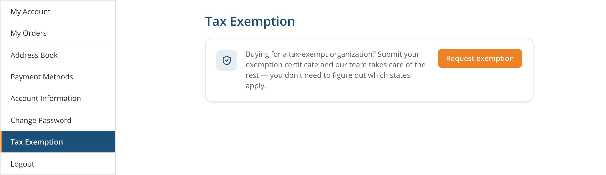
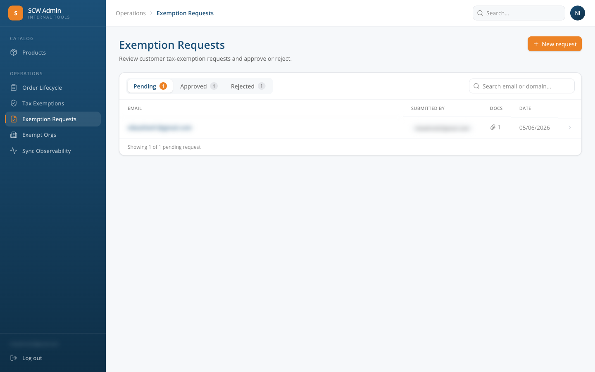
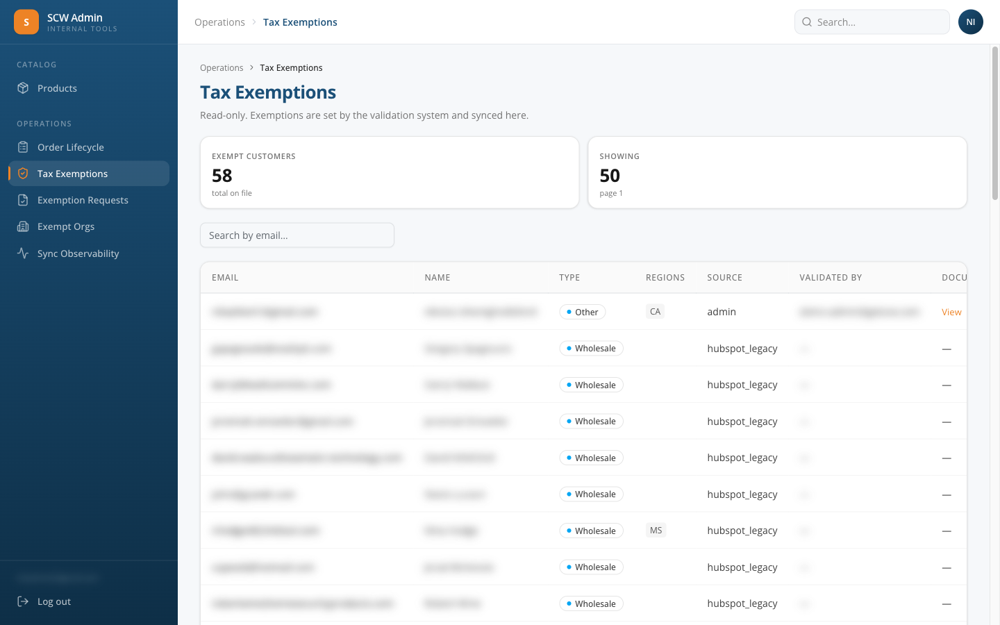

# Tax-Exemption Management

This page describes how a customer's tax-exempt status is set in SCW Commerce: how a customer requests an exemption, how an admin reviews and approves or rejects it, what approval does behind the scenes, and how a company exemption reaches every member of that company.

> **A tax exemption belongs to the company.** A person receives it by being a member of a company that holds one, either through an email domain match or through an administrator-approved guest link. A plain HubSpot association grants nothing. Exemptions approved for an individual account before the company model still work and are never re-decided. See [Entitlement Request Workflows](entitlement-request-workflows.md) for the membership model.

> **Note — the external validation webhook was removed.** An earlier design accepted exemptions from an external doc-review system over a signed inbound webhook (`POST /api/webhooks/tax-exemption`, secured with `TAX_EXEMPTION_WEBHOOK_SECRET`). That endpoint, its signature helper, its validator, and the shared-secret env var were all removed (commit `ca65706a`, "drop external webhook; ExemptionSource = admin|hubspot\_legacy"). There is no external webhook to call any more — any request to the old URL returns `404`. Exemptions are now set entirely inside SCW Commerce through the admin review flow and the customer self-service request flow described below. HubSpot is **not** an input to exemption status; historical values imported before this system are simply marked `hubspot_legacy`.

***

## Overview

A customer's tax treatment is driven by two fields on their SCW Commerce account:

* `exemption_type` — one of `wholesale`, `government`, `other`, or `non_exempt`
* `exempt_regions` — a comma-separated list of two-letter US state codes (e.g. `CA,NY,TX`)

A third field, `exemption_source`, records **how** the exemption was set:

| `exemption_source` | Meaning                                                                                                                                                  |
| ------------------ | -------------------------------------------------------------------------------------------------------------------------------------------------------- |
| `admin`            | Set by a staff member approving an exemption request in the admin UI. This is the authoritative, highest-precedence source.                              |
| `org`              | Set automatically by a company exemption reaching this account through its registered email domain.                                                      |
| `hubspot_legacy`   | A value migrated in from HubSpot before this system existed. Not an active input — it simply records that the value predates the current flow.           |
| `magento_legacy`   | A value migrated in from Magento during the historical import. Not an active input — treated the same way as `hubspot_legacy` for filtering and display. |

There is no `webhook` source — the external webhook concept no longer maps to anything in the system.

Whenever an exemption is applied, SCW Commerce pushes the customer's exemption to **TaxJar** so the correct tax treatment (`$0` tax in the exempt states) applies at checkout, and writes an append-only audit row so the full history of every change is preserved.

***

## How a Customer Requests an Exemption

A logged-in customer requests an exemption from their account at **`/account/tax-exemption`**.

The page shows a status card:

* **Not exempt, no pending request** — a "Request exemption" button opens a dialog.
* **Under review** — a pending request exists; the customer is told the team is reviewing and will email them. The button is hidden while a request is pending.
* **Tax-exempt** — the account is already exempt; the card shows the exempt states and an "Update documents" button.

In the request dialog the customer:

1. Uploads one or more documents (PDF or image, up to 10 files) — e.g. a reseller or exemption certificate. At least one document is required.
2. Optionally selects a requested exemption type (Wholesale / resale, Government, or Other) — or leaves it as "Not sure — let your team decide".
3. Optionally lists the states they believe apply.

Submitting `POST`s a multipart form to **`POST /api/account/tax-exemption`**. The documents are uploaded to private S3 storage and a **pending** request row is created (`submitted_by = "customer"`). A customer may only have one pending request at a time — a second submission returns `409 request_already_pending`.

Staff can also create a request **on behalf of** a customer from the admin side (`POST /api/admin/tax-exemption-requests` with the customer's email and the documents); those requests are recorded with the admin's email as `submitted_by`.

***

## How an Admin Reviews a Request

Pending requests land in the admin review queue at **`/admin/tax-exemption-requests`**.

_The admin Exemption Requests queue with Pending / Approved / Rejected tabs (each showing a count), the search box, and the list of requests_

The queue has three tabs — **Pending**, **Approved**, and **Rejected** — each with a count badge, plus a search box. It defaults to the Pending tab. Clicking a request opens its detail page at **`/admin/tax-exemption-requests/{id}`**.

> \[SCREENSHOT: The admin Exemption Request detail page showing the customer panel, the uploaded documents list, and the "Review decision" card with the exemption-type select, states field, Approve button, and the reject reason box — images/admin-tax-exemption-request-detail.png]

The detail page shows:

* **Customer panel** — name, email, the requested type and states, who submitted it, and when.
* **Documents** — the uploaded certificate(s), each opening in a new tab.
* **Review decision** card (for pending requests) — the admin picks the **exemption type** (Wholesale, Government, or Other), enters the **states** (comma-separated), and clicks **Approve & apply exemption**; or enters a **reason** and clicks **Reject request**.

If the customer pre-filled a requested type or states, those values pre-populate the approval form so the admin can confirm or adjust them.

#### Scope banner: company-wide vs. per-account

Before the Approve button, the review card shows a **scope banner** derived from the customer's email domain:

* **Amber / "Organization-wide"** means the customer's email is on a corporate domain (not gmail, yahoo, etc.). Approving will call `upsertOrgForDomain` and apply the exemption to **every existing and future account on that domain**. The banner names the domain so the admin can verify it before clicking.
* **Gray / "Applies to … only"** — the customer's email is on a known public/webmail domain. Approving exempts only this account; no domain cascade occurs.

The banner uses the same `extractEmailDomain` / `isPublicEmailDomain` helpers that `approveRequest` uses server-side, so the preview is never out of sync with what actually happens.

A buyer on a public/webmail address who genuinely purchases for a company reaches the company exemption a different way: a rep files **Link Guest Email to Company** on the HubSpot contact card, an admin approves it under **Requests → Membership Requests**, and the approved membership carries the company's exemption. Approving a per-account exemption for them instead creates a personal grant that no company change can take back.

When creating a request on behalf of a customer (`/admin/tax-exemption-requests/new`), the email field shows a helper note warning that a company domain will apply company-wide. Identical guidance, earlier in the flow.

### Approving

Approving `POST`s to **`POST /api/admin/tax-exemption-requests/{id}/approve`** (admin authentication required). The body is `{ type, regions }`, where `type` is one of `wholesale`, `government`, or `other` and `regions` is the comma-separated state list. This runs `approveRequest`, which performs three steps **in order**:

1. **Apply the exemption first** — calls `applyExemption` (see below). This can throw if TaxJar fails. If it throws, the request is **not** marked approved and **no** email is sent.
2. **Mark the request approved** — only reached if step 1 succeeded — recording the applied type, applied states, the reviewing admin, and the timestamp.
3. **Email the customer** that their exemption was approved.

On success the API returns `{ ok: true }`. A request that is not found returns `404`; a request that is no longer pending returns `409`; an underlying failure (e.g. a TaxJar error bubbling up from `applyExemption`) returns `502 approve_failed`.

### Rejecting

Rejecting `POST`s to **`POST /api/admin/tax-exemption-requests/{id}/reject`** with `{ reason }` (a non-empty string is required). This marks the request `rejected`, stores the reason and the reviewing admin, and emails the customer the rejection reason. **Rejection does not touch the customer's exemption values** — an already-exempt customer stays exempt; a non-exempt customer stays non-exempt.

***

## Outbound Make Webhook on Status Changes

Separate from the (removed) _inbound_ validation webhook described at the top of this page, SCW Commerce fires an **outbound** Make.com webhook every time a tax-exemption request changes status. This is what loops the team in automatically:

| Transition | Event type                | Who it notifies                                       |
| ---------- | ------------------------- | ----------------------------------------------------- |
| Submitted  | `tax_exemption.submitted` | Compliance — triggers the ClickUp admin-approval flow |
| Approved   | `tax_exemption.approved`  | Sales — includes the applied type and states          |
| Rejected   | `tax_exemption.rejected`  | Sales — includes the reject reason                    |

**The submission event fires for every submission — both customer self-service and admin-on-behalf** (both paths run through the same `createRequest`), so on-behalf requests still reach the ClickUp approval flow.

All three events POST to **one shared Make hook** (configured by the `MAKE_TAX_EXEMPTION_WEBHOOK_URL` env var, overridable per-event in **Admin → Integrations → Make Webhooks**). The payload carries a top-level `status` field (`submitted` / `approved` / `rejected`) so a single Make scenario can branch on it. Each payload includes: the request id, the customer's id and email, the customer's **HubSpot contact id** (`hubspot_contact_id`) and **company** (both sent as `null` when not on file — added July 2026 so a Make scenario can look up the assigned account owner and loop them in), the requested type and states, the applied type and states (on approval), the reject reason (on rejection), and `submitted_by` plus a derived `submitted_by_kind` (`customer` vs `admin`).

Delivery reuses the durable **Make integration outbox** (the same mechanism behind order- and refund-created webhooks):

* The webhook is enqueued **after** the status change has committed and delivered on a **best-effort, non-blocking** basis — a Make outage never blocks or fails the customer/admin action.
* If a delivery fails, the durable outbox row is retried by the `process-make-outbox` cron on a backoff schedule (1m → 2h) until it succeeds or is exhausted.
* Each transition is delivered **exactly once** (idempotency keyed per request + transition), so submitted, approved, and rejected for the same request never collide or double-send.
* If the webhook URL is **not configured** (or the event is disabled in the admin UI), the event is simply skipped — nothing is sent and no failed-delivery rows accumulate.

***

## What Approval Does — `applyExemption`

The authoritative write happens in `applyExemption` (`src/services/tax-exemption-sync.service.ts`). It is **idempotent**: if the incoming type and states exactly match the customer's current values, it is a complete no-op — no TaxJar call, no audit row, no DB write — and returns `{ changed: false }`.

When values do change, the steps run **in this exact order**:

1. **Push to TaxJar first.** The customer's exemption is synced to TaxJar via `syncCustomerExemption` (creating a TaxJar customer record if one doesn't exist yet). `syncCustomerExemption` returns `{ success: false }` rather than throwing, so `applyExemption` **throws** on failure here — **before any database write**. This ordering is deliberate: throwing before the DB write means nothing is persisted, so a retry still sees a database-vs-incoming mismatch and re-attempts TaxJar instead of short-circuiting to a no-op.
2. **Append an audit row** to the `tax_exemption_events` table — the append-only history of every exemption change (customer, email, type, states, source, validated-by, validated-at, document reference, and the raw inbound payload). The audit row is written **before** the customer update so it is never lost on a partial failure.
3. **Update the customer row** — sets `exemption_type`, `exempt_regions`, `exemption_source`, the provenance fields (`exemption_validated_by`, `exemption_validated_at`, `exemption_document_reference`, `exemption_updated_at`), and saves back the new TaxJar customer id when a record was just created.

The important consequence of "TaxJar first": **if TaxJar fails, nothing is saved.** Neither the customer row nor TaxJar is updated, the audit row is not written, and the approve endpoint returns `502`. Retry the full approval — there is no half-applied state where SCW Commerce records an exemption that TaxJar never received.

For an admin approval the audit/customer rows are written with `source = "admin"`, `validated_by` = the approving admin's email, `validated_at` = the approval time, and `document_reference` = the first uploaded document key.

> **About the state codes:** `parseExemptRegions` normalizes the supplied list — it splits on commas/semicolons, upper-cases each token, and **drops any token that is not exactly two characters**. It does not check the tokens against a list of real US state codes, so a malformed two-letter string (e.g. `ZZ`) would pass through. Enter valid state codes.

***

## Company Exemptions

For B2B accounts where everyone at a company should be exempt, the exemption is held by the **company** and reaches people through **membership**.

Approving an exemption request from a corporate email domain creates or updates the company exemption for that domain (`upsertOrgForDomain`) and applies it to every customer whose email domain matches, reusing the same trusted `applyExemption` path so every write is audited and TaxJar-synced, with `source = "org"`. New sign-ups whose email domain belongs to an exempt company are exempted automatically on account creation (a failure there is logged and never blocks sign-up).

A member whose own email is on a public/webmail domain reaches the same company exemption through an **administrator-approved guest link** rather than through the domain rule. A plain HubSpot association grants nothing.

Companies, their domains, their members, and their entitlements are managed at **Admin → Entitlements → Organizations** (`/admin/organizations`). The company page carries a **Revoke** action for the exemption and a **Remove** action per member, and both are audited.

Two precedence rules are locked in:

* **Admin beats company.** A company exemption never overwrites a customer who is already exempt via a manual admin approval (`exemption_source = "admin"`).
* **Removing the company configuration does not revoke exemptions.** Already-exempt customers stay exempt, so removing a rule never triggers a surprise tax change at checkout. Revoke the exemption explicitly when that is the intent.

***

## The Read-Only Tax Exemptions List

A read-only view of every exempt customer lives at **`/admin/tax-exemptions`**.

_The read-only Tax Exemptions list showing the exempt-customer count and a table of email, name, type, regions, source, validated-by, and document_

It shows, per exempt customer: email, name, exemption type, regions, **source** (`admin` / `org` / `hubspot_legacy` / `magento_legacy`), who validated it, and a link to the supporting document. It is searchable by email and paginated. This page does not edit anything: exemptions are set through the request-approval flow and the company exemptions described above, and this list just reflects the result.

***

## Audit Trail

Every applied exemption change appends one row to the `tax_exemption_events` table. This append-only log records who validated the exemption, when, the source (`admin` / `org` / `hubspot_legacy` / `magento_legacy`), the type and states applied, the document reference, and the raw payload — providing a compliance history that cannot be overwritten by later changes.
