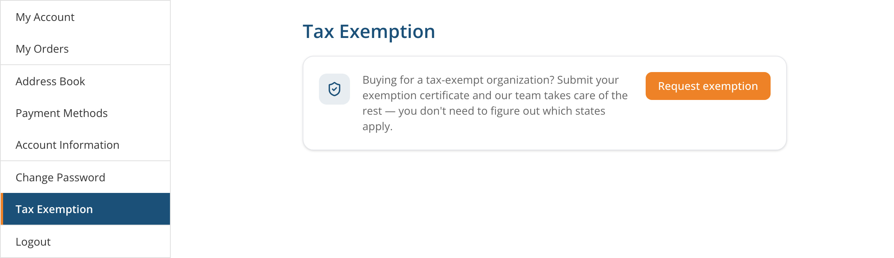
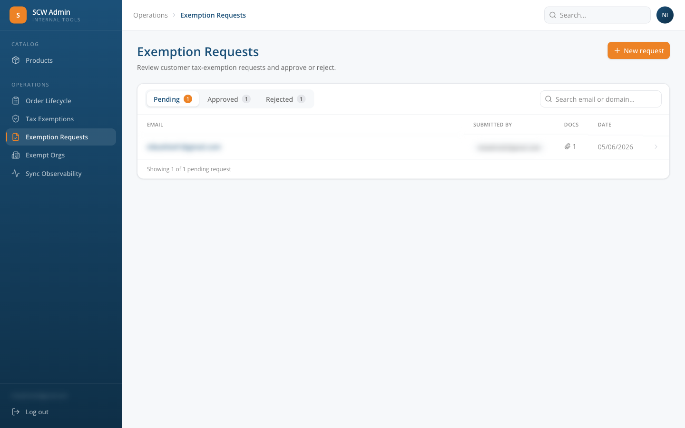

# Tax-Exemption Management

This page describes how tax exemption works in SCW Commerce: which exemption an order gets, how a customer requests an exemption, how an admin reviews and approves or rejects it, what approval does behind the scenes, and how a company exemption reaches the people who buy for that company.

> **A tax exemption belongs to the company.** An order is exempt when the company it is for holds an exemption covering the ship-to state. Personal exemptions exist only for buyers on a free email address (gmail, yahoo, and similar), for example a church volunteer buying on a personal address. A buyer with a company email always uses their company's exemption. A plain HubSpot association grants nothing. See [Entitlement Request Workflows](entitlement-request-workflows.md) for the membership model.

> **Note — the external validation webhook was removed.** An earlier design accepted exemptions from an external doc-review system over a signed inbound webhook (`POST /api/webhooks/tax-exemption`, secured with `TAX_EXEMPTION_WEBHOOK_SECRET`). That endpoint, its signature helper, its validator, and the shared-secret env var were all removed (commit `ca65706a`, "drop external webhook; ExemptionSource = admin|hubspot\_legacy"). There is no external webhook to call any more — any request to the old URL returns `404`. Exemptions are now set entirely inside SCW Commerce through the admin review flow and the customer self-service request flow described below. HubSpot is **not** an input to exemption status; historical values imported before this system are simply marked `hubspot_legacy`.

***

## Overview

### Which Exemption an Order Gets

The same rule decides every tax calculation: checkout, the HubSpot quote builder, the quote PDF and email, quote payment links, quote to order, and order address edits. First, SCW works out which company the order is for. The first match wins:

1. **The company the buyer picks at checkout** under **"Who is this order for?"**, as long as they are still a member of it.
2. **The company the HubSpot quote was written for**, for everything priced from a quote: the quote builder, the quote PDF and email, the payment link, and quote to order. The contact on the quote does not need to be a member of it. See [Quote Builder](quote-builder.md) for how SCW picks a quote's company.
3. **The buyer's only company**, when they are a member of exactly one and did not pick **Myself**. A member of two or more companies has no default: they pick at checkout.
4. **The company that owns the buyer's email domain.** This applies even when the buyer picked **Myself**: a buyer on a company email always buys with their company's exemption.

The order is exempt only in **that company's** exempt states. A company exempt in NC pays tax on a shipment to SC, and SCW does not look for another company to cover SC.

When that company does not cover the ship-to state, or there is no company, a buyer on a **free email** can still use their own **personal exemption** if it covers the state. A buyer on a company email never gets a personal exemption.

Otherwise the order is taxed. Orders shipping outside the US, or with no state, are never exempt, and an exemption with no states is exempt nowhere.

Only an email SCW trusts counts: the signed-in account's email, or the contact email on a HubSpot quote. An email typed at guest checkout never makes an order exempt.

### Where Exemptions Are Stored

* **Company exemptions** live on the company (**Admin → Entitlements → Organizations**): exemption type, exempt states, and certificate expiry. When the company covers the ship-to state, SCW sets tax to `$0` itself. TaxJar is not asked, and no TaxJar customer record is involved.
* **Personal exemptions** live on the customer's account, in two fields:
  * `exemption_type`: one of `wholesale`, `government`, `other`, or `non_exempt`
  * `exempt_regions`: a comma-separated list of two-letter US state codes (e.g. `CA,NY,TX`)

  A personal exemption is pushed to **TaxJar** as a customer record, and TaxJar applies it when SCW asks for tax.

A third account field, `exemption_source`, records **how** the account's exemption was set:

| `exemption_source` | Meaning |
| ------------------ | ------- |
| `admin`            | A personal exemption a staff member approved in the admin review queue. |
| `org`              | A legacy copy of a company exemption, written onto member accounts before exemptions moved to companies. Tax ignores it and reads the company instead. No new `org` rows are written. |
| `hubspot_legacy`   | A value migrated in from HubSpot before this system existed. Treated as a personal exemption. |
| `magento_legacy`   | A value migrated in from Magento during the historical import. Treated as a personal exemption, the same as `hubspot_legacy`. |

An `admin`, `hubspot_legacy` or `magento_legacy` exemption applies only while the account's email is a free email. On a company email it is not applied, and the admin list marks it **Not applied: company email**.

There is no `webhook` source: the external webhook concept no longer maps to anything in the system.

Every change is audited: personal exemptions in the `tax_exemption_events` table, company exemptions in the company's edit history.

***

## How a Customer Requests an Exemption

A logged-in customer requests an exemption from their account at **`/account/tax-exemption`**.

The page shows a status card:

* **Not exempt, no pending request** — a "Request exemption" button opens a dialog.
* **Under review** — a pending request exists; the customer is told the team is reviewing and will email them. The button is hidden while a request is pending.
* **Tax-exempt**: the customer is already exempt in at least one state; the card shows the exempt states and an "Update documents" button.

The status follows the same rules checkout uses (see [Which Exemption an Order Gets](#which-exemption-an-order-gets)). An old personal exemption on a company email, or an exemption with no states, shows as not exempt and offers the request button. A member of several companies counts as exempt in the states of any exempt company they can pick at checkout.

In the request dialog the customer:

1. Uploads one or more documents (PDF or image, up to 10 files) — e.g. a reseller or exemption certificate. At least one document is required.
2. Optionally selects a requested exemption type (Wholesale / resale, Government, or Other) — or leaves it as "Not sure — let your team decide".
3. Optionally lists the states they believe apply.

Submitting `POST`s a multipart form to **`POST /api/account/tax-exemption`**. The documents are uploaded to private S3 storage and a **pending** request row is created (`submitted_by = "customer"`). A customer may only have one pending request at a time — a second submission returns `409 request_already_pending`.

Staff can also create a request **on behalf of** a customer from the admin side (`POST /api/admin/tax-exemption-requests` with the customer's email and the documents); those requests are recorded with the admin's email as `submitted_by`.

***

## How an Admin Reviews a Request

Pending requests land in the admin review queue at **`/admin/tax-exemption-requests`**.

_The admin Exemption Requests queue with Pending / Approved / Rejected tabs (each showing a count), the search box, and the list of requests_

The queue has three tabs — **Pending**, **Approved**, and **Rejected** — each with a count badge, plus a search box. It defaults to the Pending tab. Clicking a request opens its detail page at **`/admin/tax-exemption-requests/{id}`**.

> \[SCREENSHOT: The admin Exemption Request detail page showing the customer panel, the uploaded documents list, and the "Review decision" card with the exemption-type select, states field, Approve button, and the reject reason box — images/admin-tax-exemption-request-detail.png]

The detail page shows:

* **Customer panel** — name, email, the requested type and states, who submitted it, and when.
* **Documents** — the uploaded certificate(s), each opening in a new tab.
* **Review decision** card (for pending requests): the admin checks the **Company** field (see below), picks the **exemption type** (Wholesale, Government, or Other), selects the **states**, checks the **certificate expiry**, and clicks **Approve & apply exemption**; or enters a **reason** and clicks **Reject request**.

If the customer pre-filled a requested type or states, those values pre-populate the approval form so the admin can confirm or adjust them.

#### The Company field: where the exemption lands

The review card starts with a **Company** field. What it offers depends on the applicant's email:

* **Company email** (any domain that is not free webmail): the field is prefilled with the company that owns the email domain. Approving puts the exemption on that company, so its members and every account on its domains are exempt in the approved states, now and in future. If no company owns the domain yet, approving creates one for that domain (named after the domain) and puts the exemption on it. **This person only** is not offered, because a buyer with a company email always uses their company's exemption. Use **Change** to pick a different company; the applicant is then added to it as a member.
* **Free email** (gmail, yahoo, and similar): choose **This person only**, or leave the field empty, for a personal exemption (the church volunteer case). Or search for the company they buy for: approving then puts the exemption on that company, adds the applicant as a member, **and** gives the applicant the same exemption as their own, so it still applies when they buy as **Myself** or on a quote for another company.

When a company is selected, an amber **Organization-wide** note names it, and the confirmation dialog says the exemption reaches all existing and future accounts on its domains.

A free-email buyer who buys for a company that is **already** exempt does not need an exemption request: a rep files **Link Guest Email to Company** on the HubSpot contact card, an admin approves it under **Requests → Membership Requests**, and the membership carries the company's exemption.

When creating a request on behalf of a customer (`/admin/tax-exemption-requests/new`), the email field shows a helper note warning that a company domain will apply company-wide. Identical guidance, earlier in the flow.

### Approving

Approving `POST`s to **`POST /api/admin/tax-exemption-requests/{id}/approve`** (admin authentication required). The body is `{ type, regions, organizationId, expiresAt }`:

* `type` is one of `wholesale`, `government`, or `other`.
* `regions` is a list of US state codes, at least one.
* `organizationId` is the company from the Company field. `null` means **This person only** (free email only). Leaving it out means the company that owns the applicant's email domain.
* `expiresAt` is the certificate expiry. Leaving it out sets one year from now; `null` records no expiry.

This runs `approveRequest`, which works **in order**:

1. **Apply the exemption first.** A company exemption is written to the company, and the applicant is attached as a member. A free-email applicant's own exemption goes through `applyExemption` (see below), which can throw if TaxJar fails. If anything throws, the request is **not** marked approved and **no** email is sent.
2. **Mark the request approved**, recording the applied type, applied states, certificate expiry, the reviewing admin, and the timestamp. Steps 1 and 2 commit together.
3. **Queue the `tax_exemption.approved` Make event** (see below).
4. **Email the customer** that their exemption was approved.

On success the API returns `{ ok: true }`. A request that is not found returns `404`; a rejected request returns `409`; **This person only** for a company email returns `422 personal_exemption_needs_free_email`; an underlying failure (for example a TaxJar error on a personal exemption) returns `502 approve_failed`.

### Rejecting

Rejecting `POST`s to **`POST /api/admin/tax-exemption-requests/{id}/reject`** with `{ reason }` (a non-empty string is required). This marks the request `rejected`, stores the reason and the reviewing admin, and emails the customer the rejection reason. **Rejection does not touch the customer's exemption values** — an already-exempt customer stays exempt; a non-exempt customer stays non-exempt.

***

## Outbound Make Webhook on Status Changes

Separate from the (removed) _inbound_ validation webhook described at the top of this page, SCW Commerce fires an **outbound** Make.com webhook every time a tax-exemption request changes status. This is what loops the team in automatically:

| Transition | Event type                | Who it notifies                                       |
| ---------- | ------------------------- | ----------------------------------------------------- |
| Submitted  | `tax_exemption.submitted` | Compliance — triggers the ClickUp admin-approval flow |
| Approved   | `tax_exemption.approved`  | Sales — includes the applied type and states          |
| Rejected   | `tax_exemption.rejected`  | Sales — includes the reject reason                    |

**The submission event fires for every submission — both customer self-service and admin-on-behalf** (both paths run through the same `createRequest`), so on-behalf requests still reach the ClickUp approval flow.

All three events POST to **one shared Make hook** (configured by the `MAKE_TAX_EXEMPTION_WEBHOOK_URL` env var, overridable per-event in **Admin → Integrations → Make Webhooks**). The payload carries a top-level `status` field (`submitted` / `approved` / `rejected`) so a single Make scenario can branch on it. Each payload includes: the request id, the customer's id and email, the customer's **HubSpot contact id** (`hubspot_contact_id`) and **company** (both sent as `null` when not on file — added July 2026 so a Make scenario can look up the assigned account owner and loop them in), the requested type and states, the applied type and states (on approval), the reject reason (on rejection), and `submitted_by` plus a derived `submitted_by_kind` (`customer` vs `admin`).

Delivery reuses the durable **Make integration outbox** (the same mechanism behind order- and refund-created webhooks):

* The webhook is enqueued **after** the status change has committed and delivered on a **best-effort, non-blocking** basis — a Make outage never blocks or fails the customer/admin action.
* If a delivery fails, the durable outbox row is retried by the `process-make-outbox` cron on a backoff schedule (1m → 2h) until it succeeds or is exhausted.
* Each transition is delivered **exactly once** (idempotency keyed per request + transition), so submitted, approved, and rejected for the same request never collide or double-send.
* If the webhook URL is **not configured** (or the event is disabled in the admin UI), the event is simply skipped — nothing is sent and no failed-delivery rows accumulate.

***

## What a Personal Exemption Approval Does: `applyExemption`

This path runs only for a personal exemption (a free-email applicant). A company exemption is written to the company, recorded in its edit history, and never sent to TaxJar.

The personal write happens in `applyExemption` (`src/services/tax-exemption-sync.service.ts`). It is **idempotent**: if the incoming type and states exactly match the customer's current values, it is a complete no-op (no TaxJar call, no audit row, no DB write) and returns `{ changed: false }`.

When values do change, the steps run **in this exact order**:

1. **Push to TaxJar first.** The customer's exemption is synced to TaxJar via `syncCustomerExemption` (creating a TaxJar customer record if one doesn't exist yet). `syncCustomerExemption` returns `{ success: false }` rather than throwing, so `applyExemption` **throws** on failure here — **before any database write**. This ordering is deliberate: throwing before the DB write means nothing is persisted, so a retry still sees a database-vs-incoming mismatch and re-attempts TaxJar instead of short-circuiting to a no-op.
2. **Append an audit row** to the `tax_exemption_events` table — the append-only history of every exemption change (customer, email, type, states, source, validated-by, validated-at, document reference, and the raw inbound payload). The audit row is written **before** the customer update so it is never lost on a partial failure.
3. **Update the customer row** — sets `exemption_type`, `exempt_regions`, `exemption_source`, the provenance fields (`exemption_validated_by`, `exemption_validated_at`, `exemption_document_reference`, `exemption_updated_at`), and saves back the new TaxJar customer id when a record was just created.

The important consequence of "TaxJar first": **if TaxJar fails, nothing is saved.** Neither the customer row nor TaxJar is updated, the audit row is not written, and the approve endpoint returns `502`. Retry the full approval — there is no half-applied state where SCW Commerce records an exemption that TaxJar never received.

For an admin approval the audit/customer rows are written with `source = "admin"`, `validated_by` = the approving admin's email, `validated_at` = the approval time, and `document_reference` = the first uploaded document key. The change also queues an update of the customer's HubSpot contact (see [HubSpot Contact Properties](#hubspot-contact-properties)).

> **About the state codes:** `parseExemptRegions` splits the list on commas or semicolons, upper-cases each code, and **keeps only valid US state codes**. An empty list, or one with no valid codes, means **not exempt anywhere**. There is no "blank means every state" exemption.

***

## Company Exemptions

The exemption is held by the **company**. Approving an exemption request from a company email puts it on the company that owns the email domain, creating that company when none owns the domain yet. An admin can also set or change a company's exemption type, states, and certificate expiry directly on the company page.

Nothing is copied onto people's accounts. Tax reads the company on every order, so a company exemption reaches:

* its **members** (email domain match, approved guest link, or added by an admin), when the order is for that company;
* every account whose email is on one of the company's **domains**, membership or not, and even when they buy as **Myself**;
* every **quote** written for the company in HubSpot, whoever the contact on the quote is.

A member whose own email is on a public/webmail domain reaches the company exemption through an **administrator-approved guest link** (or by being approved for the company on their exemption request). A plain HubSpot association grants nothing.

Companies, their domains, their members, and their entitlements are managed at **Admin → Entitlements → Organizations** (`/admin/organizations`). The company page carries a **Revoke** action for the exemption and a **Remove** action per member, and both are audited.

Two precedence rules are locked in:

* **Company first.** A personal exemption applies only to a buyer on a free email, and only in states the order's company does not cover. A buyer on a company email always uses their company's exemption. An old personal exemption on a company email is not applied; approve the exemption for the company instead.
* **Company changes apply to the next order.** Revoking a company's exemption or changing its states changes tax on the next order and the next quote price for everyone it reaches. Old account rows with source `org` are leftover copies from before this change; tax ignores them, so they never keep anyone exempt.

***

## The Read-Only Tax Exemptions List

A read-only view of exemptions lives at **`/admin/tax-exemptions`** (**Entitlements → Tax Exemptions**).

_The read-only Tax Exemptions list showing the exempt-customer count and a table of email, name, type, regions, source, validated-by, and document_

The page has two sections:

* **Exempt organizations** lists every exempt company: name, exemption type, exempt states, domains, certificate expiry, and **Accounts** (its members plus the accounts on its domains, each counted once). It can be searched by name or domain and filtered by type and expiry. The tiles above it count expiring and expired certificates. Certificate dates are for review only: an expired certificate still prices exempt.
* **Individual customer exemptions** lists every account row with an exemption: email, name, exemption type, regions, **source** (`admin` / `org` / `hubspot_legacy` / `magento_legacy`), who validated it, and a link to the supporting document. It is searchable by email and paginated. Two badges flag rows tax does not apply as shown:
  * **Not applied: company email**: a personal exemption on a company email. Tax ignores it and uses the company's exemption. The states stay visible because this list is the audit trail.
  * **Needs certificate**: an exemption type with no states, which is exempt nowhere.

  Rows with source `org` carry no badge but are legacy copies of a company exemption: tax ignores them and reads the company.

This page does not edit anything: exemptions are set through the request-approval flow and on the company page, and this list just reflects the result. The **Sync to HubSpot** button re-queues the HubSpot contact update described below.

***

## HubSpot Contact Properties

The HubSpot contact properties `tax_exemption_type` and `tax_exempt_regions` show the same answer the account page and checkout use: the company's exemption, or (free email only) the personal one. For a member of several companies with no default, they include the states of any exempt company the contact can pick at checkout. A contact who is exempt nowhere shows `non_exempt` with no states.

SCW Commerce updates them automatically when that answer can change: a personal exemption is approved or changed, a company's exemption or domains change, a membership is added or removed, or the customer's email changes.

They are **display only**. Editing them in HubSpot changes nothing in SCW Commerce, and SCW overwrites them on the next update.

**Sync to HubSpot** on the Tax Exemptions page (`POST /api/admin/tax-exemptions/sync-hubspot`) is a backfill, safe to run again. It queues every contact that may show an exemption: members of exempt companies, accounts on their domains, accounts with a personal exemption, and every account whose row still holds an old exemption value (so stale values are cleared).

***

## Audit Trail

Every personal exemption change appends one row to the `tax_exemption_events` table. This append-only log records who validated the exemption, when, the source (`admin` / `org` / `hubspot_legacy` / `magento_legacy`), the type and states applied, the document reference, and the raw payload, providing a compliance history that cannot be overwritten by later changes. Company exemption changes are recorded in the company's edit history on its page in **Admin → Entitlements → Organizations**.
